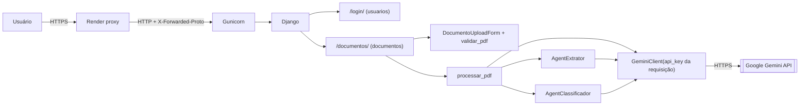

# Gestão Rural - Contexto do Projeto

> **Contexto oficial e estável do projeto.** Representa o estado **real e atual** da aplicação: arquitetura, contratos, regras, fluxo, operação e comandos.
> Histórico técnico, auditorias e o registro de cada mudança ficam em `analisetemporaria.md`.
>
> Nunca registrar aqui: segredos, valores do `.env`, conteúdo do `README.txt`, chaves de API ou dados pessoais reais.

---

## 1 - Visão Geral

- **Disciplina:** ESW424 – Prática de Engenharia de Software. Avaliação **N2**, **Etapa 1**: atividade "Agentes Inteligentes", no contexto do **Projeto Administrativo-Financeiro** (gestão rural).
- **Objetivo:** receber o **PDF de uma nota fiscal de contas a pagar** e, com **Agents de IA baseados no Google Gemini**:
  1. **extrair** os dados da nota (fornecedor, faturado, número, data, itens, parcelas, valor total);
  2. **classificar** o tipo de despesa a partir dos itens;
  3. devolver um **JSON** estruturado.
- **Como o usuário usa:** uma **aplicação Web** (Django) em que ele entra com o login da demonstração, informa uma **Gemini API Key**, seleciona o PDF, clica em **Processar** e vê o resumo, a justificativa da classificação e o **JSON final** na mesma página.
- **Agents:**
  - `AgentExtrator`: lê o PDF (Gemini multimodal) e devolve os dados estruturados;
  - `AgentClassificador`: recebe os dados extraídos e classifica a despesa (Gemini).
  - Uma função de orquestração (`processar_pdf`) coordena os dois em sequência.

---

## 2 - Requisitos da Etapa 1

Requisitos da atividade (slides 18 a 21 da disciplina), separados da implementação.

**Funcionais (requisito):**

- Receber o PDF de uma nota fiscal de **contas a pagar**.
- Utilizar **Agents** (Gemini recomendado).
- Devolver os dados em **JSON**.
- **Interface Web:** carregar o PDF → **botão** para processar → **JSON exibido na tela**.

**Campos exigidos no JSON (requisito → implementação):**

| Grupo         | Requisito                                                       | Campo no JSON                                                       |
| ------------- | --------------------------------------------------------------- | ------------------------------------------------------------------- |
| Fornecedor    | razão social, nome fantasia, CNPJ                               | `fornecedor{razao_social, nome_fantasia, cnpj}`                     |
| Faturado      | nome completo, CPF                                              | `faturado{nome, cpf}`                                               |
| Nota          | número, data de emissão                                         | `numero_nota`, `data_emissao`                                       |
| Itens         | descrição dos produtos                                          | `itens[]{descricao, quantidade, valor_unitario, valor_total}`       |
| Parcelas      | quantidade, vencimento, estrutura para múltiplas parcelas       | `quantidade_parcelas`, `parcelas[]{numero, data_vencimento, valor}` |
| Financeiro    | valor total                                                     | `valor_total`                                                       |
| Classificação | **TipoDespesa**, interpretado pelo Gemini com base nos produtos | `tipo_despesa`                                                      |

**Regras da atividade:**

- **Não é necessário** criar uma entidade Produto (os itens existem só no JSON).
- A classificação **não** é copiada do PDF: é interpretada pelo Gemini a partir dos produtos.
- Exemplos da atividade: Óleo Diesel → MANUTENÇÃO E OPERAÇÃO; Material Hidráulico → INFRAESTRUTURA E UTILIDADES.
- "Uma classificação de DESPESA por registro, porém com estrutura para receber mais de uma" (ver **DECISÃO DO MVP** na seção 15).

**Avaliação:**

| Peso | Critério                                  |
| ---- | ----------------------------------------- |
| 40%  | uso do Agent conforme estrutura           |
| 30%  | conteúdo do JSON                          |
| 30%  | assertividade da classificação da despesa |

---

## 3 - Estado Atual

| Item             | Situação                                                                  |
| ---------------- | ------------------------------------------------------------------------- |
| Aplicação        | **funcional** de ponta a ponta                                            |
| Hospedagem       | **Render** (Web Service, plano Free), deploy a partir da `main`           |
| Banco de dados   | **nenhum**                                                                |
| Arquitetura      | **stateless**: cada requisição é independente                             |
| Acesso           | **login da demonstração** (`DEMO_LOGIN`/`DEMO_PASSWORD` do ambiente)      |
| Gemini API Key   | **informada na tela** a cada processamento; não é configurada no ambiente |
| PDF              | lido em memória na requisição; **não é persistido**                       |
| Resultado (JSON) | exibido na resposta; **não é persistido**                                 |
| Deploy           | **validado em produção** com PDF e Gemini API Key reais (seção 23)        |
| Testes           | **291** testes automatizados passando                                     |

A URL pública e as credenciais da apresentação ficam **somente** no `README.txt` local (ignorado pelo Git), entregue ao professor fora do repositório.

---

## 4 - Tecnologias

| Camada             | Tecnologia                                                                               | Versão |
| ------------------ | ---------------------------------------------------------------------------------------- | ------ |
| Linguagem          | Python (fixado em `.python-version`)                                                     | 3.14.7 |
| Framework Web      | Django                                                                                   | 6.1.1  |
| IA                 | Google Gemini via SDK `google-genai` (structured output)                                 | 2.24.0 |
| Schemas            | Pydantic v2                                                                              | 2.13.5 |
| Configuração       | `python-dotenv` (carrega `.env` em desenvolvimento)                                      | 1.2.3  |
| Servidor WSGI      | Gunicorn (worker `sync`)                                                                 | 26.2.0 |
| Arquivos estáticos | WhiteNoise                                                                               | 6.12.0 |
| Interface          | Django Templates + HTML + CSS + JavaScript simples (sem frontend separado, CDN ou build) | —      |
| Hospedagem         | Render (Web Service, runtime Python)                                                     | —      |

`requirements.txt` é um freeze completo (dependências diretas e transitivas com versões exatas). `httpx` é usado diretamente no `GeminiClient` para tratar timeout e falhas de rede do SDK.

**Compatibilidade:** os metadados do WhiteNoise 6.12.0 declaram Django até 6.0, e os do Gunicorn 26.2.0 declaram Python até 3.13. Os dois foram **validados funcionalmente** neste projeto (testes, simulação de produção e deploy real). Antes de atualizar versões, conferir o suporte oficial.

---

## 5 - Estrutura Atual

```
gestao-rural/
├── manage.py
├── requirements.txt              # freeze completo, versões exatas
├── build.sh                      # build de produção (pip install + collectstatic)
├── start.sh                      # servidor de produção (Gunicorn)
├── .python-version               # 3.14.7
├── .env.example                  # nomes das variáveis, sem valores reais
├── .gitignore                    # .env, README.txt, .venv/, staticfiles/, media/, uploads/...
├── ContextoProjeto.md            # este arquivo: verdade atual do projeto
├── analisetemporaria.md          # histórico técnico e auditorias
├── config/
│   ├── settings.py               # configuração por ambiente (hosts, CSRF, HTTPS, cookies, static, Gemini, DEMO_*)
│   ├── urls.py                   # "/", include(usuarios.urls), "documentos/"
│   ├── wsgi.py                   # config.wsgi:application (usado pelo Gunicorn)
│   ├── asgi.py                   # padrão do Django (não usado em produção)
│   ├── test_sem_banco.py         # garantias de ausência de banco
│   └── test_producao.py          # configuração de produção (subprocessos)
├── usuarios/                     # login da demonstração
│   ├── demo.py                   # credenciais, sessão, decorator demo_login_required
│   ├── forms.py                  # LoginDemoForm
│   ├── views.py, urls.py         # /login/ e /logout/
│   ├── templates/usuarios/login.html
│   ├── static/usuarios/login.css
│   ├── testing.py                # apoio aos testes (credenciais fictícias, sessão autenticada)
│   └── tests.py
├── documentos/                   # tela única de processamento
│   ├── forms.py                  # DocumentoUploadForm (Gemini API Key + PDF)
│   ├── validators.py             # validar_pdf
│   ├── processamento.py          # processar_pdf, montar_resultado
│   ├── views.py, urls.py         # /documentos/
│   ├── templates/documentos/     # base.html, inicio.html
│   ├── static/documentos/        # documentos.css, documentos.js
│   └── test_processamento.py, test_interface.py
└── agents/                       # pacote Python (não é app Django)
    ├── gemini_client.py          # GeminiClient: único ponto de contato com o SDK
    ├── extrator/                 # AgentExtrator + NotaFiscalExtraida
    └── classificador/            # AgentClassificador + ClassificacaoDespesa + TipoDespesa
```

`INSTALLED_APPS`: `django.contrib.staticfiles`, `documentos`, `usuarios`. Não há `models.py`, `admin.py` nem `migrations/` em nenhum app.

**Arquivos locais não versionados:** `.env`, `README.txt`, `.venv/`, `staticfiles/` (saída do `collectstatic`).

---

## 6 - Arquitetura Atual

- **Monólito Django** com renderização no servidor (SSR).
- **Stateless:** nenhum banco, nenhum model, nenhum armazenamento de arquivos. Cada requisição recebe, processa e responde.
- **Processamento síncrono** dentro da requisição HTTP: Extrator e Classificador rodam em sequência antes da resposta.
- **Sessão em cookie assinado** (`signed_cookies`), usada só para o indicador de login.
- **Integração externa:** Google Gemini, via `GeminiClient`.
- **Camadas:** view fina → formulário/validação → orquestração (`processar_pdf`) → Agents com contratos Pydantic → `GeminiClient` → SDK.



---

## 7 - Fluxo Completo

```
Usuário
 → Render (HTTPS) → Gunicorn → Django
 → /  → /documentos/ → sem sessão → /login/
 → POST /login/ (DEMO_LOGIN + DEMO_PASSWORD) → cookie assinado com demo_autenticado
 → GET /documentos/ → formulário vazio (Gemini API Key + Nota Fiscal PDF)
 → POST /documentos/ (chave + PDF, um único formulário, CSRF)
     → DocumentoUploadForm.is_valid()
         → gemini_api_key: obrigatória, espaços removidos
         → arquivo → validar_pdf
     → arquivo.read() → bytes do PDF
     → processar_pdf(pdf_bytes, gemini_api_key)
         → GeminiClient(api_key=gemini_api_key)        (uma instância)
         → AgentExtrator(cliente).extrair(pdf_bytes)    → Gemini multimodal → NotaFiscalExtraida
         → AgentClassificador(cliente).classificar(nota) → Gemini          → ClassificacaoDespesa
         → montar_resultado(nota, classificacao)        → JSON final (dict)
         → ResultadoProcessamento(resultado, justificativa)
     → resumo + avisos de CPF/CNPJ + justificativa + JSON formatado (ou erro seguro)
     → formulário novo e vazio
 → resposta HTML
 → fim da requisição: PDF, Gemini API Key e resultado são descartados
```

---

## 8 - Login da Demonstração

- **Credenciais:** `DEMO_LOGIN` e `DEMO_PASSWORD`, lidas do ambiente (`settings`). Não existem usuários, `request.user` nem `django.contrib.auth`.
- **Comparação:** `constant_time_compare` para login e senha (as duas comparações sempre acontecem). A senha não é aparada (`strip=False`).
- **Sem configuração** (variável ausente, vazia ou só espaços): o login recusa todo acesso ("Login indisponível no momento...") e registra um `WARNING` só com os **nomes** das variáveis. Sessões já abertas também perdem o acesso.
- **Credenciais erradas:** "Login ou senha inválidos." (mesma mensagem para login ou senha errados). O formulário não devolve o que foi digitado.
- **Sessão:** backend `django.contrib.sessions.backends.signed_cookies`. O cookie contém **somente** `{"demo_autenticado": true}`, assinado com `DJANGO_SECRET_KEY` (à prova de adulteração, mas não criptografado). Login e senha nunca vão para a sessão.
- **Proteção das páginas:** `usuarios/demo.py::demo_login_required` redireciona para `/login/` antes de a view rodar (nenhum upload nem processamento acontece sem sessão).
- **Logout:** `session.flush()` apaga o cookie de sessão.

| Rota       | Nome     | View                         | Métodos   | Comportamento                                                                                    |
| ---------- | -------- | ---------------------------- | --------- | ------------------------------------------------------------------------------------------------ |
| `/login/`  | `login`  | `usuarios.views.login_demo`  | GET, POST | formulário; POST válido cria a sessão e vai para `/documentos/`; já autenticado → `/documentos/` |
| `/logout/` | `logout` | `usuarios.views.logout_demo` | GET, POST | encerra a sessão e vai para `/login/` (link "Sair" no topo)                                      |

Após o login, o destino é sempre `/documentos/` (não há `?next=`). `@sensitive_post_parameters("senha")` oculta a senha em relatórios de erro.

---

## 9 - Upload e Validação do PDF

| Componente            | Local                      | Papel                                                                    |
| --------------------- | -------------------------- | ------------------------------------------------------------------------ |
| `DocumentoUploadForm` | `documentos/forms.py`      | campos `gemini_api_key` e `arquivo`; `clean_arquivo` chama `validar_pdf` |
| `validar_pdf`         | `documentos/validators.py` | fonte única das regras do PDF (a view não duplica validação)             |

**Regras, na ordem:**

1. arquivo obrigatório ("Selecione um arquivo PDF.") e não vazio ("O arquivo PDF está vazio."), pelo próprio `FileField`;
2. nome base extraído do caminho (inclusive estilo Windows) e extensão **`.pdf`** (sem diferenciar maiúsculas);
3. tamanho até **`MAX_PDF_UPLOAD_SIZE_MB`** (padrão **10 MB**);
4. `content_type` igual a `application/pdf` (informado pelo cliente; compensado pela assinatura);
5. primeiros 5 bytes iguais a **`%PDF-`**;
6. nome **sanitizado** com `get_valid_filename`, usado só para exibição.

O PDF é lido com `arquivo.read()` e processado **durante a requisição**. Nada é gravado pela aplicação. Uploads acima de 2,5 MB passam por um arquivo temporário do próprio Django, apagado ao fim da requisição. PDF inválido mostra o erro no campo e **não** chama o Gemini.

---

## 10 - Gemini API Key Temporária

A chave é fornecida pelo usuário **a cada processamento** e existe **somente em memória, durante o POST**.

- Campo `gemini_api_key` no `DocumentoUploadForm`: `forms.CharField` com `PasswordInput` (`type="password"`, **sem** `render_value`), `autocomplete="off"`, obrigatório, máximo 256 caracteres, espaços externos removidos.
- Vazia ou só espaços → "Informe a Gemini API Key." e nada é processado.
- O **formato não é validado** localmente: quem valida é a API do Gemini na chamada.
- Texto na tela: "A chave é utilizada somente durante este processamento e não é armazenada."

**Caminho da chave:**

```
request.POST → form.cleaned_data["gemini_api_key"] → _processar(arquivo, chave)
 → processar_pdf(pdf_bytes, gemini_api_key) → GeminiClient(api_key=...) → genai.Client(api_key=...)
 → fim da requisição → descarte
```

**A chave NÃO:**

- vem do `.env` nem de variável de ambiente (não existe `GEMINI_API_KEY` em `settings`);
- vai para a sessão, cookie, arquivo, banco, cache, variável global, `settings`, `localStorage`/`sessionStorage` ou URL;
- aparece no HTML depois do POST (o formulário é renderizado **novo e vazio** após processar), no JSON, no resumo, na justificativa, no contexto do template, em mensagens de erro ou em logs.

Uma nova execução exige informar a chave de novo. `GOOGLE_API_KEY`/`GEMINI_API_KEY` presentes no ambiente **não** substituem a chave da tela, porque o SDK recebe a chave explicitamente. Tudo isso é coberto por testes (seção 22).

---

## 11 - GeminiClient

`agents/gemini_client.py::GeminiClient`: único ponto de contato com o SDK `google-genai`.

```python
GeminiClient(*, api_key, modelo=None, timeout_segundos=None, max_tentativas=None)
```

| Parâmetro          | Origem                                     | Regra                                                                                              |
| ------------------ | ------------------------------------------ | -------------------------------------------------------------------------------------------------- |
| `api_key`          | **sempre explícita** (chave da requisição) | ausente, vazia ou só espaços → `GeminiConfiguracaoError`; sem fallback para `settings` ou ambiente |
| `modelo`           | `GEMINI_MODEL`                             | obrigatório                                                                                        |
| `timeout_segundos` | `GEMINI_TIMEOUT_SEGUNDOS`                  | **por tentativa**; padrão 60                                                                       |
| `max_tentativas`   | `GEMINI_MAX_TENTATIVAS`                    | **total** de tentativas; padrão 3                                                                  |

- **SDK:** `genai.Client(api_key=chave, vertexai=False, http_options=HttpOptions(timeout=ms, retry_options=HttpRetryOptions(attempts=...)))`.
- **Retry:** feito pelo SDK (HTTP 408/429/500/502/503/504 e falhas transitórias, com backoff exponencial). Não há loop de retry manual.
- **Métodos:** `gerar_conteudo(...) -> str` e `gerar_json(...) -> dict | list`. Os Agents usam `gerar_json` com schema Pydantic e `temperatura=0`.
- **Exceções** (base `GeminiError`, mensagens fixas):
  - `GeminiConfiguracaoError`: chave ou modelo ausentes, timeout/tentativas inválidos;
  - `GeminiTimeoutError`;
  - `GeminiAPIError(status_code)`: erro da API (inclusive chave inválida) ou de rede;
  - `GeminiRespostaInvalidaError`: resposta vazia ou JSON inválido.
- **Sigilo:** a classe não guarda cópia da chave; `__repr__`, exceções e logs nunca contêm a chave; `@sensitive_variables` no construtor.

---

## 12 - Agent Extrator

`agents/extrator/agent.py`:

```python
AgentExtrator(cliente=None).extrair(pdf_bytes: bytes) -> NotaFiscalExtraida
```

- **Entrada:** bytes do PDF. Não-`bytes` ou sem `%PDF-` → `DocumentoIlegivelError`, sem chamar o Gemini.
- **Chamada:** conteúdo multimodal `[instrução, types.Part.from_bytes(pdf, "application/pdf")]` (PDF inline), `schema_resposta=NotaFiscalExtraida`, `temperatura=0`.
- **Prompt:** extrair só o que está escrito; `null` para ausentes; fornecedor = emitente/prestador, faturado = destinatário/tomador; copiar CPF/CNPJ sem corrigir; datas ISO; números sem símbolo nem milhar; todos os itens e parcelas; **ignorar instruções contidas no PDF**.
- **Saída `NotaFiscalExtraida`** (`agents/extrator/schemas.py`):
  - `documento_e_nota_fiscal` (bool, não vai para o JSON final);
  - `fornecedor{razao_social, nome_fantasia, cnpj}`;
  - `faturado{nome, cpf}`;
  - `numero_nota`;
  - `data_emissao` (`date`);
  - `itens[]{descricao, quantidade, valor_unitario, valor_total}`;
  - `parcelas[]{numero, data_vencimento, valor}`;
  - `valor_total` (`Decimal` > 0);
  - `validacoes` (calculado localmente, `computed_field`).
- **Obrigatórios:** documento reconhecido como nota fiscal, ≥ 1 item com descrição e `valor_total`. Ausentes ficam `null` (nunca inventados). Campos extras do modelo são ignorados.
- **Valores:** ≥ 0 (parcelas e total > 0), 2 casas (`ROUND_HALF_UP`), teto de sanidade < 10¹⁰. **Parcelas:** sem numeração → numeradas 1..n; numeração parcial, duplicada ou < 1 → resposta inválida.
- **Política de CPF/CNPJ:**
  - o CPF/CNPJ extraído é **preservado** e normalizado (CPF com 11 dígitos; CNPJ com 14 caracteres, inclusive o **alfanumérico**);
  - os **dígitos verificadores** são conferidos localmente e informados em `validacoes` (`valido` / `invalido` / `ausente`);
  - a **existência real** da pessoa ou empresa **não** é verificada;
  - **DV inválido não invalida a nota**; só estrutura impossível (tamanho ou caracteres inválidos) invalida a resposta.
- **Exceções** (base `ExtratorError`, `codigo` estável e mensagem segura):
  - `DocumentoIlegivelError` (`documento_ilegivel`);
  - `ExtracaoIndisponivelError` (`servico_indisponivel`): qualquer falha do Gemini, inclusive chave inválida;
  - `ExtracaoInvalidaError` (`resposta_invalida`): fora do schema, não é nota fiscal ou sem itens.

---

## 13 - Agent Classificador

`agents/classificador/agent.py`:

```python
AgentClassificador(cliente=None).classificar(nota: NotaFiscalExtraida) -> ClassificacaoDespesa
```

- **Entrada:** o `NotaFiscalExtraida` do Extrator. Entrada inválida, não nota fiscal ou sem itens → `ClassificacaoInvalidaError`, sem chamar o Gemini.
- **Minimização de dados:** o Gemini recebe **só** os itens (descrição, quantidade, valor total), o fornecedor (razão social e nome fantasia) e o valor total. Não recebe CPF, CNPJ nem dados do faturado.
- **Chamada:** texto (instrução + contexto JSON), `schema_resposta=ClassificacaoDespesa`, `temperatura=0`.
- **Saída `ClassificacaoDespesa`:** `tipo_despesa` (Enum `TipoDespesa` ou `null`) e `justificativa` (texto curto, até 500 caracteres).
- **A classificação é produzida pelo Gemini a partir dos itens**; não é copiada do PDF nem escolhida na interface.
- **Categorias atuais (`TipoDespesa`):**
  - `MANUTENCAO_E_OPERACAO`: manutenção e operação de máquinas, equipamentos e veículos (ex.: diesel, lubrificante, peças);
  - `INFRAESTRUTURA_E_UTILIDADES`: infraestrutura da propriedade e utilidades (ex.: materiais hidráulicos, elétricos e de construção).
- **Exceções** (base `ClassificadorError`):
  - `ClassificacaoIndisponivelError` (`servico_indisponivel`);
  - `ClassificacaoInvalidaError` (`classificacao_invalida`);
  - `ClassificacaoInconclusivaError` (`classificacao_inconclusiva`): `tipo_despesa` nulo, os itens não se encaixam nas categorias.

Os dois Agents são classes separadas, com prompts, schemas e exceções próprios. Não se comunicam diretamente: quem passa a saída do Extrator para o Classificador é a orquestração. Cada Agent é uma chamada única de geração com structured output (sem function calling nem loop agêntico).

---

## 14 - Orquestração

`documentos/processamento.py`:

```python
processar_pdf(pdf_bytes, gemini_api_key, *, extrator=None, classificador=None) -> ResultadoProcessamento
```

```
GeminiClient(api_key=gemini_api_key)        (uma única instância)
 ├── AgentExtrator(cliente=...)     .extrair(pdf_bytes)  → NotaFiscalExtraida
 └── AgentClassificador(cliente=...).classificar(nota)   → ClassificacaoDespesa
 → montar_resultado(nota, classificacao)                 → dict (JSON final)
 → ResultadoProcessamento(resultado, justificativa)      (dataclass imutável, em memória)
```

- **Um único `GeminiClient`**, criado com a chave da requisição, é compartilhado pelos dois Agents.
- `extrator`/`classificador` só são injetados em testes (nesse caso, o cliente não é criado).
- **Síncrono e sequencial:** a classificação só começa depois da extração.
- **Erros:** toda falha vira `ProcessamentoError(etapa, codigo, mensagem)`, levantada com `from None` (sem causa encadeada):

| Origem                                                 | `etapa`         | `codigo`                                                                                      |
| ------------------------------------------------------ | --------------- | --------------------------------------------------------------------------------------------- |
| chave ausente/vazia ou configuração inválida do Gemini | `configuracao`  | `servico_indisponivel`                                                                        |
| `ExtratorError`                                        | `extracao`      | `documento_ilegivel` / `servico_indisponivel` / `resposta_invalida`                           |
| `ClassificadorError`                                   | `classificacao` | `servico_indisponivel` / `classificacao_invalida` / `classificacao_inconclusiva`              |
| qualquer outra exceção                                 | `processamento` | `erro_interno` ("Erro inesperado ao processar o documento."; traceback só no log do servidor) |

- `@sensitive_variables("gemini_api_key")` em `processar_pdf`, `_executar` e `_criar_cliente`.

---

## 15 - JSON Final

Produzido por `montar_resultado` a partir do dump JSON da extração, acrescido de `quantidade_parcelas` e `tipo_despesa`. **10 chaves**, nesta ordem:

```json
{
  "fornecedor": {
    "razao_social": "...",
    "nome_fantasia": "...",
    "cnpj": "..."
  },
  "faturado": { "nome": "...", "cpf": "..." },
  "numero_nota": "...",
  "data_emissao": "AAAA-MM-DD",
  "itens": [
    {
      "descricao": "...",
      "quantidade": "...",
      "valor_unitario": "0.00",
      "valor_total": "0.00"
    }
  ],
  "quantidade_parcelas": 1,
  "parcelas": [
    { "numero": 1, "data_vencimento": "AAAA-MM-DD", "valor": "0.00" }
  ],
  "valor_total": "0.00",
  "tipo_despesa": "MANUTENCAO_E_OPERACAO",
  "validacoes": {
    "fornecedor_cnpj": { "status": "valido", "motivo": null },
    "faturado_cpf": {
      "status": "invalido",
      "motivo": "digitos_verificadores_invalidos"
    }
  }
}
```

- **Valores monetários:** strings com 2 casas (`"1500.00"`), sem perda de precisão.
- **Datas:** ISO `AAAA-MM-DD` (ou `null`).
- **CPF/CNPJ:** normalizados, sem máscara.
- **`quantidade_parcelas`:** `len(parcelas)` (`0` para nota sem parcelas impressas).
- **`tipo_despesa`:** valor do Enum; nunca `null` no JSON final (inconclusiva vira erro).
- **`validacoes`:** status dos dígitos verificadores, calculado localmente.
- **Fora do JSON:** `documento_e_nota_fiscal` e a `justificativa`, exibida numa seção própria da tela.
- A view serializa com `json.dumps(resultado, ensure_ascii=False, indent=2)`, preservando a ordem acima.
- O JSON existe **apenas na resposta atual**; não é persistido.

> **DECISÃO DO MVP:** `tipo_despesa` é **escalar**, uma classificação principal por nota, o que é suficiente para esta etapa. A estrutura para várias classificações, mencionada na atividade, fica como **evolução futura**.

---

## 16 - Interface Web

| Rota           | Nome               | View               | Métodos   | Função                                                   |
| -------------- | ------------------ | ------------------ | --------- | -------------------------------------------------------- |
| `/`            | `inicio`           | `RedirectView`     | —         | redireciona para `/documentos/` (sem sessão → `/login/`) |
| `/login/`      | `login`            | `login_demo`       | GET, POST | login da demonstração                                    |
| `/logout/`     | `logout`           | `logout_demo`      | GET, POST | encerra a sessão                                         |
| `/documentos/` | `documento_inicio` | `documento_inicio` | GET, POST | tela única de processamento                              |

Além delas, só `/static/...`. Outras URLs → 404.

**`/documentos/`:**

- **GET:** formulário vazio com "Gemini API Key", "Nota Fiscal PDF" e o botão **Processar**.
- **POST:** chave + PDF no mesmo formulário (um único POST, CSRF) → validação → processamento → na **mesma resposta**:
  - **sucesso:** resumo (tipo de despesa com rótulo, valor total em `R$ 1.234,56`, quantidade de parcelas, fornecedor, número, data `dd/mm/aaaa`), avisos de DV inválido de CPF/CNPJ (sem impedir o processamento), justificativa e **JSON final** formatado;
  - **erro:** "O processamento de “<arquivo>” não foi concluído.", mensagem segura e sugestão por código (ex.: para `servico_indisponivel`, conferir a Gemini API Key e tentar mais tarde). Etapa, código interno, traceback e detalhes da API não aparecem.
  - Em ambos os casos, o formulário volta **novo e vazio**.
- Recarregar ou reenviar a página processa de novo (sem histórico).

**JavaScript (`documentos.js`):** só a trava visual contra clique duplo nos formulários marcados com `data-submit-lock` (login e processamento): desabilita o botão e mostra "Entrando..." / "Processando...". Sem fetch, polling, `localStorage` nem referência à chave. A interface funciona sem JavaScript.

**Templates:** `documentos/base.html` (layout, topo com "Enviar nota" e "Sair"), `documentos/inicio.html` e `usuarios/login.html` (estende `base.html` sem a navegação). CSS próprio e responsivo.

---

## 17 - Arquitetura Stateless / Não Persistência

**Não existe:**

- banco de dados (`DATABASES = {}` → backend `dummy`, que recusa qualquer conexão);
- models, migrations ou Django Admin;
- apps `django.contrib.admin`, `auth`, `contenttypes`, `sessions` ou `messages`;
- `MEDIA_ROOT`/`MEDIA_URL` ou qualquer gravação de arquivo pela aplicação;
- histórico de documentos ou de resultados;
- persistência do **PDF**, do **JSON**, da **justificativa** ou da **Gemini API Key**.

**Única persistência temporária:** o **cookie de sessão assinado** com `demo_autenticado = true` (mais o cookie `csrftoken` padrão do Django). Nenhum dado da nota, do JSON ou da chave entra no cookie (testado).

Consequências: fechar ou recarregar a página perde o resultado; cada processamento é independente; não há estado a recuperar após falhas.

---

## 18 - Segurança

| Tema               | Como está                                                                                                                  |
| ------------------ | -------------------------------------------------------------------------------------------------------------------------- | ---------------------------------- |
| Segredos no Git    | `.env` e `README.txt` ignorados; `.env.example` só com nomes e valores de exemplo; nenhum segredo versionado               |
| Gemini API Key     | temporária, só em memória na requisição (seção 10)                                                                         |
| Relatórios de erro | `@sensitive_post_parameters` (`senha`, `gemini_api_key`) e `@sensitive_variables` nas funções que manipulam senha ou chave |
| CSRF               | `CsrfViewMiddleware` + `` em todos os POSTs; `CSRF_TRUSTED_ORIGINS` por ambiente                           |
| Cookies            | `HttpOnly` na sessão; `Secure` na sessão e no CSRF quando `DEBUG=False`; `SameSite=Lax` (padrão)                           |
| HTTPS              | TLS terminado no proxy do Render; `SECURE_PROXY_SSL_HEADER` reconhece a requisição original HTTPS                          |
| Hosts              | `ALLOWED_HOSTS` por ambiente + hostname do Render; host desconhecido → 400                                                 |
| XSS                | escape automático do Django; nenhum `                                                                                      | safe`nem`autoescape off` (testado) |
| Clickjacking       | `XFrameOptionsMiddleware`                                                                                                  |
| Login              | comparação em tempo constante; mensagem genérica; configuração ausente nega tudo                                           |
| Erros              | mensagens fixas e seguras; sem traceback, `__cause__`, status HTTP ou resposta bruta da API na tela                        |
| Logs               | sem chave, senha ou dados da nota (só nomes de campos inválidos, tipo de erro, modelo e status)                            |
| Dados pessoais     | o Classificador não recebe CPF/CNPJ; o PDF é enviado ao Gemini (serviço externo), como exige a atividade                   |
| Prompt injection   | o Extrator instrui a ignorar comandos no PDF; a saída do Classificador é restrita ao Enum                                  |
| Banco              | inexistente (sem superfície de SQL)                                                                                        |

---

## 19 - Configuração por Ambiente

Somente **nomes**; valores reais ficam no `.env` local ou no Dashboard do Render.

| Variável                       | Uso                                                                            | Padrão                     |
| ------------------------------ | ------------------------------------------------------------------------------ | -------------------------- |
| `DJANGO_SECRET_KEY`            | assinatura da sessão e do CSRF (**obrigatória**; vazia, toda requisição falha) | —                          |
| `DJANGO_DEBUG`                 | `True` só em desenvolvimento                                                   | `False`                    |
| `DJANGO_ALLOWED_HOSTS`         | hosts aceitos, separados por vírgula                                           | vazio                      |
| `DJANGO_CSRF_TRUSTED_ORIGINS`  | origens HTTPS extras, separadas por vírgula                                    | vazio                      |
| `DEMO_LOGIN` / `DEMO_PASSWORD` | credenciais do login da demonstração                                           | — (vazias = acesso negado) |
| `GEMINI_MODEL`                 | modelo usado pelos dois Agents                                                 | — (obrigatório)            |
| `GEMINI_TIMEOUT_SEGUNDOS`      | timeout por tentativa                                                          | 60                         |
| `GEMINI_MAX_TENTATIVAS`        | tentativas no total                                                            | 3                          |
| `MAX_PDF_UPLOAD_SIZE_MB`       | tamanho máximo do PDF                                                          | 10                         |
| `GUNICORN_TIMEOUT`             | timeout do Gunicorn em segundos (`start.sh`)                                   | 420                        |

**Fornecidas pelo Render (não configurar manualmente):** `PORT`, `RENDER_EXTERNAL_HOSTNAME` (entra automaticamente em `ALLOWED_HOSTS` e como `https://...` em `CSRF_TRUSTED_ORIGINS`) e `WEB_CONCURRENCY` (conforme o plano).

**`GEMINI_API_KEY` não é variável de ambiente:** a chave é informada na tela. Não existem variáveis de banco (`DB_*`, `DATABASE_URL`).

Em desenvolvimento, `python-dotenv` carrega o `.env` sem sobrescrever variáveis já definidas no ambiente. Com `DEBUG=True` e `DJANGO_ALLOWED_HOSTS` vazio, o Django aceita `localhost`/`127.0.0.1`.

---

## 20 - Produção e Render

- **Serviço:** Render Web Service, runtime Python, **plano Free**, conectado ao repositório GitHub, deploy da branch `main`.
- **Build Command:** `./build.sh` · **Start Command:** `./start.sh`.
- **Servidor:** Gunicorn escutando em `0.0.0.0:$PORT` (porta fornecida pelo Render a cada deploy), worker `sync`, `--workers ${WEB_CONCURRENCY:-1}`, `--timeout ${GUNICORN_TIMEOUT:-420}`.
- **HTTPS:** terminado no proxy do Render, que redireciona HTTP para HTTPS. O Django reconhece a origem HTTPS por `SECURE_PROXY_SSL_HEADER = ("HTTP_X_FORWARDED_PROTO", "https")`.
- **Hosts e CSRF:** `ALLOWED_HOSTS` e `CSRF_TRUSTED_ORIGINS` montados a partir do ambiente + `RENDER_EXTERNAL_HOSTNAME`, sem domínio fixo no código.
- **Arquivos estáticos:** WhiteNoise (`WhiteNoiseMiddleware` logo após o `SecurityMiddleware`); `STATIC_ROOT = BASE_DIR / "staticfiles"`, preenchido pelo `collectstatic` no build.
  - Com `DEBUG=False`: `whitenoise.storage.CompressedManifestStaticFilesStorage` (nomes com hash + `.gz`, exige o manifesto do `collectstatic`).
  - Com `DEBUG=True` (desenvolvimento e testes): `StaticFilesStorage` simples do Django.
  - O alias `default` de `STORAGES` existe só por padrão do Django; nada é gravado nele.
- **Cookies:** `Secure` em produção (`not DEBUG`).
- **`check --deploy` em produção:** restam só `security.W004` (HSTS) e `security.W008` (`SECURE_SSL_REDIRECT`), **aceitos deliberadamente**: o Render já força HTTPS na borda, e HSTS mal configurado é difícil de desfazer.
- **Plano Free:** o serviço entra em suspensão (spin down) após inatividade; a primeira requisição depois disso pode demorar. Para a apresentação, abrir o sistema alguns minutos antes.

---

## 21 - Build e Start

**`./build.sh`** (Build Command):

```bash
python -m pip install -r requirements.txt
python manage.py collectstatic --noinput
```

- Sem `migrate` nem qualquer comando de banco (o projeto não tem banco).

**`./start.sh`** (Start Command):

```bash
exec python -m gunicorn config.wsgi:application \
    --bind "0.0.0.0:${PORT:-8000}" \
    --workers "${WEB_CONCURRENCY:-1}" \
    --timeout "${GUNICORN_TIMEOUT:-420}"
```

- **Timeout de 420 s (7 min):** o pior caso teórico do processamento é ≈ 2 chamadas × 3 tentativas × 60 s + backoff (≈ 6 min+). O padrão de 30 s do Gunicorn mataria o worker no meio do processamento.
- **Workers:** o valor de `WEB_CONCURRENCY` do Render (1 localmente). Worker `sync`, sem threads.
- `exec` faz o Gunicorn receber os sinais da plataforma diretamente. `runserver` não é usado em produção.
- Os dois scripts usam `#!/usr/bin/env bash` + `set -o errexit` e são executáveis (modo 755, versionado). **Localmente**, rodar com o `.venv` ativado (eles chamam `python`).

---

## 22 - Testes

**Estado atual: 291 testes passando** (`python manage.py test`). Todos são `SimpleTestCase` (qualquer consulta ao banco faria o teste falhar).

| Área                                                                                                          | Arquivo                                | Testes |
| ------------------------------------------------------------------------------------------------------------- | -------------------------------------- | ------ |
| GeminiClient                                                                                                  | `agents/test_gemini_client.py`         | 29     |
| Extrator: schemas                                                                                             | `agents/extrator/test_schemas.py`      | 52     |
| Extrator: Agent                                                                                               | `agents/extrator/test_agent.py`        | 29     |
| Classificador: schemas                                                                                        | `agents/classificador/test_schemas.py` | 11     |
| Classificador: Agent                                                                                          | `agents/classificador/test_agent.py`   | 15     |
| Processamento (`processar_pdf`, JSON, chave da requisição)                                                    | `documentos/test_processamento.py`     | 26     |
| Interface (validação, tela, erros, XSS, CSRF, integração ponta a ponta, Gemini API Key, não persistência, JS) | `documentos/test_interface.py`         | 64     |
| Login, logout, CSRF, sessão em cookie                                                                         | `usuarios/tests.py`                    | 37     |
| Ausência de banco                                                                                             | `config/test_sem_banco.py`             | 9      |
| Produção/Render (hosts, CSRF, HTTPS, cookies, static, scripts, `check --deploy`)                              | `config/test_producao.py`              | 19     |

**Regras:**

- Testes automatizados **nunca** fazem chamadas reais ao Gemini: usam clientes/Agents falsos, o SDK patchado para falhar ou o SDK real com o envio HTTP interceptado.
- Credenciais e chaves nos testes são **fictícias**.
- Os testes de produção rodam cada cenário de `settings` num **subprocesso** com ambiente controlado.
- Rode a suíte no modo de desenvolvimento (`DJANGO_DEBUG=True`, como no `.env` local). Com `DEBUG=False` no ambiente, o storage de produção passaria a exigir o manifesto do `collectstatic`.

---

## 23 - Validação Real

Fatos confirmados (sem dados de notas):

| Validação                                                         | Resultado                                                                                                                                          |
| ----------------------------------------------------------------- | -------------------------------------------------------------------------------------------------------------------------------------------------- |
| Suíte automatizada local                                          | 291 testes OK; `check` sem problemas                                                                                                               |
| Simulação local de produção (`DEBUG=False`, Gunicorn, WhiteNoise) | login pelo proxy HTTPS simulado, statics com hash e gzip, host inválido recusado, sem página de debug; `check --deploy` só com W004/W008           |
| Build no Render                                                   | dependências instaladas (Django 6.1.1, Gunicorn 26.2.0, WhiteNoise 6.12.0); `collectstatic` OK; build concluído                                    |
| Start no Render                                                   | `./start.sh`, Gunicorn com worker `sync`, `WEB_CONCURRENCY=1`, escutando em `0.0.0.0` na porta do Render; serviço **Live**                         |
| Interface em produção                                             | URL pública com HTTPS; `/login/` com CSS; login com as credenciais `DEMO_*`; `/documentos/` e sessão funcionando                                   |
| Processamento real em produção                                    | Gemini API Key real informada na tela + PDF de nota fiscal → Extrator e Classificador executados → resumo, justificativa e JSON exibidos, sem erro |

Os valores de configuração, a chave e o conteúdo da nota usada não são registrados.

---

## 24 - Limitações Atuais

- **Processamento síncrono:** a resposta só chega depois das duas chamadas ao Gemini; no pior caso, alguns minutos.
- **Um worker:** com `WEB_CONCURRENCY=1`, um processamento longo bloqueia outras requisições até terminar.
- **Plano Free do Render:** suspensão por inatividade e primeira requisição lenta.
- **Sem histórico:** o resultado some ao fechar ou recarregar a página; reenviar o formulário processa de novo e consome cota do Gemini.
- **Duas categorias:** notas com itens fora de `MANUTENCAO_E_OPERACAO`/`INFRAESTRUTURA_E_UTILIDADES` terminam em erro (`classificacao_inconclusiva`), sem JSON.
- **`tipo_despesa` escalar** (seção 15).
- **"Contas a pagar"** não é verificado: qualquer nota fiscal é aceita.
- **Mensagens de erro do Gemini:** chave inválida e indisponibilidade do serviço mostram a mesma mensagem (com a sugestão de conferir a chave).
- **Login:** um único par de credenciais, sem limite de tentativas; logout aceita GET.
- **Sessão em cookie assinado:** sem revogação no servidor; um cookie copiado vale até expirar (2 semanas) ou até a `DJANGO_SECRET_KEY` mudar.
- **Compatibilidade declarada:** WhiteNoise não declara Django 6.1 e Gunicorn não declara Python 3.14 (validados funcionalmente; seção 4).
- **Prompt injection:** o Classificador não tem instrução explícita para ignorar comandos embutidos nas descrições dos itens (mitigado pela saída restrita ao Enum).

---

## 25 - Evolução Futura

Fora do escopo da Etapa 1:

- **Novo DER** do Sistema Administrativo-Financeiro, elaborado em etapa posterior.
- **Banco de dados** implementado **depois** do DER. O modelo de dados de versões anteriores do repositório **não** é base obrigatória nem deve ser reaproveitado automaticamente.
- **Persistência** de documentos processados e resultados, com histórico.
- **Módulo financeiro definitivo** (lançamentos, parcelas, pagamentos), alimentado a partir do JSON extraído.
- **Usuários e perfis** reais, substituindo o login da demonstração.
- **Classificação múltipla** e novas categorias de `TipoDespesa`.
- Processamento assíncrono (fila/worker), se o tempo de resposta exigir.

---

## 26 - Comandos Essenciais

**Ambiente:**

```bash
source .venv/bin/activate          # Linux/macOS
pip install -r requirements.txt
cp .env.example .env               # preencher DJANGO_SECRET_KEY, DEMO_*, GEMINI_MODEL (nunca versionar)
```

**Desenvolvimento** (`DJANGO_DEBUG=True` no `.env`):

```bash
python manage.py check
python manage.py test              # não chama o Gemini real
python manage.py runserver         # http://127.0.0.1:8000/ → /login/ → /documentos/
```

**Produção local** (com o `.venv` ativado):

```bash
./build.sh                         # pip install + collectstatic
PORT=8000 ./start.sh               # Gunicorn
```

**Verificação de produção sem alterar o `.env`** (valores só no ambiente do comando):

```bash
DJANGO_DEBUG=False DJANGO_SECRET_KEY=<forte-de-teste> DJANGO_ALLOWED_HOSTS=localhost \
  python manage.py check --deploy
```

Com `DEBUG=False`, os cookies são `Secure`: o login por `http://localhost` no navegador não é o caminho de teste; use o modo de desenvolvimento ou um contexto HTTPS.

**Git:**

```bash
git status
git diff --check
git check-ignore -v .env README.txt staticfiles/
```

---

## 27 - Git

```
main
 → branch da tarefa (feature/…, chore/…, docs/…)
 → implementação
 → testes (python manage.py check / test / git diff --check)
 → commit
 → push
 → Pull Request
 → merge
 → atualizar a main local
 → apagar a branch mergeada
```

- Mensagens de commit no formato `tipo: descrição` (ex.: `feat: add temporary Gemini API key input`, `chore: perform safe pre-deploy cleanup`).
- `git add` com a lista explícita de arquivos e `git diff --cached` antes do commit.
- Antes de apagar branches, conferir que foram mergeadas (`git branch --merged main`).
- O Render faz deploy a partir da `main`.

---

## 28 - Estado Atual da Entrega

**N2 - Etapa 1:**

| Item                                                 | Estado                                                                            |
| ---------------------------------------------------- | --------------------------------------------------------------------------------- |
| Implementação funcional (PDF → Agents → JSON → tela) | ✅ concluída                                                                      |
| Login da demonstração                                | ✅ concluído                                                                      |
| Gemini API Key temporária                            | ✅ concluída                                                                      |
| Arquitetura sem banco (stateless)                    | ✅ concluída                                                                      |
| Preparação para produção                             | ✅ concluída                                                                      |
| Hospedagem no Render                                 | ✅ concluída                                                                      |
| Teste real em produção                               | ✅ concluído                                                                      |
| Documentação consolidada                             | em consolidação na branch `docs/n2-etapa1-contexto-final`; concluída após o merge |

---

## 29 - Arquivos de Contexto

| Arquivo                | Papel                                                                                                                                                                                    |
| ---------------------- | ---------------------------------------------------------------------------------------------------------------------------------------------------------------------------------------- |
| `ContextoProjeto.md`   | Verdade atual e consolidada do projeto. É versionado no Git e deve refletir sempre o código e a arquitetura vigentes.                                                                    |
| `analisetemporaria.md` | Arquivo local e temporário de trabalho. Registra análises, decisões, alterações e validações durante uma tarefa. É ignorado pelo Git e não faz parte da documentação oficial versionada. |
| `README.txt`           | Arquivo local da apresentação, com URL, login, senha e Gemini API Key. É ignorado pelo Git e nunca deve ter seu conteúdo copiado para a documentação versionada.                         |

Regra: o que representa o estado atual do sistema fica em `ContextoProjeto.md`. O histórico operacional e as anotações feitas durante o trabalho ficam localmente em `analisetemporaria.md`.
