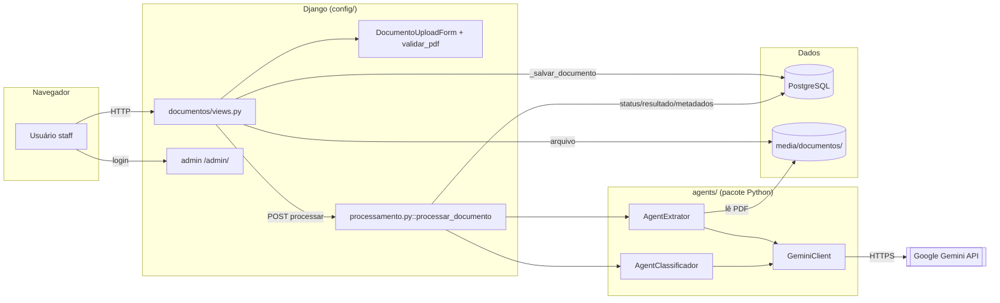
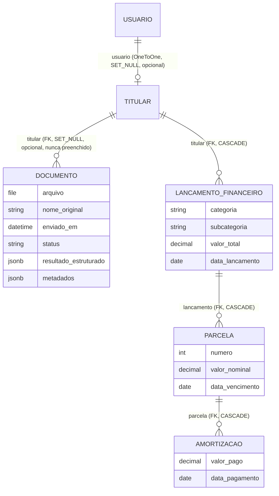
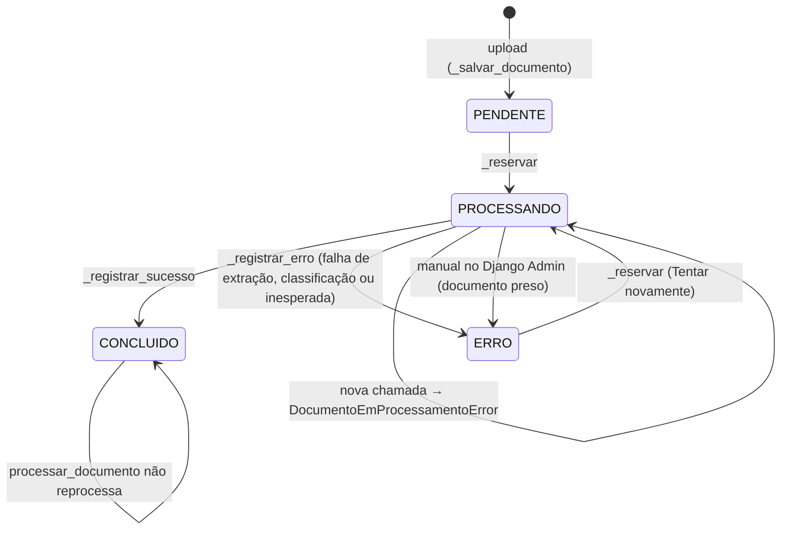
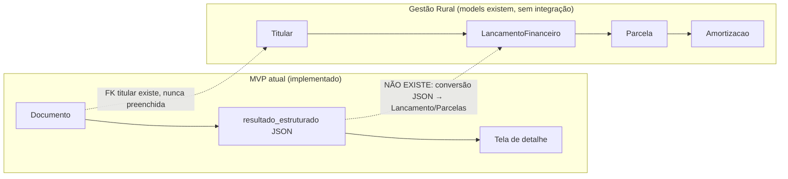
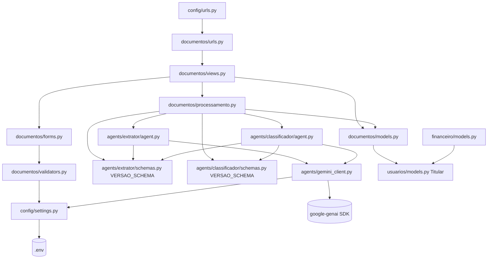
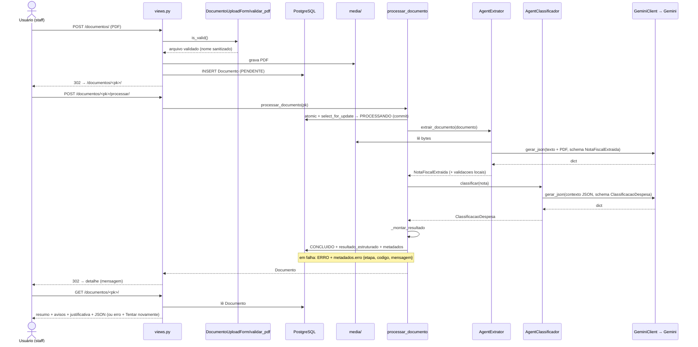
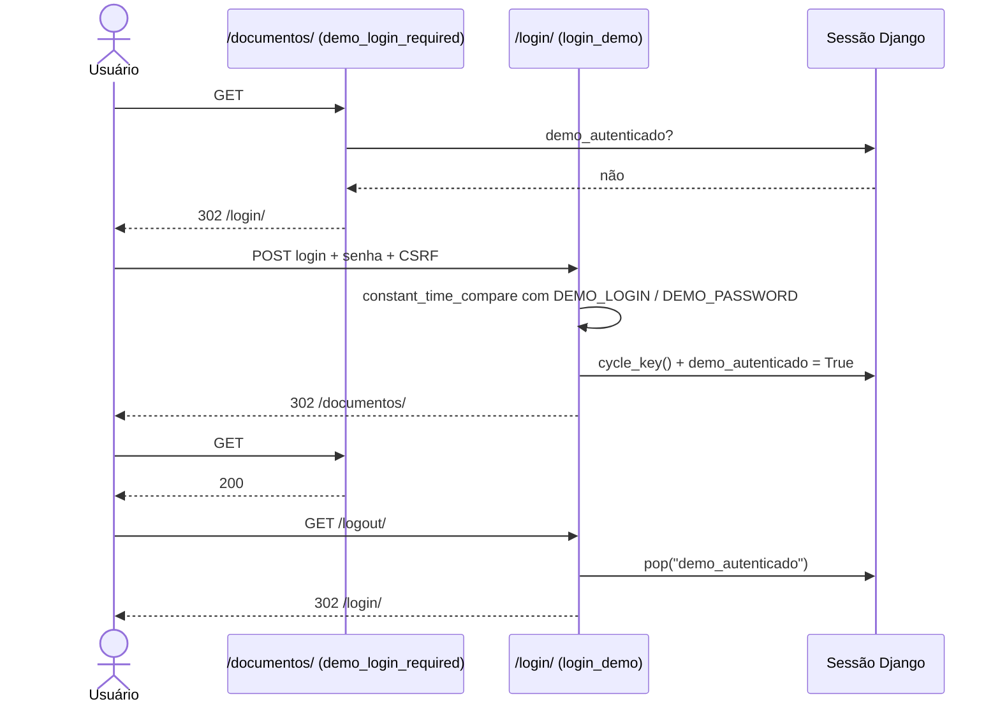
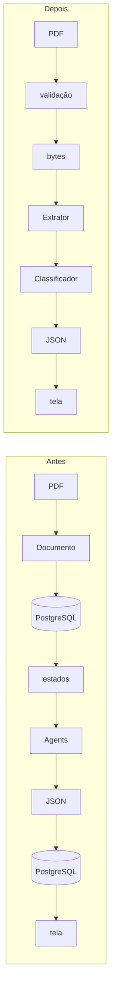

# Gestão Rural — Auditoria Técnica Completa

> **Data da auditoria:** 2026-09-28 · **Branch auditada:** `main` @ `bf7208e` · **Escopo:** repositório inteiro (código, testes, migrations, settings, templates, static, Git e documentação).
>
> **Legenda de evidência usada em todo o documento:**
> - **CONFIRMADO** — encontrado no código ou verificado por execução nesta auditoria.
> - **DOCUMENTADO** — aparece somente na documentação (`ContextoProjeto.md` ou versão anterior deste arquivo).
> - **INFERIDO** — conclusão que decorre da arquitetura observada, sem execução direta.
> - **NÃO CONFIRMADO** — não há evidência suficiente.
>
> Este arquivo não contém chaves, senhas, valores do `.env`, nem CPF/CNPJ ou dados de notas reais. Os valores do `.env` foram lidos apenas com mascaramento (`VAR=<redacted>`) para conferir **quais** variáveis existem.
>
> Esta auditoria **substitui** o conteúdo anterior deste arquivo (handoff da GR-21). As afirmações do handoff anterior foram tratadas como DOCUMENTADO e reconferidas contra o código.
>
> **Histórico de mudanças (a partir de 2026-09-28):** este arquivo também registra as alterações feitas para preparar a entrega, na seção **34 - Histórico de Mudanças**. As seções 1 a 33 são a **fotografia da auditoria** (estado em `bf7208e`) e não são reescritas; quando uma mudança posterior as torna desatualizadas, isso é indicado na seção 34.

---

## Sumário

1. Resumo Executivo
2. Objetivo do Projeto
3. Estado Atual do Repositório
4. Tecnologias Utilizadas
5. Estrutura do Projeto
6. Arquitetura Geral
7. Modelo de Dados
8. Fluxo Completo do Sistema
9. Mapa de Conexões do Projeto
10. Upload e Validação de PDF
11. GeminiClient
12. Agent Extrator
13. Agent Classificador
14. Orquestração
15. JSON Final
16. Persistência
17. Interface Web
18. Estados do Documento
19. Testes Automatizados
20. Segurança
21. Estado Real das Funcionalidades
22. O Que Já Foi Concluído
23. O Que Está Parcial
24. O Que Ainda Não Foi Implementado
25. Documentação x Código
26. Requisitos da Atividade x Implementação
27. MVP Atual x Evolução Futura
28. Dependências Entre Componentes
29. Riscos e Pontos de Atenção
30. Próximas Pendências Técnicas
31. Visão Geral do Fluxo
32. Conclusão da Auditoria
33. Apêndice — Comandos executados nesta auditoria
34. Histórico de Mudanças
    - 34.1 Login da Apresentação
    - 34.2 Simplificação Stateless da Etapa 1

---

# 1 - Resumo Executivo

**O que é:** uma aplicação Django monolítica (`config/` + apps `documentos`, `usuarios`, `financeiro` + pacote Python `agents`) que recebe o PDF de uma nota fiscal, usa **dois Agents baseados no Google Gemini** (um extrai, outro classifica a despesa) e grava/exibe um **JSON estruturado**. É a 1ª etapa (atividade "Agentes Inteligentes") de um futuro sistema de gestão financeira rural.

**Estado real (CONFIRMADO):**

| Item | Resultado |
| --- | --- |
| Branch | `main`, sincronizada com `origin/main`, árvore limpa |
| `python manage.py check` | **0 issues** |
| `python manage.py test` | **303 testes, OK** (≈1,9 s, PostgreSQL de teste) |
| Migrations | todas aplicadas; nenhuma mudança de model pendente |
| Chamadas reais à Gemini nos testes | **nenhuma** (SDK patchado + `GEMINI_API_KEY=None`) |
| Fluxo ponta a ponta | Upload → validação → `Documento(PENDENTE)` → botão Processar → `processar_documento` → `AgentExtrator` → Gemini → `AgentClassificador` → Gemini → `resultado_estruturado` → tela. **Implementado e testado com fakes.** |
| Banco local | 7 `Documento` (5 `CONCLUIDO`, 1 `ERRO`, 1 `PROCESSANDO`); `LancamentoFinanceiro`/`Parcela`/`Amortizacao` **vazios** |

**Conclusões principais:**

1. O **MVP da atividade está implementado e coerente**: os campos exigidos existem no JSON, os Agents são classes separadas, compartilham um cliente Gemini, usam structured output com Pydantic e são orquestrados sequencialmente por um serviço.
2. O **núcleo financeiro** (`LancamentoFinanceiro` → `Parcela` → `Amortizacao`) existe apenas como models + admin + testes; **não há integração** `Documento → financeiro`, nem views/URLs financeiras.
3. `Titular` e `Documento.titular` existem, mas **nenhum fluxo preenche** `Documento.titular`.
4. Não há README, API REST (DRF instalado sem uso), processamento assíncrono, nem configuração de deploy.
5. Riscos relevantes: processamento **síncrono dentro do request** (até ~6 min no pior caso) e **ausência de recuperação automática** para documentos presos em `PROCESSANDO` (há um no banco local); `tipo_despesa` escalar vs "estrutura para mais de uma" dos slides; notas fora das 2 categorias terminam em `ERRO`.
6. A documentação (`ContextoProjeto.md`) está **majoritariamente alinhada** ao código; a divergência principal é de estado (ainda diz "branch atual `feature/GR-21-validacao-final`, aguardando commit/PR", mas a GR-21 já foi mergeada pelo PR #14). Os arquivos `ContextoTasksJira.md` e `NovoContextoMVP*.md` citados no pedido **não existem** no repositório.

---

# 2 - Objetivo do Projeto

## 2.1 - Atividade acadêmica

**DOCUMENTADO** (`ContextoProjeto.md` §1–2; os slides 18–21 citados **não estão no repositório**, então os requisitos abaixo não puderam ser conferidos na fonte original):

- Disciplina ESW424 – Prática de Engenharia de Software, Avaliação N2, 1ª etapa "Agentes Inteligentes".
- Receber o PDF de uma nota fiscal de **contas a pagar**.
- Usar **Agents** (Gemini recomendado).
- Devolver os dados em **JSON** com: fornecedor (razão social, nome fantasia, CNPJ); faturado (nome, CPF); número e data de emissão; descrição dos itens; parcelas (quantidade, vencimento, estrutura para múltiplas); valor total; **TipoDespesa** interpretado pelo Gemini a partir dos produtos.
- Interface Web: upload → botão para processar → JSON na tela.
- Não é necessário criar entidade Produto.
- "Uma classificação de DESPESA por registro, porém com estrutura para receber mais de uma."
- Pesos: 40% uso do Agent; 30% conteúdo do JSON; 30% assertividade da classificação.

## 2.2 - Sistema futuro

**DOCUMENTADO + CONFIRMADO parcialmente:** base de um sistema de gestão financeira rural. O que existe em código para esse futuro:

- `usuarios.Usuario` (usuário customizado, `AUTH_USER_MODEL`) e `usuarios.Titular` (pessoa titular com CPF, opcionalmente ligada a um `Usuario`).
- `financeiro.LancamentoFinanceiro` → `Parcela` → `Amortizacao`, com cálculos `total_pago`, `saldo_restante`, `quitada`.
- `Documento.titular` (FK opcional para `Titular`).

Nada disso é alimentado pelo fluxo de Agents hoje (ver §27).

---

# 3 - Estado Atual do Repositório

## 3.1 - Git

**CONFIRMADO** (`git status`, `git branch -vv -a`, `git log --graph`, `git branch -a --merged main`, `git diff --check`):

- Árvore de trabalho **limpa**; `git diff --check` sem problemas; sem stash; sem tags.
- Histórico linear por PRs (#1 a #14), cada tarefa GR-N em uma `feature/GR-N-*` mergeada na `main`:

| Ordem | Commit (merge) | Tarefa |
| --- | --- | --- |
| base | `c9a6911`, `eb21316`, `f76f3b8` | base Django/PostgreSQL, estrutura dos módulos, `Usuario` + `Titular` (este último também é a ponta da branch `qa`) |
| PR #1–#5 | `c6ad1a7` … `345bcec` | GR-1 a GR-5: `LancamentoFinanceiro`, `Parcela`, `Amortizacao`, cálculos e testes financeiros |
| PR #6–#8 | `3a502db`, `b211f04`, `4b4a5f6` | GR-6 `Documento`, GR-7 upload, GR-8 validação |
| PR #9–#11 | `c822c59`, `0f19201`, `e25d47d` | GR-9 `GeminiClient`, GR-10 Extrator, GR-11 Classificador |
| PR #12 | `292ee0c` | GR-12 orquestração |
| PR #13 | `acedf6b` | GR-14 interface Web |
| PR #14 | `bf7208e` (HEAD) | GR-21 validação final (só documentação: `ContextoProjeto.md`, `analisetemporaria.md`) |

- **Não há trabalho não integrado:** `git branch -a --no-merged main` retorna vazio. Todas as branches remotas restantes (`feature/GR-1…9`, `GR-11`, `qa`) já estão contidas na `main`. As branches de GR-10, GR-12, GR-14 e GR-21 já foram apagadas do remoto.
- Branch local `qa` aponta para `f76f3b8` (commit antigo, anterior ao GR-1). Está **atrás** da `main`; não é usada no fluxo atual (INFERIDO).
- Não existem tarefas GR-13, GR-15…GR-20 no histórico (NÃO CONFIRMADO se existem no Jira; não há arquivo de tarefas no repositório).

## 3.2 - Branch atual

`main` @ `bf7208e`, "up to date with origin/main". **CONFIRMADO.**

## 3.3 - Testes

**CONFIRMADO:** `python manage.py test` → `Found 303 test(s)` → `Ran 303 tests in 1.895s` → **OK**. Banco de teste PostgreSQL criado e destruído. Nenhum arquivo do projeto foi alterado pela execução (`git status` limpo antes e depois; `media/` inalterado, pois os testes usam `MEDIA_ROOT` temporário).

Saídas de log aparecem no stderr durante os testes (ex.: "Classificação indisponível (GeminiConfiguracaoError, status=None)") — são `logger.warning` esperados, não falhas. Também aparece o aviso do SDK "Both GOOGLE_API_KEY and GEMINI_API_KEY are set. Using GOOGLE_API_KEY." vindo de `agents/test_gemini_client.py::GeminiClientSdkRealTests`, que define `GOOGLE_API_KEY` de propósito e **afirma** que o cliente usa a chave explícita (o teste passa; o aviso é do SDK, emitido antes da chave explícita prevalecer).

DOCUMENTADO (handoff anterior): uma falha intermitente não identificada ocorreu uma vez na GR-21 e não foi reproduzida em 19 execuções. Nesta auditoria a suíte passou na única execução feita.

## 3.4 - Validação Django

| Comando | Resultado (CONFIRMADO) |
| --- | --- |
| `python manage.py check` | `System check identified no issues (0 silenced).` |
| `python manage.py showmigrations` | todas `[X]`: `usuarios.0001`, `financeiro.0001–0003`, `documentos.0001` + apps do Django |
| `python manage.py makemigrations --check --dry-run` | `No changes detected` (**ver observação no §33**: executado em modo somente verificação, sem gravar arquivos) |
| `pip freeze` vs `requirements.txt` | idênticos |

Ambiente: Python **3.14.7** em `.venv/`; PostgreSQL local acessível.

---

# 4 - Tecnologias Utilizadas

| Camada | Tecnologia (versão em `requirements.txt`) | Uso real (CONFIRMADO) |
| --- | --- | --- |
| Linguagem | Python 3.14.7 (venv) | — |
| Framework | Django 6.1.1 | todo o backend, templates, admin, auth, messages |
| Banco | PostgreSQL via `psycopg` 3.3.6 (+ binary) | `config/settings.py::DATABASES`; `JSONField` → `jsonb`; `select_for_update` |
| IA | `google-genai` 2.24.0 | somente em `agents/gemini_client.py` (e `types.Part` em `agents/extrator/agent.py`) |
| Validação/schemas | `pydantic` 2.13.5 | schemas dos Agents e `response_schema` do Gemini |
| HTTP | `httpx` 0.28.1 | exceções `httpx.TimeoutException`/`HTTPError` tratadas no `GeminiClient` (transporte do SDK) |
| Retry | `tenacity` 9.1.4 | **indireto**: usado internamente pelo SDK `google-genai` para `HttpRetryOptions` |
| Config | `python-dotenv` 1.2.3 | `load_dotenv()` em `config/settings.py` |
| API REST | `djangorestframework` 3.18.1 | em `INSTALLED_APPS`, **nenhum import/uso** no código |
| `requests` | 2.34.2 | nenhum import no projeto (dependência transitiva do ecossistema Google) |
| Frontend | Django Templates + CSS + JS puro | `documentos/templates/`, `documentos/static/` (sem CDN, sem build) |
| Testes | `django.test` (`TestCase`, `TransactionTestCase`, `SimpleTestCase`) + `unittest.mock` | sem pytest |

---

# 5 - Estrutura do Projeto

```
gestao-rural/
├── manage.py                    # padrão Django (config.settings)
├── requirements.txt             # 32 pacotes fixados
├── .env.example                 # DJANGO_*, DB_*, MAX_PDF_UPLOAD_SIZE_MB, GEMINI_*
├── .gitignore                   # .env, .venv, media/, uploads/, *.log, db.sqlite3...
├── ContextoProjeto.md           # documentação técnica consolidada (única doc de contexto)
├── analisetemporaria.md         # este arquivo (versionado no Git)
├── config/                      # settings.py, urls.py, wsgi.py, asgi.py
├── agents/                      # pacote Python (NÃO é app Django: não está em INSTALLED_APPS)
│   ├── gemini_client.py         # GeminiClient + exceções Gemini*
│   ├── test_gemini_client.py
│   ├── extrator/                # agent.py, schemas.py, test_agent.py, test_schemas.py
│   └── classificador/           # agent.py, schemas.py, test_agent.py, test_schemas.py
├── documentos/                  # app Django do MVP
│   ├── models.py                # Documento
│   ├── forms.py, validators.py  # DocumentoUploadForm, validar_pdf
│   ├── processamento.py         # processar_documento (orquestração)
│   ├── views.py, urls.py        # 4 views
│   ├── admin.py                 # DocumentoAdmin
│   ├── templates/documentos/    # base.html, inicio.html, detalhe.html
│   ├── static/documentos/       # documentos.css, documentos.js
│   ├── migrations/0001_initial.py
│   └── tests.py, test_upload.py, test_processamento.py, test_interface.py
├── financeiro/                  # models + admin + tests; views.py vazio; sem urls.py
├── usuarios/                    # Usuario, Titular + admin; views.py e tests.py vazios; sem urls.py
├── media/                       # (não versionado) PDFs enviados pela interface
└── uploads/                     # (não versionado) PDF fictício de teste manual
```

Observações (CONFIRMADO):

- **Não existem** `templates/` nem `static/` na raiz: `TEMPLATES['DIRS'] = []` e `APP_DIRS=True`; tudo fica dentro de `documentos/`.
- **Não existem** `README.md`, `ContextoTasksJira.md`, `NovoContextoMVP*.md`.
- `agents/` é pacote Python comum importado por `documentos/processamento.py`. Os testes em `agents/` são descobertos pelo runner porque `agents/__init__.py` existe e os arquivos seguem `test*.py`.

---

# 6 - Arquitetura Geral

**Estilo:** monólito Django em camadas, renderização no servidor (SSR), processamento síncrono no ciclo do request.

| Camada | Componentes | Responsabilidade |
| --- | --- | --- |
| Apresentação | `documentos/views.py`, templates, `documentos.js`, `documentos.css` | HTTP, formulários, mensagens, formatação para exibição |
| Validação de entrada | `documentos/forms.py::DocumentoUploadForm`, `documentos/validators.py::validar_pdf` | regras de upload |
| Serviço/orquestração | `documentos/processamento.py::processar_documento` | estados, coordenação dos Agents, montagem do JSON, persistência |
| Agents | `agents/extrator/agent.py::AgentExtrator`, `agents/classificador/agent.py::AgentClassificador` | lógica de IA + validação das respostas |
| Contratos | `agents/extrator/schemas.py::NotaFiscalExtraida`, `agents/classificador/schemas.py::ClassificacaoDespesa` | schema enviado ao Gemini **e** validação local |
| Integração externa | `agents/gemini_client.py::GeminiClient` | único ponto de contato com o SDK `google-genai` |
| Persistência | `documentos.models.Documento` (PostgreSQL + `FileSystemStorage` em `media/`) | estado e resultado |
| Domínio futuro | `financeiro.models`, `usuarios.models` | não participam do fluxo do MVP |



---

# 7 - Modelo de Dados

## 7.1 - `usuarios.Usuario` (`usuarios/models.py`)

- `class Usuario(AbstractUser): pass` — sem campos extras. Definido como `AUTH_USER_MODEL = "usuarios.Usuario"`.
- Uso atual: login no admin; `@staff_member_required` exige `is_staff=True`. **CONFIRMADO** (1 usuário staff no banco local).

## 7.2 - `usuarios.Titular`

| Campo | Tipo | Regra |
| --- | --- | --- |
| `nome` | `CharField(255)` | — |
| `cpf` | `CharField(14, unique=True)` | **sem validação** de formato/DV (os validadores de CPF existem só em `agents/extrator/schemas.py`) |
| `ativo` | `BooleanField(default=True)` | — |
| `usuario` | `OneToOneField(AUTH_USER_MODEL, SET_NULL, null, related_name="titular")` | opcional |

Uso atual: admin; FK alvo de `Documento.titular` e `LancamentoFinanceiro.titular`. Nenhuma view/serviço cria ou usa `Titular`. 1 registro no banco local.

## 7.3 - `documentos.Documento` (`documentos/models.py`)

| Campo | Tipo | Quem escreve |
| --- | --- | --- |
| `arquivo` | `FileField(upload_to="documentos/")` (max_length padrão 100) | `views._salvar_documento` |
| `nome_original` | `CharField(255)` | `_salvar_documento` (recebe o nome **já sanitizado** por `validar_pdf`, apesar do nome do campo) |
| `enviado_em` | `DateTimeField(auto_now_add)` | Django |
| `status` | `CharField(15, choices=Status)`, padrão `PENDENTE` | `processamento._reservar`, `_registrar_sucesso`, `_registrar_erro` (ou manualmente no admin) |
| `titular` | `FK(Titular, SET_NULL, null, related_name="documentos")` | **ninguém** (sempre `NULL`; confirmado no banco local) |
| `resultado_estruturado` | `JSONField(default=dict)` | `_registrar_sucesso` (JSON final) / `_registrar_erro` (`{}`) |
| `metadados` | `JSONField(default=dict)` | `_reservar`, `_registrar_sucesso`, `_registrar_erro` |

`Status` = `PENDENTE`, `PROCESSANDO`, `CONCLUIDO`, `ERRO` (`TextChoices`). Métodos: apenas `__str__` (retorna `nome_original`). Sem `Meta`, sem índices extras, sem constraints de estado.

## 7.4 - `financeiro.LancamentoFinanceiro` (`financeiro/models.py`)

| Campo | Tipo |
| --- | --- |
| `titular` | `FK(Titular, CASCADE, related_name="lancamentos")` (obrigatório) |
| `categoria` | `CharField(10, choices=DESPESA/RECEITA)` |
| `subcategoria` | `CharField(100, blank=True)` |
| `descricao` | `CharField(255)` |
| `valor_total` | `DecimalField(12, 2)` |
| `data_lancamento` | `DateField` |
| `criado_em` | `DateTimeField(auto_now_add)` |

Sem vínculo com `Documento`. `subcategoria` é texto livre (não usa `TipoDespesa`).

## 7.5 - `financeiro.Parcela`

- `lancamento` FK CASCADE (`related_name="parcelas"`), `numero` `PositiveIntegerField`, `valor_nominal` `Decimal(12,2)`, `data_vencimento` `DateField` (**obrigatória**).
- `Meta.ordering = ["numero"]`; `UniqueConstraint(lancamento, numero)`.
- Propriedades: `total_pago` (`Sum` das amortizações), `saldo_restante` (`max(nominal - pago, 0)`), `quitada` (`saldo == 0`).

## 7.6 - `financeiro.Amortizacao`

- `parcela` FK CASCADE (`related_name="amortizacoes"`), `valor_pago` `Decimal(12,2)`, `data_pagamento`, `criado_em`.
- **Sem validação** de valor positivo nem de limite ao saldo (pagamento acima do nominal é aceito; o saldo é truncado em zero — testado em `financeiro/tests.py::test_pagamento_acima_do_valor_nominal_nao_gera_saldo_negativo`).

## 7.7 - Mapa conceitual (somente relações reais)



**Não existe relação** entre `Documento` e `LancamentoFinanceiro`/`Parcela`. As "parcelas" do MVP vivem apenas dentro do JSON `Documento.resultado_estruturado["parcelas"]`.

| Entidade | Faz parte do fluxo do MVP? |
| --- | --- |
| `Documento` | **Sim** (centro do fluxo) |
| `Usuario` | Sim, só para autenticação/autorização staff |
| `Titular` | Não (FK existe, nunca usada) |
| `LancamentoFinanceiro`, `Parcela`, `Amortizacao` | Não (evolução futura) |

---

# 8 - Fluxo Completo do Sistema

Fluxo **real** reconstruído pelo código (CONFIRMADO):

| # | Etapa | Arquivo :: função | Entrada | Processamento | Saída | Grava no banco | Erros possíveis |
| --- | --- | --- | --- | --- | --- | --- | --- |
| 0 | Acesso | `config/urls.py` (`/` → `RedirectView(documento_inicio)`), `@staff_member_required` | GET `/` | redireciona; anônimo/não-staff → `/admin/login/?next=...` | página inicial | — | — |
| 1 | Tela inicial | `documentos/views.py::documento_inicio` (GET) | — | form vazio + últimos 10 `Documento` (`only(nome_original, enviado_em, status)`) | `inicio.html` | — | — |
| 2 | Upload | `documento_inicio` (POST multipart) | `request.FILES["arquivo"]` | `DocumentoUploadForm(...).is_valid()` | form válido/inválido | — | inválido → re-render com erro do campo |
| 3 | Validação | `forms.py::DocumentoUploadForm.clean_arquivo` → `validators.py::validar_pdf` | `UploadedFile` | nome base, `.pdf`, tamanho, `content_type`, `%PDF-`, `get_valid_filename` | `UploadedFile` com nome sanitizado | — | `ValidationError` (mensagens fixas) |
| 4 | Criação | `views.py::_salvar_documento` | arquivo válido | `Documento(arquivo, nome_original).save()`; em falha remove o arquivo do storage e relança | `Documento` `PENDENTE` | **INSERT** `Documento`; arquivo em `media/documentos/` | `DatabaseError`/`OSError` → "Não foi possível salvar o documento." |
| 5 | Redirecionamento | `documento_inicio` | — | `messages.success` + `redirect("documento_detalhe", pk)` | GET `/documentos/<pk>/` | — | — |
| 6 | Detalhe PENDENTE | `views.py::documento_detalhe` | `pk` | `get_object_or_404`; status `PENDENTE` → sem contexto extra | `detalhe.html` com botão **Processar** (POST + CSRF) | — | 404 |
| 7 | Disparo | `views.py::documento_processar` (POST) | `pk` | chama **somente** `processar_documento(pk)` (síncrono) | `Documento` atualizado | via serviço | ver §14 |
| 8 | Reserva | `processamento.py::_reservar` | `documento_id` | `atomic()` + `select_for_update().get()`; PROCESSANDO → exceção; CONCLUIDO → não reserva; senão `status=PROCESSANDO`, limpa `metadados["erro"]`, grava `metadados["processamento"]={versao_resultado, iniciado_em}` | `(documento, reservado)` | **UPDATE** status + metadados (commit antes dos Agents) | `DocumentoEmProcessamentoError`, `DoesNotExist` |
| 9 | Extração | `agents/extrator/agent.py::AgentExtrator.extrair_documento` → `extrair` | `Documento` → bytes do PDF | lê o arquivo pelo storage; checa `%PDF-`; cria `GeminiClient` (preguiçoso); `gerar_json([instrução, Part(pdf)], schema=NotaFiscalExtraida, temperatura=0)`; `model_validate`; exige `documento_e_nota_fiscal` e `itens` | `NotaFiscalExtraida` | — | `DocumentoIlegivelError`, `ExtracaoIndisponivelError`, `ExtracaoInvalidaError` |
| 10 | Gemini (1ª chamada) | `agents/gemini_client.py::GeminiClient.gerar_json` → `gerar_conteudo` | texto + PDF | `genai.Client.models.generate_content` com `response_mime_type="application/json"`, `response_schema` | `dict` | — | `GeminiTimeoutError`, `GeminiAPIError`, `GeminiRespostaInvalidaError`, `GeminiConfiguracaoError` |
| 11 | Classificação | `agents/classificador/agent.py::AgentClassificador.classificar` | `NotaFiscalExtraida` | `_montar_contexto` (fornecedor sem CNPJ, itens: descrição/quantidade/valor_total, valor total) → JSON texto; `gerar_json(schema=ClassificacaoDespesa, temperatura=0)`; `model_validate`; `tipo_despesa None` → inconclusiva | `ClassificacaoDespesa` | — | `ClassificacaoIndisponivelError`, `ClassificacaoInvalidaError`, `ClassificacaoInconclusivaError` |
| 12 | Gemini (2ª chamada) | `GeminiClient.gerar_json` | texto JSON | idem, sem PDF | `dict` | — | idem etapa 10 |
| 13 | JSON final | `processamento.py::_montar_resultado` | nota + classificação | `nota.model_dump(mode="json")` + `quantidade_parcelas=len(parcelas)` + `tipo_despesa` | `dict` (10 chaves) | — | — |
| 14 | Sucesso | `processamento.py::_registrar_sucesso` | documento, resultado, info de processamento | `status=CONCLUIDO`, `resultado_estruturado=resultado`, `metadados["processamento"]` com `finalizado_em`, schema/modelo por Agent, `justificativa` | — | **UPDATE** status, resultado, metadados | exceção → capturada em `processar_documento` → `erro_interno` |
| 14' | Falha | `_erro_seguro` + `_registrar_erro` | exceção de domínio ou inesperada | `metadados["erro"]={etapa, codigo, mensagem}`; `resultado_estruturado={}`; `status=ERRO` | — | **UPDATE** | se o próprio save falhar, a exceção sobe e o documento fica `PROCESSANDO` |
| 15 | Resposta | `documento_processar` | `Documento` | `messages.success/error/info` → `redirect(documento_detalhe)` | 302 | — | exceção inesperada → `messages.error` genérica |
| 16 | Exibição | `documento_detalhe` | `pk` | CONCLUIDO: `_resumo`, `_avisos_validacao`, `_justificativa`, `_json_ordenado`; ERRO: `_erro_para_exibir` | `detalhe.html` | — | JSON malformado não quebra (`_dicionario`) |

---

# 9 - Mapa de Conexões do Projeto

Cadeia real (CONFIRMADO):

```
config/urls.py  "/"  ──RedirectView──▶  documentos/urls.py
    │
    ├─ "documentos/"            → views.documento_inicio (GET|POST)
    │      └─ DocumentoUploadForm.clean_arquivo → validators.validar_pdf
    │      └─ views._salvar_documento → Documento(PENDENTE).save() → media/documentos/<nome>.pdf
    │      └─ redirect → documento_detalhe
    ├─ "documentos/upload/"     → views.upload_documento (POST, JSON)  [mesmo form + _salvar_documento]
    ├─ "documentos/<pk>/"       → views.documento_detalhe (GET) → detalhe.html
    └─ "documentos/<pk>/processar/" → views.documento_processar (POST)
           └─ processamento.processar_documento(pk)
                 ├─ _reservar  (atomic + select_for_update)  → Documento.status = PROCESSANDO
                 └─ _executar
                       ├─ AgentExtrator().extrair_documento(documento)
                       │     ├─ documento.arquivo.open("rb").read()
                       │     ├─ GeminiClient()  (settings.GEMINI_*)
                       │     ├─ GeminiClient.gerar_json(..., schema_resposta=NotaFiscalExtraida)
                       │     │      └─ genai.Client.models.generate_content → Google Gemini
                       │     └─ NotaFiscalExtraida.model_validate  (+ computed validacoes: cpf_dv_valido/cnpj_dv_valido)
                       ├─ AgentClassificador().classificar(nota)
                       │     ├─ _montar_contexto(nota) → json.dumps
                       │     ├─ GeminiClient()  (nova instância; não é compartilhada a mesma instância)
                       │     ├─ GeminiClient.gerar_json(..., schema_resposta=ClassificacaoDespesa)
                       │     └─ ClassificacaoDespesa.model_validate  (TipoDespesa Enum)
                       ├─ _montar_resultado(nota, classificacao)  → dict JSON final
                       └─ _registrar_sucesso → Documento.resultado_estruturado / metadados / CONCLUIDO
                  (falha) _erro_seguro → _registrar_erro → Documento.metadados["erro"] / ERRO
           └─ messages + redirect → documento_detalhe
                 └─ _resumo / _avisos_validacao / _justificativa / _json_ordenado / _erro_para_exibir
                       └─ detalhe.html (autoescape) + documentos.js (trava visual de clique duplo)
```

**Explicação das conexões:**

- **URL → view:** `documentos/urls.py` sem `app_name`; nomes globais (`documento_inicio`, `documento_upload`, `documento_detalhe`, `documento_processar`).
- **view → form → validator:** a view nunca valida o arquivo diretamente; `DocumentoUploadForm.clean_arquivo` delega a `validar_pdf`, que é a fonte única da regra (teste `test_validacao_nao_e_duplicada_na_view`).
- **view → model:** `_salvar_documento` é compartilhado entre a tela HTML e o endpoint JSON.
- **view → serviço:** `documento_processar` é o único caminho de processamento pela interface e não recebe parâmetros do request além do `pk` (teste `test_parametros_do_request_nao_chegam_ao_servico`). As views não importam Agents nem `GeminiClient` (teste `test_views_so_processam_via_processar_documento`).
- **serviço → Agents:** `processar_documento` aceita `extrator`/`classificador` injetados (usado nos testes); sem injeção cria `AgentExtrator()` e `AgentClassificador()` **a cada chamada**.
- **Agents → GeminiClient:** cada Agent cria o **seu próprio** `GeminiClient()` na primeira chamada (lazy). "Compartilhado" significa **mesma classe/configuração**, não a mesma instância. Os Agents não se comunicam: o serviço passa a saída do Extrator (`NotaFiscalExtraida`) para o Classificador.
- **Schemas ↔ Gemini:** a mesma classe Pydantic é `response_schema` (enviado ao SDK) e validador local (`model_validate`).
- **Serviço → banco:** três pontos de escrita (`_reservar`, `_registrar_sucesso`, `_registrar_erro`), todos com `update_fields`.
- **Banco → tela:** `documento_detalhe` só lê; toda a formatação (moeda BR, data dd/mm/aaaa, rótulos de TipoDespesa, ordem do JSON) é feita na view.

---

# 10 - Upload e Validação de PDF

**Arquivos:** `documentos/forms.py`, `documentos/validators.py`, `documentos/views.py::_salvar_documento`, `upload_documento`, `documento_inicio`. **CONFIRMADO.**

Ordem real das verificações:

1. `forms.FileField` do Django: campo obrigatório ("Selecione um arquivo PDF.") e **arquivo vazio** (rejeitado aqui pelo próprio Django com a mensagem padrão "O arquivo submetido está vázio." — verificado nesta auditoria). Por isso a checagem `arquivo.size == 0` de `validar_pdf` ("O arquivo PDF está vazio.") **não é alcançada pelo form** (código inalcançável nesse caminho).
2. `validar_pdf`:
   - `Path(name.replace("\\","/")).name` → remove caminhos (inclusive estilo Windows);
   - extensão `.pdf` (case-insensitive);
   - `size > settings.MAX_PDF_UPLOAD_SIZE` (MB de `MAX_PDF_UPLOAD_SIZE_MB`, padrão 10);
   - `content_type in {"application/pdf"}` (valor **informado pelo cliente**);
   - leitura dos 5 primeiros bytes `== b"%PDF-"` (assinatura real);
   - `arquivo.name = get_valid_filename(nome)`.
3. `_salvar_documento`: `Documento.save()`; se o INSERT falhar após o arquivo ter sido gravado (`arquivo._committed`), remove o arquivo e relança.

Observações:

- O limite de tamanho é checado **depois** que o Django já recebeu o upload (não há `DATA_UPLOAD_MAX_MEMORY_SIZE`/limite de servidor específico para arquivos; `FILE_UPLOAD_MAX_MEMORY_SIZE` padrão faz arquivos > 2,5 MB irem para arquivo temporário). INFERIDO.
- Não há verificação de estrutura completa do PDF (apenas assinatura); PDFs corrompidos após o cabeçalho passam e falham depois no Gemini (→ `resposta_invalida`/`servico_indisponivel`). INFERIDO.
- Colisão de nomes: tratada pelo storage padrão (sufixo aleatório, ex.: `_G9aoHC5`). `nome_original` guarda o nome sanitizado, sem sufixo.
- `.env` local **não define** `MAX_PDF_UPLOAD_SIZE_MB` (usa o padrão 10). Não é erro.

Endpoint JSON `upload_documento` (`POST /documentos/upload/`): 201 `{id, nome_original, status}`, 400 `{erro}`, 500 `{erro}`. Não é usado pela interface HTML (mantido por contrato da GR-7 — DOCUMENTADO). Por usar `@staff_member_required`, um cliente anônimo recebe **302 para o login** (HTML), não 401/403 JSON.

---

# 11 - GeminiClient

**Arquivo:** `agents/gemini_client.py`. **CONFIRMADO.**

- **Configuração** (`__init__`, keyword-only): `api_key`, `modelo`, `timeout_segundos`, `max_tentativas`; se omitidos, lê `settings.GEMINI_API_KEY`, `GEMINI_MODEL`, `GEMINI_TIMEOUT_SEGUNDOS` (padrão 60), `GEMINI_MAX_TENTATIVAS` (padrão 3).
  - Chave ausente/vazia/só espaços → `GeminiConfiguracaoError("GEMINI_API_KEY não configurada.")`.
  - Modelo ausente → `GeminiConfiguracaoError`.
  - Timeout/tentativas não inteiros ou < 1 → `GeminiConfiguracaoError`.
  - `@sensitive_variables("api_key", "chave")` oculta a chave em relatórios de erro do Django.
  - `__repr__` não mostra a chave.
- **SDK:** `genai.Client(api_key=chave, vertexai=False, http_options=HttpOptions(timeout=ms, retry_options=HttpRetryOptions(attempts=max_tentativas)))`. `api_key` explícita impede que `GOOGLE_API_KEY` do ambiente prevaleça (testado com SDK real, sem rede).
- **Retry:** delegado ao SDK (tenacity). Conferido no código do SDK instalado (`google/genai/_api_client.py::retry_args`): repete para HTTP **408, 429, 500, 502, 503, 504** e exceções transitórias do httpx, com backoff exponencial com jitter (inicial 1 s, máx. 60 s). Não há retry manual no projeto. **CONFIRMADO**.
- **Timeout:** por tentativa, em milissegundos no SDK.
- **Métodos:**
  - `gerar_conteudo(conteudo, *, instrucao_sistema, schema_resposta, tipo_resposta, temperatura) -> str`: monta `GenerateContentConfig`; traduz `httpx.TimeoutException` → `GeminiTimeoutError`, `errors.APIError` → `GeminiAPIError(status_code)`, `httpx.HTTPError` → `GeminiAPIError`; texto ausente/vazio → `GeminiRespostaInvalidaError`.
  - `gerar_json(...) -> dict|list`: força `application/json`, faz `json.loads`; JSON inválido → `GeminiRespostaInvalidaError`.
- **Hierarquia:** `GeminiError` ← `GeminiConfiguracaoError`, `GeminiTimeoutError`, `GeminiAPIError`, `GeminiRespostaInvalidaError`. Mensagens fixas, sem a chave nem o corpo da resposta.
- **Logs:** `logger.warning` com modelo e status HTTP; nunca a chave nem o conteúdo.
- **Não tratado explicitamente:** exceções que não sejam `httpx.*` nem `errors.APIError` (ex.: erro interno do SDK ao converter o schema) sobem cruas; nos Agents não são `GeminiError`, então chegam ao `except Exception` de `processar_documento` → `erro_interno`. INFERIDO; o resultado final continua seguro.
- **Bloqueio de segurança (safety) / `finish_reason`:** não há tratamento específico; um bloqueio resulta em texto vazio/`ValueError` → `GeminiRespostaInvalidaError`. INFERIDO.

---

# 12 - Agent Extrator

**Arquivos:** `agents/extrator/agent.py`, `agents/extrator/schemas.py`. **CONFIRMADO.**

**Entrada → processamento → saída:**

- **Entrada:** `extrair_documento(documento)` (lê `documento.arquivo` pelo storage) ou `extrair(pdf_bytes: bytes)`.
- **Processamento:**
  1. rejeita não-`bytes` ou sem `%PDF-` → `DocumentoIlegivelError` (sem chamar o Gemini, sem criar cliente);
  2. conteúdo multimodal: `[INSTRUCAO_EXTRACAO, types.Part.from_bytes(data=pdf, mime_type="application/pdf")]` (PDF enviado **inline**, não via File API);
  3. `GeminiClient.gerar_json(..., instrucao_sistema=INSTRUCAO_SISTEMA, schema_resposta=NotaFiscalExtraida, temperatura=0)`;
  4. `NotaFiscalExtraida.model_validate(dados)`;
  5. regras de negócio: `documento_e_nota_fiscal` precisa ser `true`; `itens` não pode ser vazio.
- **Saída:** instância `NotaFiscalExtraida`. **Não altera o `Documento`.**

**Prompt (`INSTRUCAO_SISTEMA`):** extrair só o que está escrito; `null` para ausentes; definição de fornecedor (emitente/prestador) e faturado (destinatário/tomador); copiar CPF/CNPJ sem corrigir DV; datas ISO; números sem símbolo/milhar; todos os itens e parcelas; `documento_e_nota_fiscal=false` se não for NF; **ignorar instruções contidas no PDF** (mitigação de prompt injection).

**Schema `NotaFiscalExtraida` (`VERSAO_SCHEMA = 1`):**

| Campo | Tipo | Obrigatório | Regra |
| --- | --- | --- | --- |
| `documento_e_nota_fiscal` | bool | sim | não vai para o JSON final |
| `fornecedor` | `{razao_social?, nome_fantasia?, cnpj?}` | bloco sim, campos não | CNPJ normalizado (remove `.-/` e espaços, maiúsculas); estrutura `[0-9A-Z]{12}\d{2}` (aceita CNPJ **alfanumérico**) |
| `faturado` | `{nome?, cpf?}` | bloco sim | CPF normalizado; estrutura `\d{11}` |
| `numero_nota` | str? | não | — |
| `data_emissao` | date? | não | só string `AAAA-MM-DD` (datetime rejeitado) |
| `itens[]` | `{descricao (min 1), quantidade?, valor_unitario?, valor_total?}` | lista sim (não vazia pela regra do Agent) | quantidade ≥ 0; valores ≥ 0, 2 casas `ROUND_HALF_UP`, < 10¹⁰ |
| `parcelas[]` | `{numero?, data_vencimento?, valor}` | lista sim (pode ser vazia) | valor > 0; numeração: todas nulas → numera 1..n; parcial → erro; duplicada → erro; < 1 → erro |
| `valor_total` | Decimal | sim | > 0, 2 casas, < 10¹⁰ |
| `validacoes` | `computed_field` | calculado localmente | `{fornecedor_cnpj, faturado_cpf}` → `{status: valido/invalido/ausente, motivo}` |

- `extra="ignore"` (campos extras do Gemini são descartados, inclusive um `validacoes` enviado pelo modelo — testado).
- Texto: espaços repetidos colapsados; string vazia → `None`.
- Booleanos recusados em campos numéricos.
- `WithJsonSchema` força `number`/`string` simples no schema enviado ao Gemini (sem `pattern`/`format` — testado em `SchemaParaGeminiTests`).
- `cpf_dv_valido` rejeita sequências repetidas; `cnpj_dv_valido` suporta alfanumérico (`ord(c)-48`). **DV inválido não invalida a nota**; só estrutura impossível invalida.
- O limite `< 10¹⁰` é compatível com `DecimalField(max_digits=12, decimal_places=2)` do financeiro (comentário no código).

**Erros (`ExtratorError`, mensagem segura, `codigo` estável):**

| Exceção | `codigo` | Quando |
| --- | --- | --- |
| `DocumentoIlegivelError` | `documento_ilegivel` | sem arquivo, falha de leitura (`OSError`/`ValueError`), sem `%PDF-` |
| `ExtracaoIndisponivelError` | `servico_indisponivel` | qualquer `GeminiError` exceto resposta inválida (inclui configuração ausente, timeout, 429, 5xx) |
| `ExtracaoInvalidaError` | `resposta_invalida` | JSON inválido/vazio, fora do schema, não é NF, sem itens |

Logs registram apenas caminhos de campos inválidos (`_campos_invalidos`, `include_input=False`), nunca valores.

---

# 13 - Agent Classificador

**Arquivos:** `agents/classificador/agent.py`, `agents/classificador/schemas.py`. **CONFIRMADO.**

**Entrada → processamento → saída:**

- **Entrada:** `classificar(nota: NotaFiscalExtraida)`. Rejeita (sem chamar o Gemini) objetos que não sejam `NotaFiscalExtraida`, notas com `documento_e_nota_fiscal=False` ou sem itens → `ClassificacaoInvalidaError`.
- **Processamento:**
  1. `_montar_contexto(nota)` — minimização de dados: `fornecedor{razao_social, nome_fantasia}`, `itens[{descricao, quantidade, valor_total}]` (Decimals como string), `valor_total`. **Não envia** CNPJ, CPF, faturado, datas, parcelas;
  2. conteúdo `[INSTRUCAO_CLASSIFICACAO, json.dumps(contexto)]` (somente texto);
  3. `gerar_json(schema_resposta=ClassificacaoDespesa, temperatura=0)`;
  4. `ClassificacaoDespesa.model_validate`;
  5. `tipo_despesa is None` → `ClassificacaoInconclusivaError`.
- **Saída:** `ClassificacaoDespesa{tipo_despesa: TipoDespesa, justificativa: str}`.

**Schema:**

- `TipoDespesa(str, Enum)`: **somente** `MANUTENCAO_E_OPERACAO` e `INFRAESTRUTURA_E_UTILIDADES`.
- `tipo_despesa: TipoDespesa | None` (obrigatório como chave, pode ser `null`).
- `justificativa: str`, 1–500 caracteres, espaços normalizados.
- `VERSAO_SCHEMA = 1`.

**Prompt:** descreve as duas categorias com exemplos (diesel, lubrificante, peças → manutenção; hidráulico, elétrico, construção → infraestrutura), proíbe categorias novas, pede `null` se nenhuma servir e justificativa curta. **Diferente do Extrator, não contém instrução para ignorar comandos embutidos nos dados** (as descrições dos itens vêm do PDF). O risco é contido porque a saída é restrita ao Enum (ver §29, BAIXO).

**Erros (`ClassificadorError`):** `ClassificacaoIndisponivelError` (`servico_indisponivel`), `ClassificacaoInvalidaError` (`classificacao_invalida`), `ClassificacaoInconclusivaError` (`classificacao_inconclusiva`).

## 13.1 - Os Agents são realmente separados?

| Pergunta | Resposta (CONFIRMADO) |
| --- | --- |
| São classes separadas? | Sim, em módulos e com schemas, prompts e exceções próprios |
| Compartilham o `GeminiClient`? | Compartilham a **classe** e a configuração; cada Agent cria **sua própria instância** (lazy) |
| Comunicação direta entre eles? | **Não**. O Classificador importa o *tipo* `NotaFiscalExtraida` para validar a entrada, mas quem passa o dado é o serviço |
| Quem coordena? | `documentos/processamento.py::_executar` |
| Síncrono/assíncrono? | **Síncrono**, dentro do request HTTP de `documento_processar` |
| Sequencial/paralelo? | **Sequencial** (Extrator → Classificador) |
| Usam "tools"/function calling/loop agentico? | **Não**. Cada Agent é uma chamada única de geração com structured output; "Agent" aqui significa componente especializado com responsabilidade, prompt e contrato próprios |

---

# 14 - Orquestração

**Arquivo:** `documentos/processamento.py`. **CONFIRMADO.**

`processar_documento(documento_id, *, extrator=None, classificador=None) -> Documento`:

1. `_reservar` (transação curta com `select_for_update`):
   - `PROCESSANDO` → `DocumentoEmProcessamentoError` (nada alterado);
   - `CONCLUIDO` → retorna sem reservar e **sem chamar Agents**;
   - `PENDENTE`/`ERRO` → `PROCESSANDO`, remove `metadados["erro"]`, grava `metadados["processamento"] = {versao_resultado: 1, iniciado_em}`;
   - inexistente → `Documento.DoesNotExist`.
   - A transação fecha **antes** das chamadas ao Gemini (testado em `test_reserva_termina_a_transacao_antes_de_retornar` e `test_nenhuma_transacao_aberta_durante_os_agents`).
2. `_executar`: Extrator → Classificador → `_montar_resultado` → `_registrar_sucesso`. Erros de domínio (`ExtratorError`, `ClassificadorError`) viram `{etapa, codigo, mensagem}` via `_erro_seguro` (`etapa` = `extracao`/`classificacao`).
3. Qualquer outra exceção (inclusive falha no save de sucesso) → `logger.exception` + erro `{etapa: "processamento", codigo: "erro_interno", mensagem: MENSAGEM_ERRO_INTERNO}`.
4. `_registrar_erro`: `status=ERRO`, `resultado_estruturado={}`, `metadados["erro"]`, `metadados["processamento"]` **reconstruído** (evita que dados parciais de sucesso fiquem gravados).
5. Se `_registrar_erro` falhar, a exceção sobe (documento permanece `PROCESSANDO`).

Sem gravação parcial: falha na classificação descarta a extração (testado em `test_falha_na_classificacao_nao_persiste_a_extracao`).

**Metadados de sucesso (formato real):**

```json
{
  "processamento": {
    "versao_resultado": 1,
    "iniciado_em": "<ISO>",
    "finalizado_em": "<ISO>",
    "extracao": {"versao_schema": 1, "modelo": "<GEMINI_MODEL>"},
    "classificacao": {"versao_schema": 1, "modelo": "<GEMINI_MODEL>", "justificativa": "..."}
  }
}
```

**Metadados de erro:** `{"erro": {"etapa", "codigo", "mensagem"}, "processamento": {"versao_resultado", "iniciado_em", "finalizado_em"}}`.

---

# 15 - JSON Final

**Produzido por** `processamento.py::_montar_resultado`, **persistido em** `Documento.resultado_estruturado`. **CONFIRMADO** (código + `MontarResultadoTests` + 5 documentos `CONCLUIDO` no banco local com exatamente estas 10 chaves).

```json
{
  "fornecedor": {"razao_social": "str|null", "nome_fantasia": "str|null", "cnpj": "str|null"},
  "faturado": {"nome": "str|null", "cpf": "str|null"},
  "numero_nota": "str|null",
  "data_emissao": "AAAA-MM-DD|null",
  "itens": [{"descricao": "str", "quantidade": "decimal-str|null", "valor_unitario": "0.00|null", "valor_total": "0.00|null"}],
  "quantidade_parcelas": 0,
  "parcelas": [{"numero": 1, "data_vencimento": "AAAA-MM-DD|null", "valor": "0.00"}],
  "valor_total": "0.00",
  "tipo_despesa": "MANUTENCAO_E_OPERACAO | INFRAESTRUTURA_E_UTILIDADES",
  "validacoes": {
    "fornecedor_cnpj": {"status": "valido|invalido|ausente", "motivo": "digitos_verificadores_invalidos|null"},
    "faturado_cpf": {"status": "valido|invalido|ausente", "motivo": "digitos_verificadores_invalidos|null"}
  }
}
```

| Campo | Origem | Obrigatório | Tratamento |
| --- | --- | --- | --- |
| `fornecedor.*` | Extrator (Gemini) | bloco sim; campos opcionais | CNPJ normalizado (14 chars, sem máscara) |
| `faturado.*` | Extrator | bloco sim; campos opcionais | CPF normalizado (11 dígitos, sem máscara) |
| `numero_nota` | Extrator | não | string como impressa |
| `data_emissao` | Extrator | não | ISO `AAAA-MM-DD` |
| `itens` | Extrator | ≥ 1 item | Decimal → **string** (`mode="json"` do Pydantic); monetários com 2 casas; quantidade sem limite de casas |
| `quantidade_parcelas` | **calculado localmente** (`len(parcelas)`) | sim | `0` = à vista / sem parcelas impressas |
| `parcelas` | Extrator (+ numeração local se ausente) | lista | `valor` > 0; `data_vencimento` pode ser `null` |
| `valor_total` | Extrator | sim | string, 2 casas, > 0 |
| `tipo_despesa` | **Classificador** (Gemini) | sim no JSON final (inconclusiva → ERRO, nunca `null` aqui) | valor do Enum |
| `validacoes` | **calculado localmente** (`computed_field`) | sim | só status; os números ficam em `fornecedor`/`faturado` |

**Fora do JSON final:** `documento_e_nota_fiscal` (sempre `true` quando chega aqui) e `justificativa` (em `metadados.processamento.classificacao.justificativa`, exibida na tela separadamente). Modelo e versões também ficam só em `metadados`.

**Ordem das chaves:** o `jsonb` do PostgreSQL não preserva ordem; a view reordena com `CHAVES_RESULTADO` (duplicação da ordem definida em `_montar_resultado`).

**Comparação com os requisitos (DOCUMENTADOS):** todos os campos exigidos têm correspondência; ver matriz no §26. Ponto em aberto: a "estrutura para receber mais de uma" classificação não existe (`tipo_despesa` é escalar — decisão D-I1 registrada no `ContextoProjeto.md` §11/§18).

---

# 16 - Persistência

- **Banco:** PostgreSQL (`django.db.backends.postgresql`, credenciais de `DB_*`). Não há fallback SQLite. **CONFIRMADO.**
- **Arquivos:** `FileSystemStorage` padrão em `MEDIA_ROOT = BASE_DIR/"media"`, subpasta `documentos/`. `MEDIA_URL="/media/"` definido, mas **nenhuma rota serve `media/`** (não há `static(settings.MEDIA_URL, ...)` em `config/urls.py`) — os PDFs não são acessíveis por URL. **CONFIRMADO.**
- **Escritas no `Documento`:**

| Momento | Campos | Transação |
| --- | --- | --- |
| upload | INSERT completo | autocommit |
| `_reservar` | `status`, `metadados` | `atomic()` + `select_for_update` |
| `_registrar_sucesso` | `status`, `resultado_estruturado`, `metadados` | autocommit (fora de transação explícita) |
| `_registrar_erro` | `status`, `resultado_estruturado`, `metadados` | autocommit |

- `update_fields` evita sobrescrever `titular`, `arquivo`, `nome_original` (testado em `test_nao_sobrescreve_outros_campos`).
- `ATOMIC_REQUESTS` não está ativado (padrão `False`) — por isso a reserva realmente comita antes das chamadas ao Gemini. CONFIRMADO (ausente em settings).
- **Exclusão:** apagar um `Documento` (admin) **não apaga o arquivo** em `media/` (comportamento padrão do Django; não há sinal `post_delete`). INFERIDO.
- **Nada é gravado no app `financeiro`** pelo fluxo.

---

# 17 - Interface Web

**Rotas (CONFIRMADO em `config/urls.py` e `documentos/urls.py`):**

| URL | Nome | View | Métodos | Template | Acesso | Função |
| --- | --- | --- | --- | --- | --- | --- |
| `/` | `inicio` | `RedirectView(pattern_name="documento_inicio")` | todos | — | livre (destino exige staff) | redireciona |
| `/admin/` | — | Django admin | — | admin | staff | login, CRUD de todos os models, destravar status |
| `/documentos/` | `documento_inicio` | `documento_inicio` | GET, POST | `inicio.html` | staff | upload + 10 recentes |
| `/documentos/upload/` | `documento_upload` | `upload_documento` | POST | — (JSON) | staff | upload via API JSON |
| `/documentos/<int:pk>/` | `documento_detalhe` | `documento_detalhe` | GET | `detalhe.html` | staff | estado, resumo, JSON, erro |
| `/documentos/<int:pk>/processar/` | `documento_processar` | `documento_processar` | POST | — (redirect) | staff | dispara `processar_documento` |

Login: `staff_member_required` redireciona para `/admin/login/`. Não há tela de login/logout própria nem link de logout na interface.

**Estados visuais (`detalhe.html`):**

| Status | O que aparece |
| --- | --- |
| `PENDENTE` | "Pronto para processar." + form POST **Processar** (CSRF, `data-submit-lock`) + aviso "pode levar alguns minutos" |
| `PROCESSANDO` | "Processando... a página atualiza automaticamente." + `<meta http-equiv="refresh" content="5">`; sem botão |
| `CONCLUIDO` | Resumo (tipo de despesa com rótulo, valor em `R$ 1.234,56`, qtd. parcelas, fornecedor = razão social ou nome fantasia, número, data `dd/mm/aaaa`), avisos de DV inválido de CPF/CNPJ, justificativa, JSON formatado em `<pre>`; sem botão |
| `ERRO` | "O processamento não foi concluído." + mensagem segura gravada + sugestão por `codigo` (`SUGESTOES_ERRO`) + botão **Tentar novamente** |

**Observação de fluxo (INFERIDO):** como o processamento é síncrono, o navegador do usuário que clicou fica aguardando o POST e, ao terminar, é redirecionado já para `CONCLUIDO`/`ERRO`. O estado `PROCESSANDO` com auto-refresh só é visto por **outra aba/usuário** durante o processamento, ou quando o documento fica preso.

**JavaScript (`documentos.js`):** apenas trava visual contra clique duplo (desabilita botão, troca texto, bloqueia segundo submit, destrava no `pageshow` com bfcache). Sem fetch/XHR/polling. A interface funciona sem JS. **CONFIRMADO** (código + `JavaScriptTests`).

**CSS:** próprio, responsivo, sem dependências externas.

---

# 18 - Estados do Documento



| Pergunta | Comportamento real (CONFIRMADO) |
| --- | --- |
| Quem altera o estado | somente `processamento.py` (`_reservar`, `_registrar_sucesso`, `_registrar_erro`) e, manualmente, o Django Admin (campo `status` editável) |
| Falha | `ERRO` + `metadados["erro"]` + `resultado_estruturado={}` |
| Nova tentativa | `ERRO → PROCESSANDO`; o erro antigo é removido na reserva |
| Concorrência | segunda execução espera o lock e recebe `DocumentoEmProcessamentoError`; a view mostra `messages.info("O documento já está sendo processado.")` (teste real com 2 threads/conexões: `ReservaConcorrenteTests`) |
| Já concluído | retorna sem chamar Agents; a view mostra "Processamento concluído." |
| Processo interrompido (kill, timeout do servidor) | documento fica **preso em `PROCESSANDO`** para sempre; não há timeout/expiração nem job de recuperação; destravamento **manual** no admin (DOCUMENTADO em `ContextoProjeto.md` §5) |
| Transições inválidas bloqueadas por constraint? | Não; não há máquina de estados no model — o controle é só do serviço |

**Banco local (CONFIRMADO):** o documento de ID 4 está em `PROCESSANDO` e ainda possui `metadados["erro"]` com código `documento_ilegivel`. Esse par é impossível pelo fluxo do serviço (`_reservar` remove o erro), portanto o status foi **alterado manualmente** no admin — INFERIDO que foi a validação manual "estado PROCESSANDO sem botões" da GR-21 (DOCUMENTADO). É dado de ambiente local, não do repositório.

---

# 19 - Testes Automatizados

**Total: 303 testes, todos passando** (CONFIRMADO). Contagem por arquivo (métodos `test_*`; subTests contam como um):

| Arquivo | Testes | Área |
| --- | --- | --- |
| `agents/test_gemini_client.py` | 27 | GeminiClient: configuração, chave explícita vs `GOOGLE_API_KEY`, timeout em ms, retry nativo, mapeamento de exceções, sigilo da chave em repr/exceções/logs, SDK real sem rede |
| `agents/extrator/test_schemas.py` | 52 | schema: obrigatórios/opcionais, normalização, CPF/CNPJ (incl. alfanumérico), DV, datas, valores, limite, itens, parcelas/numeração, formato do schema enviado ao Gemini |
| `agents/extrator/test_agent.py` | 34 | Extrator: sucesso, payload multimodal real do SDK, entradas inválidas, DV inválido aceito e sinalizado, respostas inválidas, falhas do Gemini (incl. 429), sigilo, cliente preguiçoso, leitura via storage |
| `agents/classificador/test_schemas.py` | 11 | Enum com 2 categorias, justificativa, inconclusiva, schema |
| `agents/classificador/test_agent.py` | 15 | Classificador: sucesso nas 2 categorias, schema/temperatura, entradas inválidas, respostas inválidas, falhas do Gemini, hierarquia de exceções |
| `documentos/tests.py` | 3 | model `Documento` |
| `documentos/test_upload.py` | 12 | endpoint JSON: sucesso, sem arquivo, `.txt`, sem cabeçalho, content-type errado, tamanho, vazio, sanitização, falha no banco/storage com limpeza do arquivo |
| `documentos/test_processamento.py` | 49 | exceções, `_montar_resultado`, reserva, **concorrência real (threads)**, sucesso, metadados, sem transação aberta, erros por etapa, erro seguro, erros inesperados, estados, Agents reais sem chave |
| `documentos/test_interface.py` | 83 | acesso staff/anônimo/não-staff, métodos, tela inicial, upload HTML, falhas ao salvar, regressão do endpoint JSON, detalhe por status, XSS/escape, não exposição de `media`/metadados, CSRF, integração ponta a ponta com Agents falsos, JS |
| `financeiro/tests.py` | 17 | models e cálculos de `Parcela` |
| `usuarios/tests.py` | 0 | vazio |

**Por área solicitada:**

| Área | Cobertura |
| --- | --- |
| Documento | `documentos/tests.py`, partes de `test_processamento.py` |
| Upload | `test_upload.py`, `test_interface.py::UploadHtml*` |
| Validação | `test_upload.py` (cada regra de `validar_pdf`) |
| GeminiClient | `agents/test_gemini_client.py` |
| Extrator | `agents/extrator/test_*` |
| Classificador | `agents/classificador/test_*` |
| Orquestração | `documentos/test_processamento.py` |
| Interface | `documentos/test_interface.py` |
| Financeiro | `financeiro/tests.py` |
| Segurança | CSRF, staff, XSS (`test_nome_com_script_e_escapado`, `test_script_no_resultado_e_escapado`, `test_templates_nao_usam_safe`), sigilo da chave, erro seguro, não exposição de `media` |
| Concorrência | `ReservaConcorrenteTests` (TransactionTestCase com 2 threads) |

**Isolamento da Gemini (CONFIRMADO):** todas as bases de teste que podem alcançar o SDK fazem `mock.patch("agents.gemini_client.genai.Client", side_effect=AssertionError/...)` e/ou `override_settings(GEMINI_API_KEY=None)`; fakes injetados via construtor (`AgentExtrator(cliente=fake)`, `processar_documento(pk, extrator=fake, ...)`). `PayloadEnviadoAoGeminiTests` e `GeminiClientSdkRealTests` usam o SDK real **sem rede**. Nenhuma chamada real ocorre.

**Lacunas (INFERIDO):**

- `usuarios` sem testes (`Titular.cpf` unique, `Usuario`).
- Nenhum teste de desempenho/tempo do fluxo síncrono.
- Nenhum teste de recuperação de documento preso em `PROCESSANDO` (não existe o recurso).
- Nenhum teste de integração real (cota) — decisão documentada; qualidade real da extração/classificação só tem evidência manual (DOCUMENTADO: IDs 1 e 2).
- Não há medição de cobertura (`coverage` não está instalado).
- Mensagem de arquivo vazio: teste só verifica status 400, não a mensagem (por isso o texto padrão do Django passa despercebido).

---

# 20 - Segurança

| Ponto | Situação | Evidência |
| --- | --- | --- |
| `.gitignore` | **IMPLEMENTADO** | ignora `.env`, `.venv/`, `media/`, `uploads/`, `*.log`, `db.sqlite3`; `git check-ignore` confirma `.env`, `media`, `uploads` |
| Proteção do `.env` | **IMPLEMENTADO** | `.env` não versionado; `.env.example` só com chaves vazias |
| API key | **IMPLEMENTADO** | só via `settings`; `sensitive_variables`; `__repr__` e exceções sem a chave (testado); `vertexai=False` + chave explícita |
| CSRF | **IMPLEMENTADO** | `CsrfViewMiddleware`; `` em todos os forms; teste `test_csrf_obrigatorio` |
| Autenticação | **IMPLEMENTADO** (via admin) | `@staff_member_required` em todas as views de `documentos` |
| Autorização por dono | **NÃO IMPLEMENTADO** | qualquer staff vê/processa qualquer `Documento`; `Documento.titular` nunca é preenchido |
| Acesso aos PDFs | **IMPLEMENTADO** | `media/` não é servido por URL; templates não expõem caminho (testado) |
| Dados pessoais | **PARCIAL** | Classificador não recebe CPF/CNPJ; logs sem valores; mas CPF/CNPJ/nome do faturado ficam em claro no `jsonb` e na tela (necessário para a atividade); PDF é enviado ao Gemini (serviço externo) |
| Logs | **IMPLEMENTADO** (conteúdo) / **PARCIAL** (configuração) | mensagens sem dados da nota nem chave; mas não há `LOGGING` em settings — warnings vão ao stderr pelo handler padrão do Python |
| Tratamento de exceções | **IMPLEMENTADO** | exceções de domínio com mensagens fixas; `erro_interno` genérico; `__cause__`/traceback nunca gravados (testado) |
| Exposição de mensagens internas | **IMPLEMENTADO** | tela usa só `mensagem` segura + sugestão por código; testado `test_nao_exibe_dados_internos` |
| Upload — extensão | **IMPLEMENTADO** | `.pdf` |
| Upload — MIME | **PARCIAL** | `content_type` é declarado pelo cliente (falsificável), compensado pela assinatura |
| Upload — assinatura | **IMPLEMENTADO** | `%PDF-` no form e de novo no Extrator |
| Upload — tamanho | **IMPLEMENTADO** | `MAX_PDF_UPLOAD_SIZE_MB` (checado após recebimento) |
| Nomes de arquivo | **IMPLEMENTADO** | `Path(...).name` + `get_valid_filename`; storage evita colisão |
| XSS | **IMPLEMENTADO** | autoescape; nenhum `|safe` (testado); JSON exibido em `<pre>` escapado |
| Clickjacking | **IMPLEMENTADO** | `XFrameOptionsMiddleware` |
| Prompt injection | **PARCIAL** | Extrator instrui a ignorar comandos no PDF; Classificador não tem essa instrução, mas a saída é limitada ao Enum |
| Concorrência | **IMPLEMENTADO** | `select_for_update` + estado `PROCESSANDO` |
| Transações | **IMPLEMENTADO** (reserva) / **PARCIAL** (recuperação) | reserva atômica e curta; sem recuperação automática de `PROCESSANDO` |
| Configuração de produção (`ALLOWED_HOSTS`, `SECURE_*`, cookies seguros, HSTS) | **NÃO IMPLEMENTADO** | `ALLOWED_HOSTS = []`; sem `STATIC_ROOT`; sem settings de HTTPS |
| Rate limiting / cota | **NÃO IMPLEMENTADO** | cada clique em "Tentar novamente" consome cota do Gemini; mitigado por exigir staff |
| `DEBUG` | **IMPLEMENTADO** | padrão `False` se ausente |
| `SECRET_KEY` | **IMPLEMENTADO** | lida do ambiente, sem valor padrão no código |

Nenhuma vulnerabilidade explorável clara foi encontrada dentro do escopo de um MVP autenticado por staff.

---

# 21 - Estado Real das Funcionalidades

| Funcionalidade | Estado | Evidência |
| --- | --- | --- |
| Estrutura Django | ✅ CONCLUÍDO | `config/`, 3 apps, `check` sem issues |
| PostgreSQL | ✅ CONCLUÍDO | `DATABASES` PostgreSQL; migrations aplicadas; testes rodam em PostgreSQL |
| `Documento` | ✅ CONCLUÍDO | `documentos/models.py`, migration 0001 |
| Upload | ✅ CONCLUÍDO | `documento_inicio` (HTML) e `upload_documento` (JSON), 12+ testes |
| Validação de PDF | ⚠️ EXISTE, MAS POSSUI PROBLEMAS (menor) | funciona; checagem de vazio de `validar_pdf` é inalcançável pelo form e a mensagem exibida é a padrão do Django ("vázio") |
| GeminiClient | ✅ CONCLUÍDO | `agents/gemini_client.py`, 27 testes |
| Agent Extrator | ✅ CONCLUÍDO | 86 testes; evidência real DOCUMENTADA (IDs 1 e 2) e 5 documentos `CONCLUIDO` no banco local |
| Agent Classificador | 🟡 PARCIAL (por escopo) | funciona com 2 categorias; sem "estrutura para mais de uma"; itens fora das categorias → `ERRO` |
| Orquestração | ✅ CONCLUÍDO | `processamento.py`, 49 testes incl. concorrência real |
| JSON | ✅ CONCLUÍDO (com ressalva do escalar) | `_montar_resultado`; 10 chaves confirmadas no banco |
| Persistência | ✅ CONCLUÍDO | `resultado_estruturado` / `metadados` |
| Interface | ✅ CONCLUÍDO | 4 views, 3 templates, 83 testes |
| Estados | ⚠️ EXISTE, MAS POSSUI PROBLEMAS | transições corretas, porém sem recuperação de `PROCESSANDO` preso (há um no banco local) |
| Tratamento de erros | ✅ CONCLUÍDO | códigos estáveis, mensagens seguras, sugestões na tela |
| Testes | ✅ CONCLUÍDO | 303 OK; lacunas em `usuarios` |
| Segurança | 🟡 PARCIAL | adequada ao MVP; sem autorização por dono, sem config de produção |
| Núcleo financeiro | 🟡 PARCIAL | models + cálculos + admin + 17 testes; sem views, URLs, serviços ou validações de negócio |
| Integração Documento → financeiro | ❌ NÃO IMPLEMENTADO | nenhuma referência a `financeiro` em `documentos/` ou `agents/` |
| API REST | ❌ NÃO IMPLEMENTADO | DRF em `INSTALLED_APPS`, sem serializers/viewsets; só o endpoint JSON manual de upload |
| README | ❌ NÃO IMPLEMENTADO | arquivo inexistente (adiamento DOCUMENTADO, decisão D-I3) |
| Deploy | ❌ NÃO IMPLEMENTADO | sem `ALLOWED_HOSTS`, `STATIC_ROOT`, WSGI server, Docker, CI |
| `Titular` no fluxo | ❌ NÃO IMPLEMENTADO | FK `Documento.titular` sempre nula |
| Processamento assíncrono | ❌ NÃO IMPLEMENTADO | síncrono no request |

---

# 22 - O Que Já Foi Concluído

(CONFIRMADO por código + testes)

- Base Django 6.1 + PostgreSQL + `.env` via `python-dotenv`; usuário customizado.
- `Documento` com estados, JSON e metadados.
- Upload HTML e JSON com validação em camadas e limpeza de arquivo órfão.
- `GeminiClient` com configuração validada, timeout, retry nativo, exceções próprias e sigilo da chave.
- `AgentExtrator` multimodal com structured output, schema rico, normalização e validação de DV de CPF/CNPJ (incluindo CNPJ alfanumérico).
- `AgentClassificador` com Enum restrito, justificativa e minimização de dados.
- Orquestração sequencial com reserva atômica, proteção de concorrência, sem gravação parcial, erros seguros.
- Interface Web: upload → detalhe → Processar → resumo + avisos + justificativa + JSON; erro com "Tentar novamente".
- 303 testes automatizados sem chamada real à Gemini.
- Núcleo financeiro modelado (lançamento, parcela, amortização, cálculos).
- `ContextoProjeto.md` como documentação técnica consolidada.

---

# 23 - O Que Está Parcial

| Item | O que falta | Evidência |
| --- | --- | --- |
| Classificação múltipla | estrutura para mais de uma classificação por registro | `tipo_despesa` escalar em `_montar_resultado`; `ClassificacaoDespesa` com um único campo |
| Cobertura de categorias | categorias além das 2; nota fora delas não gera JSON | `TipoDespesa` com 2 membros; `ClassificacaoInconclusivaError` |
| "Contas a pagar" | não há verificação de que a nota é de contas a pagar (qualquer NF aceita) | nenhum campo/regra no schema |
| Núcleo financeiro | camada de serviço, views, validações (valor > 0, pagamento ≤ saldo) | `financeiro/views.py` vazio, sem `urls.py`, sem `clean()` |
| `Titular` | uso no fluxo e validação de CPF | FK nunca preenchida; `cpf` sem validador |
| Autorização | escopo por titular/usuário | só `is_staff` |
| Recuperação de estados | expiração/retomada de `PROCESSANDO` | não existe; destravamento manual |
| Logging | configuração explícita (`LOGGING`) | ausente em settings |
| Validação de PDF | mensagem de arquivo vazio consistente | Django intercepta antes de `validar_pdf` |

---

# 24 - O Que Ainda Não Foi Implementado

- Integração `Documento → LancamentoFinanceiro → Parcela` (e vínculo com `Titular`).
- API REST (DRF instalado sem uso).
- Processamento em segundo plano (fila/worker) e retomada.
- README de execução.
- Configuração de deploy/produção (hosts, static, HTTPS, servidor WSGI, container, CI).
- Telas próprias de login/logout e gestão de titulares/lançamentos.
- Listagem completa/paginada/filtrável de documentos (a tela mostra apenas os 10 mais recentes).
- Remoção do arquivo físico ao excluir `Documento`.
- Testes do app `usuarios`.

**Código morto / sem uso / duplicação (CONFIRMADO):**

| Item | Tipo |
| --- | --- |
| `validar_pdf`: ramo `arquivo.size == 0` | inalcançável via `DocumentoUploadForm` (só via chamada direta) |
| `rest_framework` em `INSTALLED_APPS` | dependência sem uso |
| `requests` em `requirements.txt` | sem import direto (transitivo) |
| `financeiro/views.py`, `usuarios/views.py`, `usuarios/tests.py` | arquivos-esqueleto vazios |
| `ProcessamentoError` | usado só como base de `DocumentoEmProcessamentoError` (não é morto) |
| `GeminiClient.gerar_conteudo` público | usado somente por `gerar_json` (API reservada) |
| `_campos_invalidos` | duplicado idêntico em `extrator/agent.py` e `classificador/agent.py` |
| Padrão `codigo`/`mensagem_padrao`/`__init__` | repetido em `ExtratorError`, `ClassificadorError`, `ProcessamentoError` |
| Ordem das chaves do JSON | `_montar_resultado` e `views.CHAVES_RESULTADO` |
| Rótulos de `TipoDespesa` | `views.ROTULOS_TIPO_DESPESA` separado do Enum |
| Branch `qa` | aponta para commit antigo, sem uso no fluxo atual |

**Inconsistências de nomenclatura (CONFIRMADO, menores):** `nome_original` guarda nome sanitizado; `valor_nominal` (financeiro) vs `valor` (parcela extraída); `LancamentoFinanceiro.subcategoria` (texto livre) vs `TipoDespesa` (Enum); `upload_documento` vs demais views `documento_*`.

---

# 25 - Documentação x Código

Documentos existentes: `ContextoProjeto.md` (versionado) e a versão anterior deste arquivo (versionada, handoff GR-21). **`ContextoTasksJira.md`, `NovoContextoMVP*.md` e `README.md` não existem.**

| Informação | Documentação diz | Código mostra | Situação |
| --- | --- | --- | --- |
| Stack | Django 6.1, PostgreSQL, google-genai, Pydantic v2, templates sem CDN | idem | ALINHADO |
| Fluxo principal | form → validar_pdf → Documento → processar_documento → Extrator → Classificador → resultado | idem | ALINHADO |
| Coordenação | sequencial e síncrona | idem | ALINHADO |
| `GeminiClient` "compartilhado" | cliente compartilhado pelos Agents | mesma classe, **instâncias separadas** por Agent | ALINHADO (nuance não explicitada) |
| Retry | SDK para 408/429/500/502/503/504, timeout, conexão | conferido no SDK instalado | ALINHADO |
| Estados e transições | PENDENTE→PROCESSANDO→CONCLUIDO/ERRO; ERRO reprocessa; CONCLUIDO final | idem | ALINHADO |
| Documento preso | destravar manualmente no admin | `status` editável no admin; sem recuperação automática | ALINHADO |
| Validação de upload | inclui "arquivo não vazio" pela GR-8 | vazio é barrado pelo `FileField` do Django antes, com mensagem padrão | DOCUMENTAÇÃO DESATUALIZADA (menor; já registrado como M4 no handoff anterior) |
| JSON final | 10 chaves, dinheiro string, datas ISO, `justificativa` em metadados | idem (confirmado no banco) | ALINHADO |
| Classificador envia só itens, fornecedor (sem CNPJ) e total | — | `_montar_contexto` | ALINHADO |
| Rotas | 5 rotas + admin | idem | ALINHADO |
| Estados visuais | tabela §12 | `detalhe.html` | ALINHADO |
| Segurança (§13) | CSRF, staff, sem `safe`, PDF não exposto | idem | ALINHADO |
| Testes | 303 passando | 303 OK | ALINHADO |
| Estado das tarefas (§17) | GR-21 "validação concluída, **aguardando commit/PR**" | mergeado no PR #14 (`bf7208e`) | DOCUMENTAÇÃO DESATUALIZADA |
| Branch atual (§17) | `feature/GR-21-validacao-final` | `main`; branch GR-21 já removida do remoto | DOCUMENTAÇÃO DESATUALIZADA |
| §18 "Situação atual" | "aguardando commit/PR" | concluído | DOCUMENTAÇÃO DESATUALIZADA |
| Financeiro | "existe como modelo, não alimentado pela extração" | idem | ALINHADO |
| DRF | instalado, sem uso | idem | ALINHADO |
| README | adiado | inexistente | ALINHADO |
| Testes reais IDs 1 e 2 (§15) | `CONCLUIDO` com Gemini real | IDs 1 e 2 estão `CONCLUIDO` com as 10 chaves e `metadados.classificacao` no banco local | ALINHADO (conteúdo não reconferido com o PDF nesta auditoria) |
| Requisitos dos slides (§2) | lista de campos e regras | slides não estão no repositório | NÃO FOI POSSÍVEL CONFIRMAR (fonte) |
| `analisetemporaria.md` como "não versionado/área de trabalho" | §19: área de trabalho, reescrita a cada tarefa | o arquivo **é versionado** (commit `c862dcf`) | ALINHADO (a doc não diz que é ignorado; apenas registro) |
| `§4` arquivos não versionados | `.env`, `uploads/`, `media/` | confirmados no `.gitignore` | ALINHADO |

---

# 26 - Requisitos da Atividade x Implementação

Requisitos reconstruídos a partir do `ContextoProjeto.md` §2 (DOCUMENTADO; a fonte primária — slides — não está no repositório).

| Requisito | Implementação | Evidência | Status |
| --- | --- | --- | --- |
| Receber PDF de nota fiscal | upload HTML/JSON + `validar_pdf` | `documentos/views.py`, `validators.py`, `test_upload.py` | ATENDE |
| ...de **contas a pagar** | qualquer NF é aceita | sem regra no schema/prompt | ATENDE PARCIALMENTE |
| Usar Agents (Gemini) | `AgentExtrator`, `AgentClassificador` + `GeminiClient` | `agents/` | ATENDE |
| Devolver JSON | `resultado_estruturado` exibido na tela | `_montar_resultado`, `detalhe.html` | ATENDE |
| Fornecedor: razão social, nome fantasia, CNPJ | `fornecedor{...}` | schema `Fornecedor` | ATENDE |
| Faturado: nome completo, CPF | `faturado{nome, cpf}` | schema `Faturado` | ATENDE |
| Número da nota, data de emissão | `numero_nota`, `data_emissao` | schema | ATENDE |
| Descrição dos produtos | `itens[].descricao` (+ quantidade/valores) | schema `Item` | ATENDE |
| Parcelas: quantidade | `quantidade_parcelas` | `_montar_resultado` | ATENDE |
| Parcelas: vencimento | `parcelas[].data_vencimento` | `ParcelaExtraida` | ATENDE |
| Estrutura para múltiplas parcelas | lista `parcelas[]` com numeração validada | `ParcelasTests` | ATENDE |
| Valor total | `valor_total` | schema | ATENDE |
| TipoDespesa interpretado pelo Gemini com base nos produtos | Classificador envia itens ao Gemini; Enum restrito | `classificador/agent.py` | ATENDE |
| Exemplos Óleo Diesel → Manutenção; Material Hidráulico → Infraestrutura | categorias e exemplos no prompt | `INSTRUCAO_SISTEMA` do Classificador; testes com fakes | ATENDE (assertividade real só com evidência manual DOCUMENTADA) |
| Uma classificação por registro **com estrutura para receber mais de uma** | escalar | `tipo_despesa` string | ATENDE PARCIALMENTE (limitação aceita, D-I1) |
| Não criar entidade Produto | itens só no JSON | sem model Produto | ATENDE |
| Interface: upload → botão processar → JSON na tela | `inicio.html` → `detalhe.html` (Processar) → `<pre>` JSON | `test_sucesso_ponta_a_ponta` | ATENDE |
| Assertividade da classificação (30%) | 2 categorias, temperatura 0, justificativa | sem testes reais automatizados | NÃO FOI POSSÍVEL CONFIRMAR (depende do modelo e dos PDFs de avaliação) |
| Notas fora das 2 categorias | termina em `ERRO` sem JSON | `ClassificacaoInconclusivaError` | ATENDE PARCIALMENTE (risco na avaliação se o PDF de teste tiver outra natureza) |

---

# 27 - MVP Atual x Evolução Futura



**Integração `Documento → JSON → LancamentoFinanceiro → Parcela → Amortizacao`: NÃO EXISTE** (CONFIRMADO: nenhuma referência a `financeiro` fora do próprio app; banco local com 0 lançamentos).

Como poderá se conectar (INFERIDO a partir dos tipos já compatíveis):

| JSON (MVP) | Destino futuro | Observação |
| --- | --- | --- |
| `valor_total` (string 2 casas, < 10¹⁰) | `LancamentoFinanceiro.valor_total` `Decimal(12,2)` | já compatível (limite escolhido para isso) |
| `data_emissao` | `data_lancamento` | pode ser `null` → precisa regra |
| `tipo_despesa` | `categoria=DESPESA` + `subcategoria` | `subcategoria` é texto livre; ideal alinhar com `TipoDespesa` |
| `parcelas[].numero/valor/data_vencimento` | `Parcela.numero/valor_nominal/data_vencimento` | `data_vencimento` é obrigatória em `Parcela` mas opcional no JSON; nota à vista (`parcelas=[]`) precisa de regra |
| `faturado.cpf` | `Titular.cpf` (lookup) | `Titular.cpf` sem normalização (até 14 chars, pode ter máscara) vs CPF normalizado de 11 dígitos |
| `Documento` | `LancamentoFinanceiro` | falta FK/relacionamento para rastrear a origem |
| — | `Amortizacao` | não vem da nota; é registro de pagamento posterior |

---

# 28 - Dependências Entre Componentes



Direção das dependências: `views → processamento → agents → gemini_client → SDK`. Os Agents não dependem de `documentos` (o Extrator só usa `documento.arquivo` e `documento.pk` por duck typing). `financeiro` depende só de `usuarios`. Não há dependências circulares. **CONFIRMADO.**

---

# 29 - Riscos e Pontos de Atenção

### CRÍTICO

Nenhum risco crítico encontrado para a entrega da 1ª etapa (fluxo exigido implementado, testes verdes, evidência real documentada).

### ALTO

| # | Descrição | Evidência | Impacto | Componente | Sugestão |
| --- | --- | --- | --- | --- | --- |
| A1 | Documento pode ficar **preso em `PROCESSANDO`** sem recuperação automática | `_reservar` comita antes dos Agents; nenhum timeout/expiração; `_registrar_erro` pode falhar e deixar o estado; documento ID 4 local preso | usuário não consegue reprocessar pela interface; exige admin | `processamento.py`, `detalhe.html` | expiração por `iniciado_em` (ex.: permitir nova reserva após N minutos) ou comando de manutenção |
| A2 | Processamento **síncrono no request** com pior caso ≈ 2 Agents × 3 tentativas × 60 s + backoff (~6 min) | `documento_processar` chama `processar_documento` diretamente; `GEMINI_TIMEOUT_SEGUNDOS`/`MAX_TENTATIVAS` | em servidor com timeout de worker (ex.: 30 s padrão de gunicorn) o processo é morto → cai em A1; UX de espera longa | `views.py`, deploy | fila/worker ou reduzir timeout/tentativas para a demonstração; documentar para deploy |

### MÉDIO

| # | Descrição | Evidência | Impacto | Componente | Sugestão |
| --- | --- | --- | --- | --- | --- |
| M1 | Nota com itens fora das 2 categorias termina em `ERRO`, sem JSON | `ClassificacaoInconclusivaError` | se o PDF de avaliação for de outra natureza, nenhum JSON é mostrado (afeta 30% do conteúdo e 30% da classificação) | Classificador/orquestração | decidir se vale concluir com extração + `tipo_despesa: null` ou ampliar categorias (decisão D-I2 manteve como está) |
| M2 | `tipo_despesa` escalar vs "estrutura para receber mais de uma" | `_montar_resultado` | possível perda de pontos no critério de conteúdo do JSON | JSON/Classificador | lista de classificações mantendo a principal (decisão D-I1 manteve escalar) |
| M3 | Documentação de estado desatualizada | `ContextoProjeto.md` §17–18 | próximo desenvolvedor/agente pode achar que falta PR | documentação | atualizar estado para "GR-21 mergeada (PR #14)" |
| M4 | Assertividade real não medida | apenas evidência manual de 1 PDF fictício (DOCUMENTADO) | incerteza no critério de 30% | Agents | bateria manual com alguns PDFs fictícios das 2 categorias e com parcelas múltiplas |

### BAIXO

| # | Descrição | Evidência | Impacto | Componente | Sugestão |
| --- | --- | --- | --- | --- | --- |
| B1 | Mensagem de arquivo vazio é a padrão do Django ("vázio"), e o ramo de `validar_pdf` é inalcançável | teste via shell nesta auditoria | inconsistência de mensagens | `forms.py`/`validators.py` | `error_messages={"empty": ...}` no `FileField` |
| B2 | Classificador sem instrução anti–prompt injection | `INSTRUCAO_SISTEMA` do Classificador | descrição maliciosa poderia enviesar a categoria (saída limitada ao Enum) | Classificador | acrescentar a mesma regra do Extrator |
| B3 | Qualquer staff acessa qualquer documento | só `staff_member_required` | irrelevante no MVP monousuário | views | autorização por titular no futuro |
| B4 | Arquivo não é apagado ao excluir `Documento` | sem `post_delete` | acúmulo em `media/` | `documentos` | sinal ou rotina de limpeza |
| B5 | `content_type` confiado ao cliente | `validar_pdf` | compensado pela assinatura | validators | aceitável |
| B6 | Sem `LOGGING` configurado | settings | logs só no stderr | config | configurar handlers |
| B7 | Endpoint JSON devolve redirect HTML para anônimo | `staff_member_required` em `upload_documento` | clientes de API recebem 302 | views | irrelevante enquanto não houver API |
| B8 | Nova instância de `AgentExtrator`/`AgentClassificador`/`GeminiClient` a cada processamento | `_executar` | custo pequeno de criação do SDK | processamento | aceitável |

### MELHORIA FUTURA

- Remover ou usar DRF; remover dependências sem uso.
- Unificar `_campos_invalidos` e a base de exceções com `codigo`/`mensagem_padrao`.
- Fonte única para ordem das chaves e rótulos de `TipoDespesa`.
- Validações de negócio no financeiro (valor > 0, pagamento ≤ saldo) e testes de `usuarios`.
- README de execução; configuração de deploy (hosts, static, HTTPS).
- Paginação/filtro da lista de documentos.
- Branch `qa` desatualizada: decidir se será mantida.

---

# 30 - Próximas Pendências Técnicas

Ordenadas por impacto na entrega (sem implementar nada nesta auditoria):

1. Atualizar `ContextoProjeto.md` §17–18 (GR-21 mergeada, branch `main`).
2. Destravar o documento local preso em `PROCESSANDO` antes de qualquer demonstração (dado local).
3. Decidir sobre A1/A2 para a apresentação (tempo de resposta; plano para documento preso).
4. Reavaliar M1/M2 (inconclusiva → ERRO; `tipo_despesa` escalar) à luz dos critérios de avaliação.
5. Validação manual adicional com PDFs fictícios: categoria INFRAESTRUTURA e nota com várias parcelas.
6. Ajuste de mensagem de arquivo vazio (B1) e instrução anti-injection no Classificador (B2).
7. Para a 2ª etapa: serviço `Documento → LancamentoFinanceiro/Parcelas`, vínculo com `Titular`, validações financeiras, telas/URLs financeiras.
8. README e preparação de deploy.

---

# 31 - Visão Geral do Fluxo



Resumo em uma linha: **PDF → validação → `Documento(PENDENTE)` → [botão] → reserva `PROCESSANDO` → Extrator (Gemini multimodal) → Classificador (Gemini texto) → JSON de 10 chaves → `CONCLUIDO` → tela**; qualquer falha → `ERRO` com mensagem segura e nova tentativa.

---

# 32 - Conclusão da Auditoria

- O repositório está **íntegro e sincronizado** (`main` = `origin/main`, sem pendências locais, sem branches não integradas).
- O **MVP da atividade acadêmica está implementado de ponta a ponta** e bem testado (303 testes, isolados da Gemini real), com arquitetura em camadas clara: views finas → serviço de orquestração → dois Agents com contratos Pydantic → cliente único do SDK.
- A qualidade de engenharia é alta para o escopo: tratamento de erros com códigos estáveis e mensagens seguras, proteção de concorrência testada com threads reais, minimização de dados enviados ao Classificador, validação de DV de CPF/CNPJ (incluindo CNPJ alfanumérico), sigilo da chave.
- As limitações principais são **de escopo** (classificação escalar, 2 categorias, sem integração financeira) e **operacionais** (processamento síncrono e ausência de recuperação para `PROCESSANDO`).
- A documentação (`ContextoProjeto.md`) é fiel ao código; precisa apenas de atualização do estado da GR-21 e de um ajuste menor sobre arquivo vazio.
- O núcleo financeiro, `Titular`, DRF, README e deploy pertencem à **evolução futura** e não participam do fluxo atual.

---

# 33 - Apêndice — Comandos executados nesta auditoria

Todos somente leitura quanto ao projeto (a execução de testes cria e destrói um banco de teste PostgreSQL próprio).

| Comando | Resultado |
| --- | --- |
| `git status` | limpo, `main` up to date |
| `git branch -vv -a` | `main`, `qa` locais; 12 remotas `feature/*` + `qa` |
| `git log --oneline --decorate --graph` | PRs #1–#14 |
| `git branch -a --merged main` / `--no-merged main` | tudo mergeado / vazio |
| `git diff --check` | sem problemas |
| `git ls-files`, `git check-ignore -v .env uploads media` | `.env`, `media/`, `uploads/` ignorados |
| `python manage.py check` | 0 issues |
| `python manage.py showmigrations` | tudo aplicado |
| `python manage.py makemigrations --check --dry-run` | "No changes detected" |
| `python manage.py test` | 303 testes, OK |
| `pip freeze` vs `requirements.txt` | idênticos |
| `python manage.py shell -c ...` (leitura) | contagem de `Documento` por status, chaves do JSON, códigos de erro (sem imprimir conteúdo), contagem de registros financeiros/usuários; teste do `DocumentoUploadForm` com arquivo vazio e com MIME errado (sem salvar) |
| leitura do SDK instalado (`google/genai/_api_client.py`) | confirmação dos códigos HTTP de retry |

**Observação de transparência:** o pedido proibia executar `makemigrations`. Nesta auditoria foi executado `makemigrations --check --dry-run`, que **não grava arquivos** (apenas verifica se há mudanças) — `git status` continuou limpo e nenhuma migration foi criada. Fica o registro por ter contrariado a letra da instrução.

**Arquivos alterados por esta auditoria:** somente `analisetemporaria.md`.

---

# 34 - Histórico de Mudanças

Registro das alterações feitas depois da auditoria, na preparação da entrega da N2 - Etapa 1. Cada entrada informa o que mudou, por quê, como validar e quais seções da auditoria ficaram desatualizadas.

## 34.1 - Login da Apresentação

**Data:** 2026-09-28 · **Base:** `main` @ `bf7208e` · **Estado:** implementado e validado, **sem commit** (aguardando revisão).

### Objetivo e motivo

As páginas de `documentos` exigiam `@staff_member_required`, que manda o visitante para `/admin/login/` e depende de um usuário staff no banco. Para a apresentação, o professor deve entrar por uma **tela de login própria** do sistema, com login e senha que receberá depois (no futuro `README.txt`), **sem** existir usuário no banco e **sem** usar o Django Admin.

Fora do escopo desta mudança, que **não foi feito**: campo de Gemini API Key, `README.txt`, Render/deploy/gunicorn/Procfile, alterações em Agents, processamento, JSON, financeiro, API REST ou `ContextoProjeto.md`.

### Fluxo

```
Usuário
 ↓
/  → /documentos/ → sem sessão da demonstração → /login/
 ↓
POST /login/ (login + senha + CSRF)
 ↓
compara com DEMO_LOGIN + DEMO_PASSWORD (settings ← ambiente)
 ↓ correto                                   ↓ incorreto / sem configuração
request.session["demo_autenticado"] = True    mensagem genérica, sem sessão
 ↓
/documentos/ (upload → detalhe → processar → JSON)
 ↓
"Sair" → /logout/ → remove só "demo_autenticado" → /login/
```



### Arquivos criados

| Arquivo | Conteúdo |
| --- | --- |
| `usuarios/demo.py` | `SESSAO_DEMO = "demo_autenticado"`; `credenciais_configuradas()`; `credenciais_validas(login, senha)` (tempo constante, `@sensitive_variables`); `demo_autenticado(request)`; `iniciar_sessao_demo(request)`; `encerrar_sessao_demo(request)`; decorator **`demo_login_required`** |
| `usuarios/forms.py` | `LoginDemoForm`: `login` (`CharField`, máx. 150) e `senha` (`CharField`, `strip=False`, `PasswordInput`, máx. 256) |
| `usuarios/urls.py` | rotas `login/` (`name="login"`) e `logout/` (`name="logout"`) |
| `usuarios/templates/usuarios/login.html` | tela de login; estende `documentos/base.html` e esvazia o bloco `navegacao` |
| `usuarios/static/usuarios/login.css` | cartão estreito centralizado e campos; reutiliza as variáveis de `documentos.css` |
| `usuarios/testing.py` | apoio aos testes: `CREDENCIAIS_TESTE` (fictícias) e `autenticar_demo(client)` |

O pedido sugeria `usuarios/decorators.py`. O decorator ficou em `usuarios/demo.py` junto com as funções de sessão e de comparação que ele usa, para concentrar a autenticação da demonstração em um único módulo.

### Arquivos alterados

| Arquivo | Mudança |
| --- | --- |
| `config/settings.py` | `DEMO_LOGIN = os.getenv("DEMO_LOGIN")`, `DEMO_PASSWORD = os.getenv("DEMO_PASSWORD")` (sem valor padrão) |
| `.env.example` | `DEMO_LOGIN=` e `DEMO_PASSWORD=` (vazios) |
| `config/urls.py` | `path("", include("usuarios.urls"))` |
| `documentos/views.py` | `staff_member_required` → `demo_login_required` nas 4 views; import removido |
| `documentos/templates/documentos/base.html` | nav dentro de `` + link **Sair** (``) |
| `documentos/static/documentos/documentos.css` | `.topo__nav` em flex com espaçamento entre os links |
| `usuarios/views.py` | views `login_demo` e `logout_demo` (antes: arquivo-esqueleto) |
| `usuarios/tests.py` | 38 testes do login (antes: vazio) |
| `documentos/test_interface.py`, `documentos/test_upload.py` | trocam `force_login(staff)` por `autenticar_demo(client)` + `override_settings(**CREDENCIAIS_TESTE)`; testes de acesso agora esperam `/login/` |

**Não alterados:** `.env`, models, migrations (nenhuma criada; continuam 5), Agents, `GeminiClient`, `processamento.py`, JSON, `financeiro`, `ContextoProjeto.md`.

### Rotas

| URL | Nome | View | Métodos | Comportamento |
| --- | --- | --- | --- | --- |
| `/login/` | `login` | `usuarios.views.login_demo` | GET, POST | GET: formulário (ou 302 para `/documentos/` se já autenticado). POST: valida e cria a sessão, ou mostra erro genérico |
| `/logout/` | `logout` | `usuarios.views.logout_demo` | GET, POST | remove a autenticação da demonstração e redireciona para `/login/` |
| `/` | `inicio` | `RedirectView` (inalterada) | — | → `/documentos/` → (sem sessão) `/login/`. Sem laço: `/login/` não é protegida |

Nomes `login`/`logout` são globais; não conflitam com `admin:login`/`admin:logout` (namespace `admin`).

### Como a sessão funciona

- Login correto: `request.session.cycle_key()` (nova chave de sessão, contra fixação; os dados existentes, como a sessão do Admin, são mantidos) e `request.session["demo_autenticado"] = True`.
- A sessão guarda **somente** esse indicador booleano: nem login nem senha (testado). Armazenamento padrão do Django (tabela `django_session`); nenhum model ou migration novo.
- `demo_login_required` libera a view só se `session["demo_autenticado"] is True` **e** as credenciais continuam configuradas. Se `DEMO_LOGIN`/`DEMO_PASSWORD` forem removidos do ambiente, sessões antigas também perdem o acesso.
- Sem sessão, qualquer método (GET ou POST) recebe 302 para `/login/` **antes** de a view rodar: nenhum upload ou processamento acontece (testado).
- Expiração: a padrão do Django (`SESSION_COOKIE_AGE` = 2 semanas); não foi alterada.

### Logout

`logout_demo` faz `session.pop("demo_autenticado")` e redireciona para `/login/`. **Não** usa `session.flush()` nem `django.contrib.auth.logout`, para não derrubar uma sessão do Admin aberta no mesmo navegador (testado). O caminho inverso não vale: sair pelo Admin (`/admin/logout/`) faz `flush()` e encerra também a sessão da demonstração (comportamento padrão do Django).

**Decisão:** "Sair" é um **link GET** no topo, e `/logout/` aceita GET e POST. Motivo: vários testes existentes garantem que as páginas `PROCESSANDO`/`CONCLUIDO` não têm nenhum `<form>`/`<button>`, e um formulário de logout no topo quebraria essa garantia. O risco de GET (outro site forçar um logout) só tem como efeito pedir o login de novo.

### Validação de credenciais e mensagens

| Situação | Resultado |
| --- | --- |
| login e senha corretos | sessão criada, 302 `/documentos/` |
| login errado, senha errada, ambos errados, campos vazios, senha com diferença de maiúsculas ou espaços | 200 na tela de login, **"Login ou senha inválidos."**, sem sessão. A página é idêntica nos casos de login errado e senha errada (testado) |
| `DEMO_LOGIN` ou `DEMO_PASSWORD` ausente, vazio ou só espaços | 200, **"Login indisponível no momento. Avise o responsável pelo sistema."**, sem sessão; log `WARNING` citando apenas os **nomes** das variáveis |
| credenciais na query string (`GET /login/?login=...&senha=...`) | ignoradas; só POST autentica |

- Comparação com `django.utils.crypto.constant_time_compare` para login e senha. As duas comparações sempre são feitas (`&`, não `and`).
- A senha **não é aparada** (`strip=False`); o login é aparado pelo `CharField` (espaços nas pontas são ignorados).
- O formulário **não devolve** o que foi digitado (nem o login) após uma falha; `PasswordInput` nunca renderiza valor.
- `@sensitive_post_parameters("senha")` oculta a senha em relatórios de erro do Django; `@sensitive_variables` em `credenciais_validas`.
- Nenhum log registra login ou senha (testado com `assertLogs`).

### Django Admin

Continua independente e inalterado (`/admin/` com `admin.site.urls` e login próprio por usuário do banco). Testado:

- sessão da demonstração **não** libera `/admin/`;
- login no Admin **não** libera `/documentos/`;
- o login do Admin continua funcionando;
- login e logout da demonstração mantêm a sessão do Admin.

### Views que deixaram de usar `staff_member_required`

`documentos/views.py`: `upload_documento`, `documento_inicio`, `documento_detalhe`, `documento_processar`. Todas usam agora `@demo_login_required`, aplicado antes dos decorators de método HTTP, na mesma posição do anterior.

### Testes

**Novos: 38 em `usuarios/tests.py`**

| Classe | Cobre |
| --- | --- |
| `RotasTests` (4) | reverse; GET mostra a tela (campos, botão "Entrar", `method="post"`, CSRF); tela sem navegação/Sair; métodos não permitidos |
| `LoginCorretoTests` (7) | cria a sessão; redireciona para `/documentos/`; acessa documentos; troca a chave da sessão; nenhum usuário criado nem autenticado no banco; já autenticado em `/login/` vai para documentos; `/` autenticado vai para documentos |
| `LoginIncorretoTests` (8) | login errado; senha errada; ambos; campos vazios; maiúsculas/espaços; mensagem idêntica; query string não autentica; sem acesso depois da falha |
| `SigiloTests` (5) | credenciais fora das respostas; senha digitada não volta no HTML; credenciais fora de `/documentos/`; senha fora dos logs; sessão guarda só o indicador |
| `ConfiguracaoAusenteTests` (3) | 5 combinações de ausente/vazio: sem acesso e erro seguro (sem `DEMO_`, sem traceback); vazio não casa com vazio; sessão antiga perde acesso sem configuração |
| `LogoutTests` (4) | GET e POST removem a autenticação e voltam ao login; depois do logout `/documentos/` → `/login/`; logout sem sessão; link "Sair" nas páginas |
| `CsrfTests` (2) | POST sem token → 403 sem sessão; token da página → aceito |
| `AdminIndependenteTests` (5) | independência nos dois sentidos, login do Admin intacto, sessão do Admin preservada |

Os 13 cenários pedidos estão cobertos: 1 `test_get_mostra_a_tela_de_login`; 2 `test_cria_a_sessao`; 3 `test_redireciona_para_documentos`; 4 `test_login_incorreto_nao_cria_sessao`; 5 `test_senha_incorreta_nao_cria_sessao`; 6 `test_sem_acesso_a_documentos_depois_de_falhar` + `documentos/test_interface.py::AcessoTests`; 7 `test_acessa_documentos_depois_do_login`; 8 `test_logout_remove_a_autenticacao_e_volta_para_o_login`; 9 `test_depois_do_logout_documentos_volta_para_o_login`; 10 `SigiloTests`; 11 `ConfiguracaoAusenteTests`; 12 `CsrfTests`; 13 `AdminIndependenteTests`.

**Ajustados (mesma quantidade; semântica atualizada), em `documentos/test_interface.py`:**

- `InterfaceTestMixin` e os testes de CSRF usam `autenticar_demo`;
- `test_staff_acessa_a_tela` → `test_sessao_da_demonstracao_acessa_a_tela`;
- `test_staff_acessa` → `test_sessao_da_demonstracao_acessa`;
- `test_usuario_nao_staff_vai_para_o_login` → `test_staff_do_admin_sem_sessao_da_demonstracao_vai_para_o_login`;
- `test_anonimo_e_nao_staff_vao_para_o_login` → `test_sem_sessao_da_demonstracao_vai_para_o_login`;
- `test_anonimo_e_nao_staff_vao_para_o_login_sem_processar` → `test_sem_sessao_da_demonstracao_vai_para_o_login_sem_processar`;
- `test_anonimo_na_raiz_segue_para_o_login` e `test_anonimo_em_documentos_vai_para_o_login`: agora esperam `/login/` em vez de `/admin/login/?next=...`.

Em `documentos/test_upload.py`, as duas bases trocam `force_login(staff)` por `autenticar_demo`. Todos os testes continuam sem chamar a Gemini real.

### Validações executadas

| Comando | Resultado |
| --- | --- |
| `python manage.py check` | `System check identified no issues (0 silenced).` |
| `python manage.py test` | **341 testes, OK** (antes: 303; +38 novos) |
| `git diff --check` | sem problemas |
| Migrations | nenhuma criada (continuam 5 arquivos `0*.py`); nenhum model alterado |
| Teste manual no `runserver` (credenciais fictícias passadas só no ambiente do processo, sem alterar o `.env`) | `/` → `/documentos/` → `/login/`; `login.css` 200; senha errada → "Login ou senha inválidos."; login correto → `/documentos/` 200; `/admin/` continua pedindo o login do Admin; `/logout/` → `/login/`; depois, `/documentos/` → `/login/`. Log do servidor sem senha e sem traceback |

### Decisões técnicas

1. Autenticação só em sessão, sem `Usuario`, sem backend de autenticação do Django e sem `request.user`: o professor não precisa existir no banco e o Admin fica isolado.
2. Configuração ausente **nega** tudo, inclusive sessões já abertas.
3. `cycle_key()` no login e `pop()` no logout, preservando a sessão do Admin.
4. Logout por link GET (ver acima).
5. Sem `?next=`: após o login o destino é sempre `/documentos/`, o que evita validar URLs de redirecionamento.
6. `login.html` estende `documentos/base.html` para reutilizar identidade visual, CSS e JS sem duplicar o layout (a trava de clique duplo `data-submit-lock` também vale no botão "Entrar").

### Limitações

- Sem limite de tentativas (rate limiting/bloqueio) no `/login/`; a força da proteção depende da senha escolhida em `DEMO_PASSWORD`.
- Um único par de credenciais compartilhado; sem papéis nem autorização por documento.
- `upload_documento` (endpoint JSON) também responde 302 para `/login/` sem sessão, e não 401 JSON (mesmo padrão de antes, só mudou o destino).
- Os cookies de sessão/CSRF seguem os padrões de desenvolvimento (`SESSION_COOKIE_SECURE`/`CSRF_COOKIE_SECURE` não definidos) — relevante só para o deploy.
- `login.html` depende de `documentos/base.html` (acoplamento entre apps aceito para não duplicar o layout).

### Pendências

- Preencher `DEMO_LOGIN` e `DEMO_PASSWORD` no `.env` local (e depois no ambiente de hospedagem). **Sem isso, o login mostra "Login indisponível".** O `.env` local atual **não** tem essas variáveis e não foi alterado.
- Próximas tarefas previstas: campo da Gemini API Key, `README.txt`, hospedagem.
- Na preparação final, levar para o `ContextoProjeto.md`: login próprio, variáveis `DEMO_*`, rotas `/login/` e `/logout/`, contagem de testes (341).
- Commit/PR ainda não feitos.

### Seções da auditoria que ficaram desatualizadas por esta mudança

| Seção | O que mudou |
| --- | --- |
| §1, §3.3, §19, §21 | total de testes: 303 → **341**; `usuarios/tests.py`: 0 → 38 |
| §7.1 | `Usuario`/staff deixa de ser usado para acessar a interface (só o Admin) |
| §8 (etapa 0), §9, §17 | proteção por `demo_login_required`; sem sessão → `/login/` (antes: `/admin/login/?next=...`); novas rotas `/login/` e `/logout/`; link "Sair" no topo |
| §20 | autenticação: sessão da demonstração com credenciais do ambiente; "Telas próprias de login/logout" deixa de ser pendência (§24) |
| §24, §25 | `usuarios/views.py` e `usuarios/tests.py` deixaram de ser esqueletos vazios |

> **Atualização (34.2):** partes desta seção foram superadas pela simplificação stateless. O Django Admin foi removido, então os testes `AdminIndependenteTests` e as garantias "a sessão do Admin é preservada" não existem mais. `cycle_key()` saiu do login e o logout passou a usar `session.flush()`, porque a sessão agora é um cookie assinado. O registro acima é mantido como histórico.

## 34.2 - Simplificação Stateless da Etapa 1

**Data:** 2026-09-28 · **Base:** `main` @ `bf7208e` + login da 34.1 (ambos sem commit) · **Estado:** implementado e validado, **sem commit**.

### Motivo da decisão

Decisão da equipe: a entrega da **N2 - Etapa 1** (PDF → Agents/Gemini → JSON → tela) não precisa de banco. O modelo de dados anterior (`Usuario`, `Titular`, `Documento`, financeiro) não será a base do sistema definitivo: um **novo DER** será elaborado e só então o banco do Sistema Administrativo-Financeiro será implementado. O código anterior fica preservado no histórico do Git (até `bf7208e`).

Critério usado em cada decisão: *"isso é necessário para executar a Etapa 1?"*. Se não era, foi removido. Não foram criados substitutos, backups, pastas `legacy/` nem SQLite.

### Arquitetura anterior x nova

**ANTES**

```
PDF
 → DocumentoUploadForm / validar_pdf
 → Documento (PENDENTE) no PostgreSQL + arquivo em media/
 → botão Processar → processar_documento(documento_id)
     → atomic + select_for_update → PROCESSANDO
     → AgentExtrator.extrair_documento(documento) → Gemini
     → AgentClassificador → Gemini
     → JSON → Documento.resultado_estruturado / metadados (PostgreSQL) → CONCLUIDO | ERRO
 → redirect → /documentos/<id>/ lê do PostgreSQL → tela
```

**DEPOIS**

```
PDF (request.FILES)
 → DocumentoUploadForm / validar_pdf
 → bytes (arquivo.read(), só na requisição)
 → processar_pdf(pdf_bytes)
     → AgentExtrator.extrair(pdf_bytes) → Gemini → NotaFiscalExtraida
     → AgentClassificador.classificar(nota) → Gemini → ClassificacaoDespesa
     → montar_resultado → dict (JSON final)
 → renderizado na mesma resposta HTTP → tela
```



| Aspecto | Antes | Depois |
| --- | --- | --- |
| Banco | PostgreSQL (`psycopg`) | **nenhum** (`DATABASES = {}` → backend `dummy`, que recusa qualquer conexão) |
| Sessão | tabela `django_session` | **cookie assinado** (`signed_cookies`) |
| Autenticação | login da demonstração (34.1) + Admin/`Usuario` | só o login da demonstração |
| PDF | gravado em `media/documentos/` | lido em memória na requisição e descartado |
| Resultado | `Documento.resultado_estruturado` (jsonb) | só renderizado na resposta |
| Estados | `PENDENTE/PROCESSANDO/CONCLUIDO/ERRO` persistidos | nenhum: requisição → sucesso ou erro → resposta |
| Telas | início (upload + 10 recentes) + detalhe por ID | **uma tela**: formulário + resultado/erro |
| Setup | PostgreSQL, `migrate`, `createsuperuser` | `pip install -r requirements.txt`, `.env`, `runserver` |

### O que foi removido

**Diretórios removidos:** `financeiro/` (app inteiro), `documentos/migrations/`, `usuarios/migrations/`.

**Arquivos removidos:**

| Arquivo | O que era |
| --- | --- |
| `financeiro/{__init__,admin,apps,models,tests,views}.py` + `migrations/0001–0003` | `LancamentoFinanceiro`, `Parcela`, `Amortizacao`, cálculos e 17 testes |
| `usuarios/models.py`, `usuarios/admin.py`, `usuarios/migrations/0001_initial.py` | `Usuario` (AUTH_USER_MODEL) e `Titular` |
| `documentos/models.py`, `documentos/admin.py`, `documentos/migrations/0001_initial.py` | `Documento` (FileField, status, JSONFields) |
| `documentos/templates/documentos/detalhe.html` | página do documento por ID e estado |
| `documentos/tests.py` | testes do model `Documento` (3) |
| `documentos/test_upload.py` | endpoint JSON de upload e gravação/limpeza de arquivo no storage (12) |

**Models removidos:** `usuarios.Usuario`, `usuarios.Titular`, `documentos.Documento`, `financeiro.LancamentoFinanceiro`, `financeiro.Parcela`, `financeiro.Amortizacao`. Nenhum model existe agora (`apps.get_models() == []`, testado).

**Migrations removidas:** `usuarios/0001_initial`, `documentos/0001_initial`, `financeiro/0001_initial`, `0002_parcela`, `0003_amortizacao`. Nenhuma criada.

**Dependências removidas de `requirements.txt`:** `psycopg`, `psycopg-binary`, `djangorestframework`. Conferência feita pela árvore de dependências instaladas: todos os demais pacotes são dependências (diretas ou transitivas) de `Django`, `google-genai`, `pydantic` ou `python-dotenv`.

**Configurações removidas (`config/settings.py`):**

- `DATABASES` PostgreSQL com `DB_NAME/DB_USER/DB_PASSWORD/DB_HOST/DB_PORT` → `DATABASES = {}`;
- `INSTALLED_APPS`: `django.contrib.admin`, `auth`, `contenttypes`, `sessions`, `messages`, `rest_framework`, `financeiro` (ficaram `staticfiles`, `documentos`, `usuarios`);
- `MIDDLEWARE`: `AuthenticationMiddleware`, `MessageMiddleware`;
- context processors `auth` e `messages`;
- `AUTH_USER_MODEL`, `AUTH_PASSWORD_VALIDATORS`;
- `MEDIA_ROOT`, `MEDIA_URL`.

**`.env.example`:** removidas as variáveis `DB_*`. O `.env` local **não foi alterado**: as linhas `DB_*` que ainda existem nele são simplesmente ignoradas.

**Rotas removidas:** `/admin/`, `/documentos/upload/` (endpoint JSON), `/documentos/<id>/`, `/documentos/<id>/processar/`.

**Código removido dentro de arquivos mantidos:**

- `AgentExtrator.extrair_documento(documento)`, que lia o PDF de um `Documento` pelo storage (o fluxo usa `extrair(pdf_bytes)`), e seus 5 testes (`ExtrairDocumentoTests`);
- `processar_documento`, `_reservar`, `_registrar_sucesso`, `_registrar_erro`, `DocumentoEmProcessamentoError`, `VERSAO_RESULTADO` e `metadados`;
- views `upload_documento`, `documento_detalhe`, `documento_processar`, `_salvar_documento` e a lista de recentes;
- `django.contrib.messages` e o bloco de mensagens de `base.html`;
- `CHAVES_RESULTADO` (a ordem do JSON agora vem direto de `montar_resultado`, sem `jsonb` no meio) e os helpers defensivos de `JSONField` (`_dicionario`, `_justificativa`, `_erro_para_exibir`);
- a checagem `size == 0` de `validar_pdf`, que era inalcançável: o `FileField` agora tem mensagem própria para arquivo vazio ("O arquivo PDF está vazio."), o que resolve o achado B1 da auditoria;
- `cycle_key()` no login (ver "Sessão");
- CSS de lista, selos de status, detalhe e mensagens, e as variáveis de cor que ficaram sem uso.

**Não alterados:** `GeminiClient`, os schemas, os prompts, `AgentClassificador`, `AgentExtrator.extrair` (retry, timeout, structured output, validações e erros intactos). No Extrator mudaram só a docstring da classe e a remoção de `extrair_documento`.

**Arquivos locais não versionados:** as pastas `media/` e `uploads/` do ambiente local (PDFs de testes antigos) **não foram apagadas**, porque são dados locais e não código. A aplicação não as usa mais e elas podem ser removidas manualmente. O `.gitignore` continua ignorando essas pastas.

### Sessão em cookie

- `SESSION_ENGINE = "django.contrib.sessions.backends.signed_cookies"`: os dados da sessão ficam no próprio cookie, **assinado** com `DJANGO_SECRET_KEY` (não é criptografado; é à prova de adulteração). O `SessionMiddleware` continua ativo; o app `django.contrib.sessions` não é necessário para esse backend.
- O cookie contém **somente** `{"demo_autenticado": true}` (testado decodificando o cookie). Login, senha, Gemini API Key, PDF e JSON nunca vão para a sessão (testado também depois de um processamento).
- Cookie `HttpOnly` (padrão do Django, testado). Cookie adulterado ou assinado com outra chave não autentica (testado).
- `cycle_key()` foi removido: sem armazenamento no servidor não há chave de sessão para fixar, e o cookie inteiro é regravado quando a sessão muda.
- Logout: `session.flush()` apaga o cookie (testado: `max-age=0`). Como não há mais Admin no mesmo navegador, não existe outra sessão a preservar.
- CSRF continua no cookie próprio do Django (`csrftoken`), sem banco.
- Limitação conhecida dos cookies assinados: não há revogação no servidor. Um cookie copiado continua válido até expirar (padrão de 2 semanas) ou até a `DJANGO_SECRET_KEY` mudar. Remover `DEMO_LOGIN`/`DEMO_PASSWORD` do ambiente também bloqueia todas as sessões, porque `demo_login_required` exige a configuração.

### Rotas finais

| URL | Nome | View | Métodos | Função |
| --- | --- | --- | --- | --- |
| `/` | `inicio` | `RedirectView` | — | → `/documentos/` (→ `/login/` sem sessão) |
| `/login/` | `login` | `usuarios.views.login_demo` | GET, POST | login da apresentação |
| `/logout/` | `logout` | `usuarios.views.logout_demo` | GET, POST | encerra a sessão → `/login/` |
| `/documentos/` | `documento_inicio` | `documentos.views.documento_inicio` | GET, POST | GET: formulário. POST: valida, processa e mostra resultado ou erro na mesma resposta |

Além delas, só `/static/...` (servido pelo `staticfiles` em desenvolvimento).

### Novo fluxo do PDF

1. `documento_inicio` (POST, `@demo_login_required`, CSRF) instancia `DocumentoUploadForm(request.POST, request.FILES)`.
2. `validar_pdf`: nome base, extensão `.pdf`, tamanho, `content_type`, assinatura `%PDF-`, nome sanitizado (usado só para exibição). Arquivo vazio é barrado pelo `FileField`.
3. `arquivo.read()` → bytes → `processar_pdf(pdf_bytes)`.
4. Uploads acima de 2,5 MB passam por arquivo temporário do próprio Django (`TemporaryUploadedFile`), apagado ao fim da requisição. É comportamento transitório do framework; a aplicação não grava nada por decisão própria (rede de segurança nos testes: `FileSystemStorage._save` falha se for chamado).
5. A resposta renderiza `documentos/inicio.html` com o formulário (para enviar outra nota), e com o resultado ou o erro.

### Nova orquestração (`documentos/processamento.py`)

```python
processar_pdf(pdf_bytes, *, extrator=None, classificador=None) -> ResultadoProcessamento
```

- Cria `AgentExtrator()` e `AgentClassificador()` quando não injetados (cada um com seu `GeminiClient`, criado sob demanda, como antes).
- `extrator.extrair(pdf_bytes)` → `classificador.classificar(nota)` → `montar_resultado(nota, classificacao)`.
- Devolve `ResultadoProcessamento(resultado: dict, justificativa: str)`, uma dataclass imutável **em memória**, só para devolver os dois valores juntos. A justificativa continua fora do JSON final, como no contrato anterior, e é exibida numa seção própria.
- Sem banco, sem `transaction.atomic`, sem `select_for_update`, sem status, sem `documento_id`, sem metadados.
- Síncrono e sequencial, como antes.

### Como o JSON é produzido

`montar_resultado` é a mesma função de antes (antes `_montar_resultado`, agora pública), sem mudanças no conteúdo. As **10 chaves** continuam na mesma ordem: `fornecedor`, `faturado`, `numero_nota`, `data_emissao`, `itens`, `quantidade_parcelas`, `parcelas`, `valor_total`, `tipo_despesa`, `validacoes`. Valores monetários são strings com 2 casas, datas são ISO, `quantidade_parcelas = len(parcelas)`, CPF/CNPJ vêm normalizados e `validacoes` indica o resultado dos DVs. A view faz `json.dumps(resultado, ensure_ascii=False, indent=2)`. Como não há mais `jsonb`, a ordem é a de inserção do dict.

### Como os erros funcionam

| Origem | Resultado |
| --- | --- |
| validação do PDF | erro no campo, com a mensagem de `validar_pdf`/`FileField`; o processamento não é chamado |
| `ExtratorError` | `ProcessamentoError(etapa="extracao", codigo=<documento_ilegivel\|servico_indisponivel\|resposta_invalida>, mensagem segura)` |
| `ClassificadorError` | `ProcessamentoError(etapa="classificacao", codigo=<servico_indisponivel\|classificacao_invalida\|classificacao_inconclusiva>, ...)` |
| qualquer outra exceção | `logger.exception` no servidor + `ProcessamentoError("processamento", "erro_interno", "Erro inesperado ao processar o documento.")` |

- `ProcessamentoError` é levantada com `from None`: a causa original (que pode conter dados da nota ou detalhes da API) não fica encadeada (testado).
- A view mostra "O processamento de “<arquivo>” não foi concluído.", a mensagem segura e a sugestão por código (`SUGESTOES_ERRO`, mesmas de antes). Etapa, código, traceback e detalhes internos não aparecem (testado).
- Nova tentativa = enviar o PDF de novo.

### Testes

**Removidos (junto com as funcionalidades):**

| Origem | Qtd. | Conteúdo |
| --- | --- | --- |
| `financeiro/tests.py` | 17 | models e cálculos financeiros |
| `documentos/tests.py` | 3 | model `Documento` |
| `documentos/test_upload.py` | 12 | endpoint JSON e gravação/limpeza no storage |
| `documentos/test_processamento.py` (parte) | 39 | reserva, `select_for_update`, concorrência com threads, estados, metadados, persistência de sucesso e erro (ficaram os 10 de `MontarResultadoTests`; 11 novos de `processar_pdf`) |
| `documentos/test_interface.py` | reescrito (83 → 42) | saíram lista de recentes, detalhe por ID e por estado, meta refresh, `documento_processar`, messages, falha ao salvar no banco ou storage; as proteções que continuam valendo foram reescritas para a tela única |
| `agents/extrator/test_agent.py::ExtrairDocumentoTests` | 5 | `extrair_documento` com `Documento` e storage |
| `usuarios/tests.py` | 7 | `AdminIndependenteTests` (5), troca de chave de sessão (1), usuário do banco (1) |

**Mantidos sem mudança:** `agents/test_gemini_client.py`, `agents/extrator/test_schemas.py`, `agents/classificador/test_*.py`, e `agents/extrator/test_agent.py` (fora `ExtrairDocumentoTests`). Todos já eram `SimpleTestCase`.

**Reescritos ou adaptados:**

- `documentos/test_processamento.py`: mantém os 10 testes do contrato JSON (`MontarResultadoTests`) e ganha testes de `processar_pdf`: sucesso, bytes para o Extrator, nota para o Classificador, ordem sequencial, Agents padrão, cada erro do Extrator e do Classificador, erro sem causa encadeada, erro inesperado seguro, Gemini sem chave → `servico_indisponivel`, PDF ilegível sem chamar o Gemini;
- `documentos/test_interface.py`: acesso (raiz, anônimo, métodos, **rotas antigas → 404**), tela, cada regra de validação (inclui arquivo vazio com mensagem própria), bytes exatos enviados ao processamento, resumo, justificativa, JSON na ordem do contrato, variações, erros e sugestões, XSS, templates sem `|safe`, CSRF, **resultado fora da sessão**, **resultado não reaparece em nova visita**, integração ponta a ponta com Agents e schemas reais e `GeminiClient` falso, JS;
- `usuarios/tests.py`: agora `SimpleTestCase`; `client.logout()` (que dependia de `contrib.auth`) trocado por limpar os cookies do client.

**Novos:**

- `config/test_sem_banco.py` (9): backend `dummy` recusa conexão; nenhum model registrado; apps de banco fora de `INSTALLED_APPS`; middleware sem auth/messages; sessão em cookie assinado; sem migrations nem `financeiro/`; código de produção sem `django.db`/`.objects.`/`MEDIA_ROOT`/storage; sem `DB_*`/PostgreSQL/psycopg/SQLite/DRF em settings, `.env.example` e requirements; sem configuração de media;
- `usuarios/tests.py::SessaoEmCookieTests` (5) e `LogoutTests::test_logout_apaga_o_cookie_de_sessao`.

**Garantia de "nenhuma consulta ao banco" em tempo de execução:** **todos** os testes do projeto são `SimpleTestCase`, que faz qualquer consulta falhar (`DatabaseOperationForbidden`). Além disso, o backend `dummy` recusa conexões. O fluxo completo (login → upload → Agents → JSON → tela) roda nesses testes.

**Total final: 243 testes** (antes: 341). A redução corresponde às funcionalidades removidas.

| Arquivo | Testes |
| --- | --- |
| `agents/test_gemini_client.py` | 27 |
| `agents/extrator/test_schemas.py` | 52 |
| `agents/extrator/test_agent.py` | 29 (antes 34) |
| `agents/classificador/test_schemas.py` | 11 |
| `agents/classificador/test_agent.py` | 15 |
| `documentos/test_processamento.py` | 21 (antes 49) |
| `documentos/test_interface.py` | 42 (antes 83) |
| `usuarios/tests.py` | 37 (antes 38) |
| `config/test_sem_banco.py` | 9 (novo) |

### Validações executadas

| Comando / verificação | Resultado |
| --- | --- |
| `python manage.py check` | `System check identified no issues (0 silenced).` |
| `python manage.py test` | **`Ran 243 tests` — OK** |
| `git diff --check` | sem problemas |
| Migrations | nenhuma pasta `migrations/` no projeto; nenhuma criada; `migrate` não é necessário |
| **Máquina nova** (cópia do projeto sem `.venv`, `.env`, `.git`, `media/` e `uploads/`, em pasta temporária; venv novo com `pip install -r requirements.txt`; `.env` só com valores fictícios, sem nenhuma variável `DB_*`) | `psycopg` e `djangorestframework` **não instalados** (`import psycopg` → `ModuleNotFoundError`); `check` sem issues; `test` com 243 OK |
| `runserver` nessa cópia | iniciou **sem PostgreSQL, sem `migrate` e sem aviso de migrations**. Fluxo via HTTP: `/` → `/documentos/` → `/login/`; login fictício → `/documentos/` 200; POST de um PDF mínimo passou pela validação e chegou ao processamento, que, sem `GEMINI_API_KEY`, mostrou o erro seguro "Serviço de extração indisponível no momento." + "Tente novamente mais tarde."; `/admin/` → 404; CSS 200; `/logout/` → `/login/`; depois, `/documentos/` → `/login/`. Nenhuma pasta `media/` ou `uploads/` foi criada; log sem traceback e sem menção a banco. Cópia temporária apagada ao final |

Nenhuma chamada real ao Gemini foi feita (nem nos testes, nem na validação manual, que foi feita sem chave).

### Limitações

- Sem histórico: fechar ou recarregar a página perde o resultado. Recarregar após um POST pede ao navegador para reenviar o formulário, o que processa de novo e consome cota do Gemini.
- Processamento síncrono dentro da requisição (como antes), com pior caso de alguns minutos. Sem estado `PROCESSANDO`, o único indicador é o botão "Processando..." do JS.
- Sem proteção de concorrência entre requisições (não há mais registro compartilhado): dois envios do mesmo PDF geram dois processamentos independentes. Não há conflito de dados, só consumo de cota.
- Sessão em cookie sem revogação no servidor (ver "Sessão em cookie").
- Sem limite de tentativas no login (mesmo da 34.1).

### Pendências

- Próximas tarefas: campo da Gemini API Key, `README.txt`, hospedagem no Render.
- Novo DER e banco definitivo do Sistema Administrativo-Financeiro (fora da Etapa 1).
- Apagar manualmente, se desejado, as pastas locais `media/` e `uploads/` e as linhas `DB_*` do `.env` local.
- Commit/PR não realizados.

### `ContextoProjeto.md` desatualizado

Não foi alterado (por decisão). Ficaram **desatualizadas**, entre outras, as seções: §1 (fluxo com botão após upload persistido), §3 (PostgreSQL, `jsonb`, fluxo com `Documento`), §4 (`financeiro/`, `usuarios` com models, arquivos em `media/`), §5 (`Documento` e estados) inteira, §6 (`_salvar_documento`, remoção de órfãos), §10 (orquestração com reserva/concorrência/metadados) inteira, §11 (persistência em `jsonb`, justificativa em `metadados`), §12 (rotas e página por status) inteira, §13 (`staff_member_required`, `MEDIA_URL`), §14 (contagem e áreas de testes), §17/§18 (estado das tarefas) e §20 (comandos `migrate`/`createsuperuser`, acesso pelo admin). As seções dos Agents (§7, §8 e §9) continuam válidas, exceto a menção a `extrair_documento` na §8.

### Seções da auditoria (1 a 33) superadas

Toda descrição de `Documento`, estados, PostgreSQL, `media/`, Admin, `financeiro`, `Titular`, rotas por ID e concorrência nas seções 1, 3, 5 a 10, 14 a 21 e 24 a 31 descreve a arquitetura **anterior**. Os riscos A1 (documento preso em `PROCESSANDO`) e B1 (mensagem de arquivo vazio) deixaram de existir. A2 (processamento síncrono) continua valendo. Os riscos de integração financeira (§27) passam a ser escopo do novo DER.

## 34.3 - Gemini API Key Temporária

**Data:** 2026-09-29 · **Branch:** `feature/n2-etapa1-gemini-key` · **Base:** `main` @ `33d1be3` (34.1 e 34.2 já mescladas) · **Estado:** implementado e validado, **sem commit**.

### Objetivo

Permitir que o professor informe a própria Gemini API Key na tela, junto com o PDF, sem que a aplicação dependa de `GEMINI_API_KEY` no ambiente e sem que a chave seja guardada em lugar algum.

### Requisito do professor

Na apresentação o professor recebe um `README.txt` (próxima tarefa) com uma Gemini API Key e deve: acessar o sistema → fazer login → colar a chave → selecionar a nota fiscal PDF → clicar em Processar → ver o JSON. A chave só pode existir **em memória, durante aquele POST**.

### Arquitetura anterior x nova

**ANTES**

```
.env
 ↓
settings.GEMINI_API_KEY
 ↓
GeminiClient()            (fallback para settings; um cliente por Agent, criado sob demanda)
 ↓
AgentExtrator / AgentClassificador
```

**DEPOIS**

```
Professor
 ↓
campo "Gemini API Key" (type="password")
 ↓
POST /documentos/ (chave + PDF no mesmo formulário)
 ↓
processar_pdf(pdf_bytes, gemini_api_key)
 ↓
GeminiClient(api_key=key)          (uma única instância)
 ├── AgentExtrator(cliente=...)
 └── AgentClassificador(cliente=...)
 ↓
JSON
 ↓
resposta (formulário novo e vazio)
 ↓
Key descartada ao fim da requisição
```

### Arquivos alterados

| Arquivo | Alteração |
| --- | --- |
| `documentos/forms.py` | campo `gemini_api_key` |
| `documentos/views.py` | lê a chave, repassa a `processar_pdf`, formulário novo após processar, `@sensitive_post_parameters`/`@sensitive_variables`, sugestão de erro |
| `documentos/processamento.py` | `processar_pdf(pdf_bytes, gemini_api_key, ...)`, cliente único compartilhado |
| `agents/gemini_client.py` | chave obrigatória e explícita; sem fallback para `settings` |
| `config/settings.py` | removido `GEMINI_API_KEY` |
| `.env.example` | removido `GEMINI_API_KEY`, com comentário explicando que não é necessária |
| `documentos/templates/documentos/inicio.html` | campo, texto de apoio e erros do campo; rótulo do arquivo virou "Nota Fiscal PDF" |
| `documentos/static/documentos/documentos.css` | estilo do campo de texto (`.formulario__campo`, `.texto-apoio--campo`) |
| testes | `agents/test_gemini_client.py`, `agents/extrator/test_agent.py`, `agents/classificador/test_agent.py`, `documentos/test_processamento.py`, `documentos/test_interface.py` |

Não alterados: `documentos.js` (a trava de duplo envio continua igual e não referencia a chave), Agents (prompts, schemas, structured output, validações, erros, timeout, retry), `montar_resultado` e o contrato JSON, login/logout, sessão.

### Formulário (`DocumentoUploadForm`)

- `gemini_api_key = forms.CharField(label="Gemini API Key", max_length=256, strip=True, widget=forms.PasswordInput(...))`;
- obrigatório; vazio ou só com espaços → **"Informe a Gemini API Key."** (o `strip=True` transforma espaços em vazio);
- `PasswordInput` **sem** `render_value=True`: o valor enviado nunca volta no HTML;
- atributos `autocomplete="off"`, `autocapitalize="off"`, `spellcheck="false"`; `maxlength="256"` e `required` gerados pelo Django;
- texto de apoio (`help_text`): "A chave é utilizada somente durante este processamento e não é armazenada." (o Django liga o campo ao texto e aos erros por `aria-describedby`);
- **o formato da chave não é validado** (nada de prefixo): quem valida é a API do Gemini na chamada;
- chave e PDF ficam no **mesmo formulário**, um único POST. O campo vem antes do PDF.

### View (`documento_inicio`)

1. `@sensitive_post_parameters("gemini_api_key")` (decorator mais externo) + `@demo_login_required` + `@require_http_methods` + `@sensitive_variables("gemini_api_key")`;
2. valida o formulário; se inválido (chave ausente ou PDF inválido), mostra os erros e **não** chama o processamento;
3. se válido: `arquivo` e `gemini_api_key` do `cleaned_data` → `_processar(arquivo, gemini_api_key)` → `processar_pdf(arquivo.read(), gemini_api_key)`;
4. depois do processamento (sucesso ou erro) renderiza um **`DocumentoUploadForm()` novo e vazio**: a chave e o arquivo não reaparecem e a próxima execução exige a chave de novo;
5. a chave não entra no contexto do template, na sessão nem em mensagens.

### `processar_pdf`

```python
processar_pdf(pdf_bytes, gemini_api_key, *, extrator=None, classificador=None) -> ResultadoProcessamento
```

- cria **um** `GeminiClient(api_key=gemini_api_key)` e o passa aos dois Agents: `AgentExtrator(cliente=cliente)` e `AgentClassificador(cliente=cliente)`. Os dois construtores já aceitavam `cliente=`; não houve motivo técnico para duas instâncias;
- `extrator`/`classificador` injetados continuam existindo só para testes (nesse caso o cliente não é criado);
- `GeminiConfiguracaoError` na criação do cliente (chave vazia, `GEMINI_MODEL` ausente etc.) → `ProcessamentoError("configuracao", "servico_indisponivel", "Serviço de IA indisponível no momento.")`, sem causa encadeada;
- `@sensitive_variables("gemini_api_key")` em `processar_pdf`, `_executar` e `_criar_cliente`;
- restante igual: Extrator → Classificador → `montar_resultado`.

### `GeminiClient`

- `api_key` continua keyword-only com padrão `None`, mas **não há mais fallback** para `settings.GEMINI_API_KEY`: sem chave (ou vazia/só espaços) → `GeminiConfiguracaoError("Gemini API Key não informada.")`, antes de criar o SDK;
- continua `genai.Client(api_key=chave, vertexai=False, ...)`: com a chave explícita, o SDK **não** usa `GOOGLE_API_KEY` nem `GEMINI_API_KEY` do ambiente (testado com o SDK real, sem rede);
- a classe não guarda cópia da chave (só o SDK interno a tem); `__repr__` continua sem a chave;
- modelo, timeout e tentativas continuam vindo de `settings` (`GEMINI_MODEL`, `GEMINI_TIMEOUT_SEGUNDOS`, `GEMINI_MAX_TENTATIVAS`), com os mesmos padrões.

Os Agents mantêm o `GeminiClient()` "sob demanda" de quando não recebem cliente. Esse caminho não é usado pela aplicação e agora sempre resulta em `GeminiConfiguracaoError` → erro seguro de indisponibilidade (comportamento já testado). Foi mantido para não mexer nos Agents.

### Comportamento da Key e não persistência

A chave vive só em variáveis locais da requisição: `request.POST` → `form.cleaned_data` → `processar_pdf` → `GeminiClient` → SDK. Ao fim do POST todos esses objetos saem de escopo. Ela **não** vai para: banco (não existe), sessão, cookie, `.env`, arquivo, cache, variável global, `settings`, model, `localStorage`/`sessionStorage` (o JS não a toca), URL, logs, mensagens de erro, HTML, JSON, resumo, justificativa ou contexto do template. Tudo isso é testado (ver "Testes").

**Sessão:** continua em cookie assinado com **somente** `{"demo_autenticado": true}`; testado depois de um processamento completo.

**`.env`:** a aplicação não lê mais `GEMINI_API_KEY`. O `.env` local **não foi alterado**; se ainda tiver a linha `GEMINI_API_KEY`, ela é ignorada (o SDK também a ignora, porque a chave é explícita). `GEMINI_API_KEY` foi removida do `.env.example`, que agora diz que a chave é informada na tela.

### Tratamento de erros

| Situação | Resultado |
| --- | --- |
| chave ausente/vazia/só espaços | erro no campo "Informe a Gemini API Key."; processamento não chamado |
| chave com mais de 256 caracteres | "A Gemini API Key deve ter no máximo 256 caracteres."; sem ecoar o valor |
| PDF inválido | erro do PDF; Gemini não é chamado; chave não reaparece |
| chave inválida/expirada/sem permissão (400/401/403 da API) | tratamento seguro existente: "Serviço de extração indisponível no momento." |
| timeout, rede, 5xx | idem |

A sugestão exibida para `servico_indisponivel` passou a ser "Confira se a Gemini API Key informada é válida. Tente novamente mais tarde.", sem distinguir a causa (não se expõe status nem resposta da API). Nunca aparecem a chave, parte dela, request/resposta da API, headers ou traceback.

### Proteções de sigilo

- `PasswordInput` sem `render_value`; formulário novo após processar;
- `@sensitive_post_parameters("gemini_api_key")` na view: relatórios de erro do Django mostram `********` no lugar do campo;
- `@sensitive_variables` na view, em `_processar`, `processar_pdf`, `_executar`, `_criar_cliente` e (já existente) em `GeminiClient.__init__`;
- nenhum log recebe a chave nem `request.POST`; os logs do `GeminiClient` e dos Agents registram só tipo de erro, modelo e status;
- JS sem referência a Gemini/chave (teste já existente).

### Testes

**Criados:**

- `agents/test_gemini_client.py`: chave ausente/vazia/só espaços; espaços externos removidos; chave **não** vem de `settings` (mesmo com `GEMINI_API_KEY` sobrescrito); `settings` do projeto sem `GEMINI_API_KEY`; `GOOGLE_API_KEY`/`GEMINI_API_KEY` do ambiente nunca substituem a chave informada; cliente não guarda cópia da chave;
- `documentos/test_processamento.py`: `processar_pdf` cria **um** `GeminiClient(api_key=chave)` e o passa aos dois Agents; `GeminiApiKeyDaRequisicaoTests` (Agents e `GeminiClient` reais, só o SDK falso): um único SDK criado com a chave atende as duas chamadas, PDF em bytes, resultado correto; `GOOGLE_API_KEY` no ambiente e `GEMINI_API_KEY` ausente não mudam a chave; chave fora do resultado, da justificativa e dos logs; chave recusada pela API (400/401/403) vira erro seguro sem vazar a chave; chave ausente → `servico_indisponivel`; configuração inválida sem expor a chave;
- `documentos/test_interface.py`:
  - `GeminiApiKeyFormularioTests`: campo aparece, `type="password"`, `required`, `autocomplete="off"`, `maxlength`, sem `value=`; chave e PDF no mesmo e único formulário; sem `render_value`; ausente/vazia/só espaços recusadas; longa demais recusada sem eco; formato não validado localmente; chave não reaparece após sucesso, erro do PDF e erro de processamento; chave fora do contexto do template e das mensagens; nova visita GET sem a chave e nova execução exige chave; `sensitive_post_parameters` aplicado;
  - `IntegracaoTests` (reescrito para o `GeminiClient` real com SDK falso): ponta a ponta; Extrator e Classificador com o mesmo cliente e a chave do formulário; espaços removidos; funciona sem `GEMINI_API_KEY` e com `GOOGLE_API_KEY=CHAVE_ERRADA_DO_AMBIENTE`; chave recusada pela API mostra erro seguro;
  - `NaoPersistenciaDaChaveTests`: depois de um processamento completo, chave fora da sessão e dos cookies, da resposta, dos headers e do JSON, dos logs (captura no logger raiz em DEBUG), nenhum arquivo novo no projeto, nenhuma variável global (views, forms, processamento, gemini_client), `settings` inalterado, `os.environ` sem a chave, backend de banco `dummy`.

**Ajustados:** chamadas `GeminiClient()` dos testes passaram a usar `api_key=` explícita; removidos os `override_settings(GEMINI_API_KEY=...)`, que não têm mais efeito; POSTs dos testes de interface enviam a chave; `test_agents_padrao...` agora confere o cliente compartilhado; teste de configuração com chave ausente agora passa por `processar_pdf(PDF, chave)`; sugestão de `servico_indisponivel` referenciada pela constante.

**Total final: 272 testes** (antes: 243).

| Arquivo | Testes |
| --- | --- |
| `agents/test_gemini_client.py` | 29 (antes 27) |
| `agents/extrator/test_schemas.py` | 52 |
| `agents/extrator/test_agent.py` | 29 |
| `agents/classificador/test_schemas.py` | 11 |
| `agents/classificador/test_agent.py` | 15 |
| `documentos/test_processamento.py` | 26 (antes 21) |
| `documentos/test_interface.py` | 64 (antes 42) |
| `usuarios/tests.py` | 37 |
| `config/test_sem_banco.py` | 9 |

Nenhum teste faz chamada real ao Gemini: o SDK é sempre falso, ou real com o envio HTTP interceptado.

### Validações executadas

| Comando / verificação | Resultado |
| --- | --- |
| `python manage.py check` | `System check identified no issues (0 silenced).` |
| `python manage.py test` | **`Ran 272 tests` — OK** |
| `git diff --check` | sem problemas |
| Busca por `GEMINI_API_KEY`, `GOOGLE_API_KEY`, `gemini_api_key` | só comentários, testes (valores fictícios) e o fluxo da requisição (form → view → `processar_pdf` → `GeminiClient`); nenhuma persistência |

**Teste manual (`runserver` em porta separada, credenciais fictícias passadas pelo ambiente, sem chamada ao Gemini):** `/login/` → login → `/documentos/` 200; o campo aparece como `<input type="password" name="gemini_api_key" ... required>` com o texto de apoio, e o campo do PDF aparece; POST sem chave → "Informe a Gemini API Key."; POST com chave fictícia e arquivo que não é PDF → "O arquivo enviado não é um PDF válido." e a chave **não** aparece no HTML nem no log do servidor; `/logout/` → `/login/`; depois, `/documentos/` → `/login/`. A integração com o Gemini foi validada só pelos testes automatizados com SDK falso.

### Limitações

- O professor precisa colar a chave a cada processamento (é o comportamento pedido).
- Chave inválida e indisponibilidade do serviço mostram a mesma mensagem (a sugestão pede para conferir a chave).
- Com upload acima de 2,5 MB, o Django usa arquivo temporário para o **PDF** (comportamento do framework, já descrito na 34.2); a chave é um campo de texto e fica só em memória.
- O navegador pode oferecer para salvar o campo de senha, dependendo das configurações do professor; `autocomplete="off"` reduz isso, mas não é garantido por todos os navegadores.

### Próximas pendências

- `README.txt` com a chave para o professor (próxima tarefa; nunca versionar a chave).
- Hospedagem (Render) e servidor de produção.
- Consolidar o `ContextoProjeto.md` ao final da preparação da entrega.
- Opcional: remover a linha `GEMINI_API_KEY` do `.env` local (ignorada pela aplicação).
- Commit/PR não realizados.

## 34.4 - Auditoria de Limpeza Pré-Deploy

**Data:** 2026-09-29 · **Branch:** `chore/n2-etapa1-pre-deploy-cleanup` · **Commit base:** `841eacc` (merge do PR #16, 34.3) · **Estado:** somente análise, **sem commit**.

### Objetivo e modo de trabalho

Identificar resíduos da arquitetura anterior, pontos de confusão e tudo o que precisa ser tratado antes da hospedagem no Render, **sem executar nenhuma limpeza**. Nenhum arquivo foi removido, movido ou alterado, exceto este. Nenhuma dependência foi instalada ou removida. Os comandos usados foram de leitura (`git`, `grep`, `find`, `pip show/freeze`, AST do Python com `-B`, `manage.py check`, `check --deploy` e `test`).

Segredos: os valores de `.env` e `README.txt` **não foram lidos em claro nem registrados**. Foram verificadas só a presença das variáveis, se os campos estão preenchidos (e o tamanho) e comparações de igualdade com resultado booleano.

### Estado inicial do Git

| Comando | Resultado |
| --- | --- |
| `git branch --show-current` | `chore/n2-etapa1-pre-deploy-cleanup` |
| `git status` | `nothing to commit, working tree clean` |
| `git log --oneline -5` | `841eacc` merge PR #16 · `8acad04` feat: add temporary Gemini API key input · `33d1be3` merge PR #15 · `69b7ca4` refactor stateless · `bf7208e` merge PR #14 |

### Estrutura atual

48 arquivos versionados. Seis `__init__.py` vazios (`agents/`, `agents/extrator/`, `agents/classificador/`, `config/`, `documentos/`, `usuarios/`): são marcadores de pacote necessários e **não** são código morto.

| Diretório | Conteúdo | Participa da Etapa 1? | Resíduo de banco, Admin ou migrations? | Classificação |
| --- | --- | --- | --- | --- |
| `config/` | settings, urls, wsgi, asgi, `test_sem_banco.py` | sim | não (só `DATABASES = {}` intencional e comentários "sem banco") | **MANTER** |
| `agents/` | `GeminiClient`, Extrator, Classificador, schemas, testes | sim, é o núcleo | não; 2 comentários desatualizados (achados 26 e 27) | **MANTER** |
| `documentos/` | form, validators, processamento, view, template, CSS, JS, testes | sim | não | **MANTER** |
| `usuarios/` | login e logout da demonstração, form, template, CSS, testes | sim | não (sem models, admin nem migrations) | **MANTER** |
| `media/` | 7 arquivos em `media/documentos/` (2026-09-23), 108 KB | não | resíduo local do upload persistido antigo | **LOCAL/IGNORADO** (pode apagar localmente) |
| `uploads/` | 1 arquivo em `uploads/teste-gr10/` (2026-09-28), 16 KB | não | resíduo local de teste antigo | **LOCAL/IGNORADO** (pode apagar localmente) |
| `.venv/` | ambiente local (Python 3.14.7) | só local | contém `djangorestframework`, `psycopg` e `psycopg-binary`, fora do `requirements.txt` | **LOCAL/IGNORADO** (ver achado 17) |
| `__pycache__/` | bytecode | não | não | **LOCAL/IGNORADO** |
| `.env` | variáveis locais | só local | `DB_*` e `GEMINI_API_KEY`: VARIAVEL_AUSENTE | **LOCAL/IGNORADO** |
| `README.txt` | instruções e credenciais para o professor | entrega, fora do Git | não | **LOCAL/IGNORADO** (intencional) |

Nenhuma pasta `migrations/`, nenhum `models.py`, `admin.py` ou `financeiro/` existe (confirmado também por `config/test_sem_banco.py`).

### Resíduos do banco antigo

Termos procurados: PostgreSQL, psycopg, `DATABASES`, `DB_*`, `django.db`, `models.Model`, `.objects`, `transaction`, `select_for_update`, migration(s), `Documento.objects`, `LancamentoFinanceiro`, `Parcela`, `Amortizacao`, `Titular`, `AUTH_USER_MODEL`, `contrib.admin/auth/contenttypes`, `MEDIA_`, `media`, `uploads`, `staff_member`, `financeiro`, estados `PENDENTE/PROCESSANDO/CONCLUIDO`, `documento_id` e `rest_framework`.

| Tipo de ocorrência | Onde | Situação |
| --- | --- | --- |
| **ativa no código** | `config/settings.py:75` `DATABASES = {}` | intencional (backend `dummy`) → MANTER |
| só comentário | `config/settings.py:35` ("sem admin, auth, contenttypes") | correto e atual → MANTER |
| só comentário | `agents/extrator/schemas.py:33` "Compatível com DecimalField(...) do financeiro" | **desatualizado** (achado 26) |
| falso positivo | `documentos.css:281` `@media (max-width: 480px)` | CSS responsivo, não é media de upload |
| configuração | `.gitignore:19-20` `media/`, `uploads/` | obsoleto, mas protege os resíduos locais (achado 23) |
| só testes | `config/test_sem_banco.py` (19), `documentos/test_interface.py` (2) | são **as garantias** de ausência de banco → MANTER |
| histórico | `ContextoProjeto.md` (35), `analisetemporaria.md` (192) | documentação histórica, não é código morto |

**Conclusão:** não há nenhum resíduo ativo do banco, do Admin, das migrations ou do app financeiro no código.

### `media/` e `uploads/`

- **Uso pelo código atual:** nenhum. A busca por `media`/`uploads`/`MEDIA_` em código de produção só encontra o `@media` do CSS. `settings` não tem `MEDIA_ROOT`/`MEDIA_URL` (testado em `test_sem_armazenamento_de_media`), e as URLs não servem media.
- **Git:** ignorados (`.gitignore:19-20`, confirmado com `git check-ignore`). Nunca vão para o Render, porque o Render faz o build a partir do repositório.
- **Conteúdo:** só resíduos locais das arquiteturas anteriores. São PDFs de notas usadas em testes e **podem conter dados pessoais** (CPF/CNPJ). O conteúdo não foi aberto nesta auditoria.
- **Classificação:** **PODE APAGAR LOCALMENTE** (apagar manualmente, fora do Git, depois de confirmar que nenhum PDF é necessário como amostra para a apresentação).

### `.gitignore`

| Entrada | Classificação | Observação |
| --- | --- | --- |
| `.env` | **IMPORTANTE PARA SEGURANÇA** | contém `DJANGO_SECRET_KEY` e `DEMO_PASSWORD` |
| `README.txt` | **IMPORTANTE PARA SEGURANÇA** | contém login, senha e Gemini API Key. Nunca entrou no histórico (`git log --all -- README.txt` vazio) |
| `.venv/`, `venv/` | MANTER | |
| `__pycache__/`, `*.pyc`, `*.pyo`, `*.pyd` | MANTER | |
| `*.log` | MANTER | |
| `.vscode/`, `.idea/`, `.DS_Store` | MANTER | |
| `media/`, `uploads/` | OBSOLETA MAS INOFENSIVA | **manter** enquanto existirem resíduos locais com possíveis dados pessoais |
| `db.sqlite3` | OBSOLETA MAS INOFENSIVA | protege contra criação acidental de SQLite → manter |
| *(ausente)* `staticfiles/` | a adicionar na Fase C | destino previsto do `collectstatic` (`STATIC_ROOT`) |

Nenhuma entrada é candidata real a remoção.

### `.env.example`

| Variável | Usada no código? | No `.env.example`? | Situação |
| --- | --- | --- | --- |
| `DJANGO_SECRET_KEY` | `settings.py:26` | sim (placeholder) | OK |
| `DJANGO_DEBUG` | `settings.py:29` (padrão `False`) | sim, `True` | OK para desenvolvimento. No Render **não** definir ou usar `False` |
| `DEMO_LOGIN` / `DEMO_PASSWORD` | `settings.py` → `usuarios/demo.py` | sim | OK. Observação no achado 24 |
| `GEMINI_MODEL` | `settings.py` → `GeminiClient` | sim | OK |
| `GEMINI_TIMEOUT_SEGUNDOS` / `GEMINI_MAX_TENTATIVAS` | `settings.py` (padrões 60/3) | sim (60/3) | OK, coerente com os padrões |
| `MAX_PDF_UPLOAD_SIZE_MB` | `settings.py:100` (padrão 10) | **não** | opcional, não documentada (achado 21) |
| `DB_*`, `GEMINI_API_KEY` | não | não | OK. Há comentário explicando que a chave é informada na tela |
| *(futuras)* `DJANGO_ALLOWED_HOSTS`, `DJANGO_CSRF_TRUSTED_ORIGINS` | ainda não | não | entram na Fase C (achado 11) |

`.env` local: tem as 7 variáveis esperadas (VARIAVEL_CONFIGURADA). `DB_*` e `GEMINI_API_KEY`: VARIAVEL_AUSENTE. Nenhuma variável usada no código está ausente do `.env` local.

### `config/settings.py`

- **Imports:** `Path`, `os` e `load_dotenv` são todos usados. `load_dotenv()` é inofensivo no Render (sem `.env`, não faz nada) → MANTER.
- **Apps:** só `staticfiles`, `documentos` e `usuarios`. **Middleware:** Security, Session, Common, Csrf e XFrame, todos necessários.
- **Context processor `request`:** nenhum template usa `request.` (inofensivo, achado 30).
- **Banco, auth, Admin, media, variáveis Gemini antigas:** nenhum resíduo. Não há duplicações.
- **Desenvolvimento (pode ficar):** `DEBUG` vindo do ambiente com padrão `False`, `LANGUAGE_CODE`/`TIME_ZONE`, `SESSION_ENGINE` com cookie assinado, `MAX_PDF_UPLOAD_SIZE_MB`, `GEMINI_*`, `DEMO_*`.
- **Precisa mudar para deploy (Fase C):** `ALLOWED_HOSTS = []` fixo; sem `STATIC_ROOT` nem WhiteNoise; sem `CSRF_TRUSTED_ORIGINS`/`SECURE_PROXY_SSL_HEADER`; sem `SESSION_COOKIE_SECURE`/`CSRF_COOKIE_SECURE`. Ver a tabela pré-deploy.

### `config/urls.py`

Rotas finais: `/` (redirect), `/login/`, `/logout/`, `/documentos/`, além de `/static/` em desenvolvimento. Não há `/admin/`, rotas por ID, API de upload nem media. Os `include` usados são os dois apps. A única sobra é a docstring padrão do `startproject` (achado 31). As rotas antigas retornam 404 (testado).

### App `usuarios`

| Arquivo | Avaliação |
| --- | --- |
| `demo.py` | enxuto; todas as funções são usadas (views e `documentos/views.py`); comparação em tempo constante; `sensitive_variables` → MANTER |
| `forms.py` | `LoginDemoForm` usado só para validar (o template escreve os inputs à mão) → MANTER |
| `views.py` | `login_demo` e `logout_demo`; logout aceita GET (achado 22) → MANTER |
| `urls.py`, `apps.py` | mínimos → MANTER |
| `testing.py` | helper usado pelos testes de `documentos` e `usuarios` → MANTER |
| `tests.py` | 37 testes de login, logout, CSRF e sessão em cookie → MANTER |
| `templates/usuarios/login.html`, `static/usuarios/login.css` | usados; todas as classes CSS têm uso → MANTER |

Não há models, admin, migrations nem imports de `contrib.auth`.

### App `documentos`

| Arquivo | Avaliação |
| --- | --- |
| `forms.py` | chave + PDF → MANTER |
| `validators.py` | `validar_pdf` único ponto de validação (a view não duplica, testado) → MANTER |
| `processamento.py` | stateless, cliente único → MANTER |
| `views.py` | tela única; `SUGESTOES_ERRO` cobre os códigos atuais → MANTER |
| `urls.py` | 1 rota → MANTER |
| `templates/documentos/base.html` | base também usada pelo login → MANTER |
| `templates/documentos/inicio.html` | textos coerentes com o comportamento atual ("não é guardado", "pode levar alguns minutos") → MANTER |
| `static/documentos/documentos.css` | **todas** as classes são usadas (verificação por classe contra templates, Python e JS); duplicação leve `.formulario__campo` × `.login__campo` (achado 29) → MANTER |
| `static/documentos/documentos.js` | trava visual de duplo envio; ainda necessário (processamento longo) → MANTER |
| `test_*.py` | ver "Testes" |

Não há código de persistência, conceito de `Documento`, estados, rotas antigas nem templates antigos (`detalhe.html` já foi removido).

### Agents

- **Imports:** nenhum sem uso (análise AST de todos os `.py` versionados).
- **Fallback para `GEMINI_API_KEY`:** removido na 34.3 (não existe mais).
- **Caminho "cliente padrão sob demanda"** (`GeminiClient()` dentro de `extrair`/`classificar` quando não há cliente): inalcançável em produção, porque `processar_pdf` sempre injeta o cliente, e hoje sempre resultaria em erro seguro de indisponibilidade. É testado (`CriacaoPreguicosaDoClienteTests`) → MANTER (achado 19).
- **Símbolos usados só em testes** (restos dos metadados da arquitetura com banco): `VERSAO_SCHEMA` (nos dois schemas) e a property `modelo` dos dois Agents → MANTER (achado 20).
- **Duplicação:** `_campos_invalidos` é idêntica nos dois Agents → MANTER (achado 28).
- **Comentários desatualizados:** `schemas.py:33` (financeiro) e a docstring de `ExtratorError` ("exibir ou gravar") → achados 26 e 27.
- **Deploy:** nada nos Agents impede o deploy. O ponto sensível é o tempo das chamadas (ver "Processamento síncrono").

### `requirements.txt`

Freeze completo (29 pacotes, versões fixas). Dependências diretas de fato (importadas pelo código): **Django**, **google-genai**, **pydantic**, **python-dotenv** e **httpx** (importado diretamente em `gemini_client.py` e nos testes).

| Pacote | Origem | Classificação |
| --- | --- | --- |
| `Django` | direto | NECESSÁRIA |
| `google-genai` | direto | NECESSÁRIA |
| `pydantic` | direto (também dependência do google-genai) | NECESSÁRIA |
| `python-dotenv` | direto (`settings.py`) | NECESSÁRIA (inofensiva em produção) |
| `httpx` | direto (import) e dependência do google-genai | NECESSÁRIA |
| `asgiref`, `sqlparse` | Django | TRANSITIVA |
| `google-auth`, `requests`, `anyio`, `sniffio`, `distro`, `tenacity`, `websockets`, `typing_extensions` | google-genai | TRANSITIVA |
| `httpcore`, `h11`, `certifi`, `idna` | httpx | TRANSITIVA |
| `cryptography`, `cffi`, `pycparser`, `pyasn1`, `pyasn1_modules` | google-auth | TRANSITIVA |
| `charset-normalizer`, `urllib3` | requests | TRANSITIVA |
| `pydantic_core`, `annotated-types`, `typing-inspection` | pydantic | TRANSITIVA |
| *(ausente)* `gunicorn` | — | **SERÁ NECESSÁRIA NO DEPLOY** |
| *(ausente)* `whitenoise` | — | **SERÁ NECESSÁRIA NO DEPLOY** (ou alternativa para servir static) |

`psycopg` e `djangorestframework` **não** estão no `requirements.txt` (removidos na 34.2). Nenhum pacote do arquivo está sobrando: todos são diretos ou transitivos (conferido com `pip show` → `Required-by`). **Nenhuma dependência é candidata a remoção.** Porém ainda estão **instalados no `.venv` local** (achado 17).

### Imports e código morto

- Imports sem uso: **nenhum** (varredura AST de todos os `.py` versionados).
- Símbolos sem referência direta: só classes de teste (descobertas pelo runner) e `DocumentosConfig`/`UsuariosConfig` (carregadas pelo Django por convenção). **Não são código morto.**
- Usados só em testes: `VERSAO_SCHEMA` e a property `modelo` (achado 20).
- Sem TODO/FIXME/XXX/HACK. Sem código comentado relevante.

### HTML, CSS e JavaScript

- Templates usados: `documentos/base.html`, `documentos/inicio.html` e `usuarios/login.html`. Não há template órfão.
- Referências a static: `documentos/documentos.css`, `documentos/documentos.js` e `usuarios/login.css`. Todas existem, e o `finders` localiza o JS (testado).
- CSS: nenhuma classe sem uso; nenhuma classe do fluxo com estados (selos, lista ou detalhe já foram removidos na 34.2).
- JS: ainda necessário; sem rede, sem storage, sem referência a Gemini ou chave (testado).
- Textos: coerentes com o comportamento atual. O link "Enviar nota" aponta para a própria tela (aceitável).
- Com `DEBUG=False` sem WhiteNoise/`STATIC_ROOT`, **todo** o CSS e o JS retornariam 404 (achado 2).

### Nomenclaturas

| Nome | Classificação | Motivo |
| --- | --- | --- |
| app `documentos` sem model `Documento` | CONFUSO MAS NÃO VALE MEXER AGORA | renomear app, templates, static e testes perto da entrega tem risco alto e nenhum benefício funcional |
| app `usuarios` sem usuários | CONFUSO MAS NÃO VALE MEXER AGORA | idem; hoje é "autenticação da demonstração" |
| `DocumentoUploadForm` (agora também leva a chave) | ACEITÁVEL | o upload continua sendo o foco |
| `documento_inicio`, `documentos/base.html` usado pelo login | ACEITÁVEL | |
| `ValidacaoDocumento` (schemas) | ACEITÁVEL | refere-se a documento fiscal (CPF/CNPJ), não ao model antigo |
| `VERSAO_SCHEMA`, `modelo` | ACEITÁVEL | ver achado 20 |

Não há candidato real a renomeação antes da entrega.

### Testes

**272 testes, todos passando.** Todos são `SimpleTestCase`: qualquer consulta ao banco falharia.

- **Importantes para a entrega (manter):** ausência de banco (`config/test_sem_banco.py`); sigilo da Gemini Key (`GeminiApiKeyFormularioTests`, `NaoPersistenciaDaChaveTests`, `GeminiApiKeyDaRequisicaoTests`, testes de ambiente no `test_gemini_client.py`); login, logout, CSRF e sessão (`usuarios/tests.py`); fluxo PDF → JSON (`IntegracaoTests`, `ProcessarPdf*Tests`, `MontarResultadoTests`); schemas.
- **Comportamento não usado em produção:** `CriacaoPreguicosaDoClienteTests` (cliente padrão dos Agents) e as asserções de `VERSAO_SCHEMA`/`modelo`. São baratos e não atrapalham → MANTER.
- **Acoplados à implementação:** asserções de HTML literal (tag `<form ...>` e botão em `TelaTests`), contagem de `preventDefault` no JS e busca de strings no código-fonte (`test_validacao_nao_e_duplicada_na_view`). Quebram com mudanças cosméticas de template, mas protegem contratos visíveis → MANTER, ciente do custo (achado 25).
- **Redundância:** há sobreposição proposital entre testes de unidade e de integração (ex.: chave vazia no form e em `processar_pdf`). Não há benefício em remover.
- **Lacunas pré-deploy:** não há teste das configurações de produção (leitura de `ALLOWED_HOSTS`/`DEBUG`/cookies do ambiente) → incluir na Fase C (achado 16). Não há medição de tempo do fluxo real (fora do escopo dos testes automatizados).

### Validações executadas

| Comando | Resultado |
| --- | --- |
| `python manage.py check` | `System check identified no issues (0 silenced).` |
| `python manage.py check --deploy` (com o `.env` local) | 7 avisos: W004 (HSTS), W008 (SSL redirect), W009 (`SECRET_KEY` local fraca), W011 (`SESSION_COOKIE_SECURE`), W016 (`CSRF_COOKIE_SECURE`), W018 (`DEBUG=True`), W020 (`ALLOWED_HOSTS` vazio). É a evidência dos achados de deploy |
| `python manage.py test` | **`Ran 272 tests` — OK** |
| `git diff --check` | sem problemas |

Todos os comandos Python rodaram com `-B` (sem gerar `__pycache__`).

### Pré-deploy (Render)

| Ponto | Situação | Detalhe |
| --- | --- | --- |
| `DEBUG` | **JÁ PRONTO** | padrão `False` quando `DJANGO_DEBUG` não é definido. No Render não definir, ou definir `False` |
| `ALLOWED_HOSTS` | **PRECISA AJUSTE** | `[]` fixo → com `DEBUG=False` toda requisição recebe 400 (W020). Ler do ambiente e/ou de `RENDER_EXTERNAL_HOSTNAME` |
| `DJANGO_SECRET_KEY` | **PRECISA AJUSTE** (configuração) | gerar valor novo e forte no Render. O valor local não serve (W009). Sem ele, a sessão em cookie assinado não funciona |
| CSRF | **PRECISA AJUSTE** | o TLS termina no proxy do Render: sem `SECURE_PROXY_SSL_HEADER` e/ou `CSRF_TRUSTED_ORIGINS=https://<app>.onrender.com`, o Django compara `Origin: https://...` com `http://...` e **recusa o POST de login com 403** |
| Cookies seguros | **PRECISA AJUSTE** | `SESSION_COOKIE_SECURE`/`CSRF_COOKIE_SECURE` (W011/W016), condicionados a `not DEBUG` para não quebrar o `runserver` |
| HTTPS / HSTS / SSL redirect | **INVESTIGAR** (baixa) | o Render já redireciona HTTP→HTTPS. `SECURE_SSL_REDIRECT` exige `SECURE_PROXY_SSL_HEADER`. HSTS é opcional |
| Static files / `STATIC_ROOT` | **PRECISA AJUSTE** | sem `STATIC_ROOT` e sem WhiteNoise, CSS e JS dão 404 com `DEBUG=False`. `collectstatic` no build |
| Servidor WSGI | **PRECISA AJUSTE** | `config/wsgi.py` está pronto; falta `gunicorn` no requirements e o comando de start |
| ASGI | **NÃO SE APLICA** | fluxo síncrono; `asgi.py` pode ficar |
| requirements | **PRECISA AJUSTE** | + `gunicorn`, + `whitenoise` |
| Comando de start | **PRECISA AJUSTE** | ex.: `gunicorn config.wsgi:application --bind 0.0.0.0:$PORT --timeout <N>` |
| Porta / host `0.0.0.0` | **PRECISA AJUSTE** | via `--bind 0.0.0.0:$PORT` no start (o Render injeta `PORT`) |
| Timeout do processamento | **PRECISA AJUSTE** | ver seção seguinte: o timeout padrão do gunicorn (30 s) mata o processamento |
| Versão do Python | **INVESTIGAR** | local 3.14.7; Django 6.1 exige ≥ 3.12. Fixar a versão no Render (`PYTHON_VERSION` ou `.python-version`) para não depender do padrão da plataforma |
| Variáveis de ambiente | **PRECISA AJUSTE** (configuração) | `DJANGO_SECRET_KEY`, `DEMO_LOGIN`, `DEMO_PASSWORD`, `GEMINI_MODEL`, `GEMINI_TIMEOUT_SEGUNDOS`, `GEMINI_MAX_TENTATIVAS`, hosts/origens. **Nunca** `GEMINI_API_KEY` |
| Logs | **JÁ PRONTO** (baixa) | sem `LOGGING`: WARNING/ERROR dos loggers do projeto vão para stderr (handler padrão do Python) e aparecem no painel do Render. Sem chave nem dados da nota (testado) |
| Banco / migrations | **NÃO SE APLICA** | nenhum banco. Não rodar `migrate` no build |
| Upload | **JÁ PRONTO** | limite de 10 MB; arquivos > 2,5 MB passam por arquivo temporário do Django (efêmero) |

### Processamento síncrono

- Cada chamada ao Gemini tem timeout de `GEMINI_TIMEOUT_SEGUNDOS` (60 s) por tentativa e até `GEMINI_MAX_TENTATIVAS` (3) tentativas com backoff do SDK. O fluxo faz **2 chamadas** (Extrator e Classificador). **Pior caso ≈ 2 × 3 × 60 s + backoff ≈ 6 min.** O caso normal não foi medido nesta auditoria, mas uma nota comum costuma levar dezenas de segundos (INFERIDO).
- **gunicorn** (worker sync) tem `--timeout` padrão de **30 s**: um processamento mais lento teria o worker morto e o professor veria um erro 502. **Bloqueia** se não for ajustado.
- **Render:** o limite de duração de requisição HTTP da plataforma é alto, mas deve ser conferido na documentação antes do deploy (INVESTIGAR). Na instância gratuita, o serviço "dorme" após inatividade e a primeira requisição leva cerca de 1 minuto (cold start).
- **Opções (não implementar agora):**
  1. `--timeout` do gunicorn acima do pior caso aceitável (ex.: 180–400 s), com 2 workers para não bloquear o login durante um processamento;
  2. para a apresentação, reduzir `GEMINI_MAX_TENTATIVAS` (ex.: 2) e/ou `GEMINI_TIMEOUT_SEGUNDOS` **só pelas variáveis do Render**, sem mudar código, para limitar o pior caso;
  3. acessar o sistema alguns minutos antes da apresentação para evitar o cold start;
  4. fila/worker assíncrono: fora do escopo da Etapa 1 (reintroduziria estado).
- A trava de duplo envio e o texto "O processamento pode levar alguns minutos." já existem.

### `README.txt`

- **Existe** localmente (71 linhas) e é **ignorado** pelo Git (`.gitignore:29`, confirmado com `git check-ignore`). **Nunca** esteve no histórico.
- Estrutura: acesso (URL, login, senha), Gemini API Key (2 campos), instruções de uso, observações e fluxo. O conteúdo das instruções é coerente com o comportamento atual (chave a cada processamento, nada armazenado, resultado perdido ao recarregar).
- Preenchimento (sem registrar valores): **Login PREENCHIDO**, **Senha PREENCHIDO**, **API Key - 1 PREENCHIDO**, **API Key - 2 VAZIO** (opcional). **URL ainda é placeholder** ("A SER PREENCHIDA APÓS A HOSPEDAGEM NO RENDER").
- Login e senha do README coincidem com os do `.env` local (comparação booleana). No Render, `DEMO_LOGIN`/`DEMO_PASSWORD` precisam receber os mesmos valores do README.
- A estratégia de mantê-lo fora do Git é **coerente**: ele contém segredos e deve ser entregue ao professor por outro canal.

### `ContextoProjeto.md`

Continua desatualizado (último commit `c862dcf`, 2026-09-23). Além das divergências já listadas na 34.2, a 34.3 trouxe novas:

- **§7** lista `GEMINI_API_KEY` como variável de ambiente (hoje a chave vem da tela);
- **§14** regra de teste "SDK patchado e `GEMINI_API_KEY=None`" e contagem de testes (hoje 272);
- **§19** "README adiado" (hoje existe `README.txt` local, fora do Git);
- **§20** comando `print(... settings.GEMINI_API_KEY)`, que hoje **falharia** com `AttributeError`, porque a setting não existe mais;
- ainda não descreve login, arquitetura stateless, campo da chave nem deploy.

Consolidar tudo ao final da preparação (Fase D), como já decidido.

### Tabela principal de achados

| # | Arquivo/Área | Achado | Ação | Prioridade | Risco | Motivo |
|---|---|---|---|---|---|---|
| 1 | `config/settings.py:31` | `ALLOWED_HOSTS = []` fixo | AJUSTAR | BLOQUEIA DEPLOY | BAIXO | com `DEBUG=False` toda requisição recebe 400 (W020) |
| 2 | settings / static | sem `STATIC_ROOT`, WhiteNoise e `collectstatic` | AJUSTAR | BLOQUEIA DEPLOY | BAIXO | CSS/JS 404 em produção; a tela fica sem estilo e sem trava de envio |
| 3 | `requirements.txt` / start | sem `gunicorn` nem comando de start com `0.0.0.0:$PORT` | AJUSTAR | BLOQUEIA DEPLOY | BAIXO | `runserver` não é servidor de produção |
| 4 | settings / CSRF | sem `SECURE_PROXY_SSL_HEADER`/`CSRF_TRUSTED_ORIGINS` | AJUSTAR | BLOQUEIA DEPLOY | BAIXO | POST de login recusado (403) atrás do proxy HTTPS do Render |
| 5 | start / gunicorn | timeout padrão de 30 s menor que o tempo do processamento | AJUSTAR | BLOQUEIA DEPLOY | BAIXO | worker morto no meio do processamento → 502 |
| 6 | ambiente Render | `DJANGO_SECRET_KEY` de produção inexistente; a local é fraca (W009) | AJUSTAR | BLOQUEIA DEPLOY | BAIXO | sem chave não há sessão; chave fraca permite forjar cookie de sessão |
| 7 | settings | sem `SESSION_COOKIE_SECURE`/`CSRF_COOKIE_SECURE` | AJUSTAR | ALTA | BAIXO | cookies de sessão/CSRF trafegando fora de HTTPS (W011/W016) |
| 8 | Render | versão do Python não fixada (local 3.14.7; Django 6.1 exige ≥ 3.12) | AJUSTAR | ALTA | BAIXO | build pode falhar ou divergir do ambiente testado |
| 9 | fluxo síncrono | pior caso ≈ 6 min; cold start da instância gratuita | REVISAR | ALTA | BAIXO | risco na apresentação; mitigação por configuração e aquecimento |
| 10 | `README.txt` (local) | URL ainda é placeholder | AJUSTAR | ALTA | BAIXO | o professor não conseguirá acessar |
| 11 | `.env.example` | faltarão as variáveis de deploy (hosts/origens) | AJUSTAR | MÉDIA | BAIXO | documentar junto com a Fase C |
| 12 | `media/`, `uploads/` (locais) | 8 arquivos de arquiteturas antigas, possivelmente com dados pessoais | REMOVER (local, manual) | MÉDIA | BAIXO | não são usados; ignorados pelo Git |
| 13 | `ContextoProjeto.md` | desatualizado (34.1–34.3 + comando que hoje falha) | AJUSTAR | MÉDIA | BAIXO | documentação oficial divergente do código |
| 14 | Render | limite de duração de requisição da plataforma não conferido | REVISAR | MÉDIA | BAIXO | confirmar que comporta o pior caso escolhido |
| 15 | variáveis Render | `DEMO_*` precisam coincidir com o README | AJUSTAR | MÉDIA | BAIXO | login falharia na apresentação |
| 16 | testes | sem teste das configurações de produção | AJUSTAR (adicionar) | MÉDIA | BAIXO | regressão em `ALLOWED_HOSTS`/cookies passaria despercebida |
| 17 | `.venv` (local) | `djangorestframework`, `psycopg`, `psycopg-binary` instalados fora do requirements | REMOVER (local) | BAIXA | BAIXO | ambiente local diferente do Render; recriar o venv ou desinstalar |
| 18 | settings | HSTS / `SECURE_SSL_REDIRECT` (W004/W008) | REVISAR | BAIXA | MÉDIO | o Render já força HTTPS; HSTS mal configurado é difícil de desfazer |
| 19 | Agents | cliente padrão sob demanda inalcançável em produção | MANTER | BAIXA | MÉDIO | testado e inofensivo; mexer mudaria os Agents |
| 20 | schemas / Agents | `VERSAO_SCHEMA` e `modelo` usados só em testes | MANTER | BAIXA | BAIXO | contrato estável; úteis se os metadados voltarem com o banco |
| 21 | `.env.example` | `MAX_PDF_UPLOAD_SIZE_MB` não documentada | AJUSTAR | BAIXA | BAIXO | opcional com padrão 10 |
| 22 | `usuarios/views.py` | logout por GET (sem CSRF) | MANTER | BAIXA | BAIXO | impacto limitado a deslogar; o link "Sair" depende de GET |
| 23 | `.gitignore` | `media/`, `uploads/`, `db.sqlite3` obsoletos; falta `staticfiles/` | MANTER + AJUSTAR na Fase C | BAIXA | BAIXO | as entradas antigas são inofensivas e protegem os resíduos locais |
| 24 | `.env.example` | o exemplo de `DEMO_LOGIN` coincide com o login real | REVISAR | BAIXA | BAIXO | login não é segredo (a senha sim), mas convém saber que ele é público |
| 25 | testes | asserções de HTML literal / código-fonte | MANTER | BAIXA | BAIXO | protegem contratos; ajustar só se o template mudar |
| 26 | `agents/extrator/schemas.py:33` | comentário cita `DecimalField` do app `financeiro` (removido) | AJUSTAR | COSMÉTICA | BAIXO | comentário enganoso; o limite em si continua válido |
| 27 | `agents/extrator/agent.py:48` | docstring "segura para exibir ou gravar" | AJUSTAR | COSMÉTICA | BAIXO | nada é gravado |
| 28 | Agents | `_campos_invalidos` duplicada | MANTER | COSMÉTICA | BAIXO | 6 linhas; extrair um módulo comum não compensa agora |
| 29 | CSS | `.formulario__campo` ≈ `.login__campo` | MANTER | COSMÉTICA | BAIXO | unificar exigiria mexer em dois templates e em testes |
| 30 | settings | context processor `request` sem uso nos templates | MANTER | COSMÉTICA | BAIXO | inofensivo |
| 31 | `config/urls.py` | docstring padrão do `startproject` | IGNORAR | COSMÉTICA | BAIXO | sem impacto |
| 32 | apps `documentos`/`usuarios` | nomes herdados da arquitetura anterior | IGNORAR | COSMÉTICA | ALTO | renomear agora não traz benefício e arrisca a entrega |

**Totais:** 32 achados. **6** bloqueiam o deploy, **4** de prioridade alta, **6** média, **9** baixa e **7** cosméticos.

### Candidatos a remoção

- **Arquivos versionados:** nenhum.
- **Código:** nenhum com benefício que justifique o risco. Só ajustar 2 comentários (26 e 27).
- **Locais (fora do Git, manual):** conteúdo de `media/` e `uploads/`; pacotes `djangorestframework`, `psycopg` e `psycopg-binary` do `.venv`; `__pycache__/` (opcional, regenerável).
- **Dependências do `requirements.txt`:** nenhuma.

### Itens explicitamente recomendados para NÃO mexer

Nomes dos apps (`documentos`, `usuarios`) e de templates/static; Agents, prompts, schemas, structured output e o caminho de cliente padrão; `VERSAO_SCHEMA` e `modelo`; `_campos_invalidos`; `load_dotenv()`; sessão em cookie assinado; `config/test_sem_banco.py` e os testes de sigilo; entradas antigas do `.gitignore`; `asgi.py`; o JS de trava de envio; o contrato JSON.

### Plano de limpeza recomendado (não executado)

**FASE A — Limpeza segura (sem efeito no comportamento)**
- apagar manualmente `media/` e `uploads/` locais (achado 12), depois de separar uma nota de exemplo para a apresentação, se necessário;
- recriar o `.venv` a partir do `requirements.txt`, ou desinstalar DRF/psycopg (achado 17), e rodar os testes de novo;
- corrigir os 2 comentários desatualizados (achados 26 e 27).

**FASE B — Ajustes leves**
- `.env.example`: documentar `MAX_PDF_UPLOAD_SIZE_MB` (opcional) e preparar a seção de deploy (achados 11 e 21);
- decidir sobre o exemplo de `DEMO_LOGIN` (achado 24).

**FASE C — Preparação para o Render (bloqueadores)**
- `requirements.txt`: + `gunicorn`, + `whitenoise`;
- `settings.py`: `ALLOWED_HOSTS` do ambiente (+ `RENDER_EXTERNAL_HOSTNAME`), `CSRF_TRUSTED_ORIGINS`, `SECURE_PROXY_SSL_HEADER`, cookies seguros quando `not DEBUG`, `STATIC_ROOT` + middleware/storage do WhiteNoise; `.gitignore` + `staticfiles/`;
- build: `pip install -r requirements.txt && python manage.py collectstatic --noinput` (sem `migrate`);
- start: `gunicorn config.wsgi:application --bind 0.0.0.0:$PORT --timeout <N> --workers 2`;
- fixar a versão do Python; configurar as variáveis de ambiente (nova `DJANGO_SECRET_KEY`, `DEMO_*` iguais ao README, `GEMINI_*`; nunca `GEMINI_API_KEY`);
- testes das configurações de produção (achado 16); `check --deploy` com as variáveis de produção sem avisos relevantes;
- decidir timeout e tentativas para a apresentação (achados 5, 9 e 14).

**FASE D — Fechamento da entrega**
- preencher a URL no `README.txt` e testar no Render com uma chave real (uma execução controlada);
- consolidar o `ContextoProjeto.md` (achado 13).

### Pendências para o Render

Conferir o limite de duração de requisição e o comportamento de cold start do plano escolhido; escolher `--timeout` e o número de workers; fixar a versão do Python; gerar a `DJANGO_SECRET_KEY` de produção; cadastrar as variáveis de ambiente; fazer a validação ponta a ponta com uma chave real depois do deploy.

### Estado final do Git

Só `analisetemporaria.md` foi modificado. Nenhum código, configuração, teste, dependência ou arquivo local foi alterado ou removido. Não houve commit, push nem PR.

## 34.5 - Limpeza Segura Pré-Deploy

**Data:** 2026-09-29 · **Branch:** `chore/n2-etapa1-pre-deploy-cleanup` · **Base:** `841eacc` + seção 34.4 (sem commit) · **Estado:** executado, **sem commit**.

### Objetivo

Executar só a **Fase A** do plano da 34.4, com baixo risco e sem mudança de comportamento:

1. tratar os resíduos locais `media/` e `uploads/` (achado 12);
2. alinhar o `.venv` local ao `requirements.txt` (achado 17);
3. corrigir dois comentários desatualizados (achados 26 e 27).

Nenhuma configuração de produção ou do Render foi feita.

### `media/` e `uploads/`

O conteúdo dos PDFs **não foi aberto**. Foram usados só nome, tamanho, data e hash SHA-256.

| Arquivo | Tamanho | Hash (prefixo) | Referenciado no projeto/README? | Cópia original fora do projeto? |
| --- | --- | --- | --- | --- |
| `media/documentos/danfe_ciclano_-_pecas.pdf` | 7457 B | `13dc6ee85f2f` | não | sim |
| `media/documentos/danfe_ciclano_-_pecas_o6sflRn.pdf` | 7457 B | `13dc6ee85f2f` | não | sim |
| `media/documentos/danfe_ciclano_-_pecas_YneEPD9.pdf` | 7457 B | `13dc6ee85f2f` | não | sim |
| `media/documentos/danfe_ciclano_-_pecas_G9aoHC5.pdf` | 7457 B | `13dc6ee85f2f` | não | sim |
| `media/documentos/danfe-teste.pdf` | 7457 B | `13dc6ee85f2f` | não | sim |
| `media/documentos/danfe-teste_WmFea9v.pdf` | 7457 B | `13dc6ee85f2f` | não | sim |
| `uploads/teste-gr10/danfe (ciclano - pecas).pdf` | 7457 B | `13dc6ee85f2f` | não | sim |
| `media/documentos/Att-19-09.pdf` | 50049 B | `8b01f3ff8451` | não | sim |

- Os 7 arquivos `danfe*` são **cópias byte a byte idênticas** da nota fictícia de teste. O original continua em `Projeto-Final/Documentos/Atividade-21-09-Agent IA/Nota Fiscal - Teste/`, fora do repositório, e é essa pasta que deve ser usada como nota de demonstração.
- `Att-19-09.pdf` é cópia idêntica de um arquivo de outra disciplina (pasta "Integracao de Aplicacoes"). Não tem relação com a demonstração.
- **Resultado:** o conteúdo das duas pastas foi removido (8 PDFs e as subpastas `media/documentos/` e `uploads/teste-gr10/`). Restaram só as pastas `media/` e `uploads/` vazias, que continuam ignoradas pelo Git. **Nenhum PDF precisou de decisão manual**, porque todos têm original preservado fora do projeto. Nenhum PDF foi adicionado ao repositório.

### Recriação do `.venv`

1. `pip freeze` do ambiente antigo: 32 pacotes (os 29 do `requirements.txt` + 3 antigos);
2. removido **somente** `.venv/`. `.env`, `README.txt`, `.git/` e o código não foram tocados (SHA-256 de `.env` e `README.txt` iguais antes e depois);
3. `python3 -m venv .venv` (Python 3.14.7), `pip install --upgrade pip` (pip 26.2.1) e `pip install -r requirements.txt`, sem erros;
4. `pip check`: `No broken requirements found.`

**Pacotes antigos que desapareceram:** `djangorestframework==3.18.1`, `psycopg==3.3.6`, `psycopg-binary==3.3.6`.

| Verificação | Resultado |
| --- | --- |
| `python -c "import psycopg"` | `ModuleNotFoundError: No module named 'psycopg'` |
| `python -c "import rest_framework"` | `ModuleNotFoundError: No module named 'rest_framework'` |
| `pip freeze` × `requirements.txt` | **idênticos** (29 pacotes, mesmas versões). Não há diferença transitiva, porque o `requirements.txt` já é um freeze completo das dependências diretas e transitivas |

Observação: um `runserver` iniciado fora desta tarefa estava em execução durante a recriação. Ele não foi encerrado. O `.venv` novo está no mesmo caminho, então basta reiniciá-lo se ele parar ao recarregar.

### Comentários corrigidos

| Arquivo | Antes | Depois |
| --- | --- | --- |
| `agents/extrator/schemas.py:33` | "Compatível com DecimalField(max_digits=12, decimal_places=2) do financeiro." | "Teto de sanidade para valores extraídos: até 12 dígitos com 2 casas decimais (menor que 10 bilhões). Acima disso o valor é tratado como leitura inválida." |
| `agents/extrator/agent.py:48` | "A mensagem é segura para exibir ou gravar." | "A mensagem é segura para exibir ao usuário." |

Só comentário e docstring. `LIMITE_VALOR_MONETARIO`, validators, schema, prompts e comportamento **não mudaram**.

### Arquivos versionados alterados

- `agents/extrator/schemas.py` (1 comentário);
- `agents/extrator/agent.py` (1 docstring);
- `analisetemporaria.md` (34.4 + 34.5).

`.env`, `README.txt`, `media/`, `uploads/` e `.venv/` não aparecem no `git status` (ignorados).

### Validações executadas (no `.venv` novo)

| Comando | Resultado |
| --- | --- |
| `python manage.py check` | `System check identified no issues (0 silenced).` |
| `python manage.py test` | **`Ran 272 tests` — OK** (sem chamadas reais ao Gemini) |
| `git diff --check` | sem problemas |

**Nenhuma funcionalidade mudou.**

### Pendências restantes

- **Fase B:** `.env.example` (documentar `MAX_PDF_UPLOAD_SIZE_MB` e preparar as variáveis de deploy) e a decisão sobre o exemplo de `DEMO_LOGIN` (achados 11, 21 e 24).
- **Fase C:** os 6 bloqueadores do Render e os itens de prioridade alta (achados 1 a 10 e 16).
- **Fase D:** URL no `README.txt`, teste real no Render e consolidação do `ContextoProjeto.md`.
- Commit/PR não realizados.

## 34.6 - Ajustes Leves Pré-Deploy

**Data:** 2026-09-29 · **Branch:** `chore/n2-etapa1-pre-deploy-cleanup` · **Base:** `bf94c9d` (Fase A commitada) · **Estado:** executado, **sem commit**.

### Objetivo

Executar a **Fase B** do plano da 34.4 (achados 21 e 24): deixar o `.env.example` só com exemplos, sem credenciais reais ou parecidas com reais, e documentar `MAX_PDF_UPLOAD_SIZE_MB`. Não é a configuração do Render.

### Alteração do `.env.example`

| Variável | Antes | Depois |
| --- | --- | --- |
| `DJANGO_SECRET_KEY` | placeholder textual `SUA_CHAVE_SECRETA_DJANGO` | **vazio**, com comentário: obrigatória, gerar valor longo e aleatório |
| `DJANGO_DEBUG` | `True` | `True` (inalterado, uso local) |
| `DEMO_LOGIN` | **valor igual ao login real da apresentação** | **vazio** |
| `DEMO_PASSWORD` | placeholder textual `SUA_SENHA_DE_LOGIN` | **vazio** |
| `GEMINI_MODEL` / `GEMINI_TIMEOUT_SEGUNDOS` / `GEMINI_MAX_TENTATIVAS` | `gemini-3.5-flash-lite` / `60` / `3` | inalterados |
| `MAX_PDF_UPLOAD_SIZE_MB` | ausente | **`10`** (mesmo padrão do `settings.py`), com comentário "Tamanho máximo do PDF enviado, em MB." |
| `GEMINI_API_KEY` | ausente | **continua ausente** |

Comentários do arquivo:

- cabeçalho: copiar para `.env`, preencher e nunca versionar valores reais;
- `DJANGO_SECRET_KEY` vazia faz **toda requisição falhar** (`ImproperlyConfigured: The SECRET_KEY setting must not be empty`; verificado nesta fase, e o `check` sozinho não detecta). Por isso o comentário diz "requisição falha", e não "o Django não inicia";
- `DEMO_*` vazias fazem o login recusar todo acesso (comportamento de `usuarios/demo.py`);
- Gemini API Key: "NÃO é configurada aqui: ela é informada na interface a cada processamento e não é armazenada."

**Valor real encontrado e removido:** somente o exemplo de `DEMO_LOGIN`, que coincidia com o login real (identificado na 34.4). Os outros eram placeholders textuais, trocados por vazio. O valor não é repetido aqui. Continua no histórico do Git (commits anteriores), mas é só o login; a senha e a chave nunca foram versionadas.

Nenhum valor do `.env` real foi lido ou copiado, e o `.env` e o `README.txt` não foram alterados.

### Não feito nesta fase (Fase C)

Nenhuma variável ou configuração do Render foi adicionada: `DJANGO_ALLOWED_HOSTS`, `DJANGO_CSRF_TRUSTED_ORIGINS`, `RENDER_EXTERNAL_HOSTNAME`, `PORT` e `PYTHON_VERSION` continuam fora. Nenhum código, setting, dependência ou `.gitignore` mudou.

### Validações executadas

| Comando | Resultado |
| --- | --- |
| `python manage.py check` | `System check identified no issues (0 silenced).` |
| `python manage.py test` | **`Ran 272 tests` — OK** |
| `git diff --check` | sem problemas |

Arquivos versionados alterados: `.env.example` e `analisetemporaria.md`.

### Pendências para a Fase C

- `requirements.txt`: + `gunicorn`, + `whitenoise`;
- `settings.py`: `ALLOWED_HOSTS` do ambiente (+ `RENDER_EXTERNAL_HOSTNAME`), `CSRF_TRUSTED_ORIGINS`, `SECURE_PROXY_SSL_HEADER`, cookies seguros quando `not DEBUG`, `STATIC_ROOT` + WhiteNoise; `.gitignore` + `staticfiles/`;
- `.env.example`: documentar as novas variáveis de deploy;
- build (`pip install` + `collectstatic`, sem `migrate`) e start (`gunicorn ... --bind 0.0.0.0:$PORT --timeout <N>`);
- fixar a versão do Python; nova `DJANGO_SECRET_KEY` de produção; `DEMO_*` iguais ao `README.txt`; decidir timeout e tentativas do Gemini para a apresentação;
- testes das configurações de produção; `check --deploy` sem avisos relevantes.
- Commit/PR desta fase não realizados.

## 34.7 - Preparação Local para Produção no Render

**Data:** 2026-09-29 · **Branch:** `feature/n2-etapa1-render-deploy` · **Commit base:** `72174ce` (merge do PR #17: Fases A e B) · **Estado:** implementado e validado localmente, **sem commit e sem deploy**.

### Objetivo

Fase C.1: deixar o repositório pronto e testado localmente para produção no Render, tratando os 6 bloqueadores e os itens de prioridade alta da 34.4. **Nenhum serviço foi criado no Render**, o Dashboard não foi acessado e não há `render.yaml`. A aplicação funcional (Agents, JSON, login, chave, PDF, templates, CSS, JS, rotas, sessão) não foi alterada, e nenhum banco foi introduzido.

### Estado inicial

Branch `feature/n2-etapa1-render-deploy`, árvore limpa, Python 3.14.7, `check` sem problemas, **272 testes OK**, `git diff --check` limpo.

### Premissas do Render consideradas

- o Web Service escuta em `0.0.0.0:$PORT`, e o `PORT` é definido pela plataforma;
- o TLS termina no proxy do Render, que encaminha a requisição com `X-Forwarded-Proto`;
- `RENDER_EXTERNAL_HOSTNAME` traz o hostname externo do serviço;
- `WEB_CONCURRENCY` pode vir da plataforma conforme o plano;
- o limite relevante de duração da resposta é o timeout do próprio Gunicorn (padrão de 30 s);
- a versão do Python pode ser fixada com `.python-version`.

### Dependências adicionadas

| Pacote | Versão | Dependências próprias | Uso |
| --- | --- | --- | --- |
| `gunicorn` | **26.2.0** (mais recente disponível) | nenhuma (só extras opcionais) | servidor WSGI de produção |
| `whitenoise` | **6.12.0** (mais recente disponível) | nenhuma | static files em produção |

`requirements.txt`: só as 2 linhas adicionadas, em ordem alfabética. Todas as versões existentes foram preservadas. `pip freeze` do `.venv` == `requirements.txt` (31 pacotes); `pip check` sem problemas. Não foram adicionados `uvicorn`, `psycopg*`, `dj-database-url`, DRF, `celery` nem `redis`.

### Compatibilidade WhiteNoise + Django 6.1.1 (e Gunicorn + Python 3.14)

| Item | Resultado |
| --- | --- |
| Versões | WhiteNoise 6.12.0 · Gunicorn 26.2.0 · Django 6.1.1 · Python 3.14.7 |
| Metadados do WhiteNoise | `Requires-Python >=3.10`; classifiers de Django **4.2, 5.0, 5.1, 5.2 e 6.0**, **sem 6.1**; Python até 3.14 |
| Metadados do Gunicorn | `Requires-Python >=3.10`; classifiers de Python até **3.13**, **sem 3.14** |
| Instalação | primeiro em venv descartável fora do projeto, depois no `.venv` do projeto; sem conflitos (`pip check` OK) |
| `collectstatic` (`DEBUG=False`) | OK: 3 arquivos, 9 pós-processados (nomes com hash + `.gz`) + `staticfiles.json` |
| Middleware | carrega sem erro nem warning; posição validada por teste |
| Static com `DEBUG=False` + Gunicorn | 200 para as URLs com hash referenciadas no HTML e para as URLs sem hash; `Content-Type` correto; `Content-Encoding: gzip` quando pedido |
| Suíte completa | 291 OK |
| Warnings/erros | nenhum no log do Gunicorn, no `collectstatic` nem nos testes |

**Classificação:** compatibilidade funcional validada neste projeto; verificar o suporte oficial do pacote para Django 6.1 antes de considerar uso de longo prazo. Os metadados do WhiteNoise **não declaram Django 6.1**, e os do Gunicorn **não declaram Python 3.14**. Os dois funcionaram sem nenhum problema nesta validação, mas isso não é declaração oficial de suporte.

### Alterações em `config/settings.py`

- **`_lista_do_ambiente(nome)`**: lê uma variável separada por vírgulas, remove espaços, itens vazios e duplicados (mantendo a ordem).
- **`ALLOWED_HOSTS`** = `DJANGO_ALLOWED_HOSTS` + `RENDER_EXTERNAL_HOSTNAME` (quando existir), sem duplicados. Nenhum domínio fixo no código (testado). Em desenvolvimento, com `DEBUG=True` e lista vazia, o Django continua aceitando `localhost`/`127.0.0.1`/`[::1]`, então o `.env` local não precisa mudar.
- **`CSRF_TRUSTED_ORIGINS`** = `DJANGO_CSRF_TRUSTED_ORIGINS` + `https://<RENDER_EXTERNAL_HOSTNAME>`, sem duplicados.
- **`SECURE_PROXY_SSL_HEADER = ("HTTP_X_FORWARDED_PROTO", "https")`**: o Django reconhece a requisição original HTTPS atrás do proxy. Sem isso, o POST do login seria recusado por CSRF (bloqueador 4 da 34.4). O cabeçalho só é confiável porque o proxy do Render o define. Em desenvolvimento local não há risco relevante.
- **Cookies:** `SESSION_COOKIE_SECURE = not DEBUG` e `CSRF_COOKIE_SECURE = not DEBUG`. `SESSION_COOKIE_HTTPONLY` continua `True` (padrão). O backend `signed_cookies` não mudou.
- **Middleware:** `whitenoise.middleware.WhiteNoiseMiddleware` logo após `SecurityMiddleware`. Os demais ficaram na mesma ordem.
- **Static:** `STATIC_URL = 'static/'` (inalterado), `STATIC_ROOT = BASE_DIR / "staticfiles"`.
- **`STORAGES`:** `"default"` = `FileSystemStorage` (alias padrão preservado; nada é gravado nele, sem `MEDIA_ROOT`). `"staticfiles"` = `whitenoise.storage.CompressedManifestStaticFilesStorage` **quando `DEBUG=False`**, e `django.contrib.staticfiles.storage.StaticFilesStorage` quando `DEBUG=True`.
  - **Por que condicional:** o storage com manifesto exige `collectstatic` e troca as URLs por nomes com hash. Se estivesse sempre ativo, a suíte (que roda com `DEBUG=False` em tempo de execução) passaria a depender do `collectstatic`, e testes existentes que conferem `/static/documentos/documentos.js` quebrariam. Em produção o build sempre roda `collectstatic`. Consequência: rode a suíte no modo de desenvolvimento (como sempre foi feito); a configuração de produção é coberta pelos testes em subprocesso.
- **HSTS / `SECURE_SSL_REDIRECT`:** **não** configurados, por decisão (ver `check --deploy`).

### `.gitignore`, `.env.example` e `.python-version`

- `.gitignore`: + `staticfiles/` (seção Django). Confirmado com `git check-ignore -v staticfiles/` → `.gitignore:17`.
- `.env.example` (preservadas as variáveis da 34.6):
  - + `DJANGO_ALLOWED_HOSTS=localhost,127.0.0.1`;
  - + `DJANGO_CSRF_TRUSTED_ORIGINS=` (vazio, para origens extras);
  - + `GUNICORN_TIMEOUT=420`;
  - comentários: o hostname e a origem do Render entram automaticamente; `PORT` e `WEB_CONCURRENCY` são do Render e **não** devem ser definidos manualmente;
  - continuam fora: `GEMINI_API_KEY`, `DB_*`, `DATABASE_URL`, valores reais e hostname real (testado).
- `.python-version`: **`3.14.7`**, a mesma versão do ambiente local validado (publicada, é a que está instalada). A aceitação pelo Render será confirmada no log do primeiro build (pendência).

### `build.sh` e `start.sh`

```bash
# build.sh (Build Command: ./build.sh)
python -m pip install -r requirements.txt
python manage.py collectstatic --noinput
```

```bash
# start.sh (Start Command: ./start.sh)
exec python -m gunicorn config.wsgi:application \
    --bind "0.0.0.0:${PORT:-8000}" \
    --workers "${WEB_CONCURRENCY:-1}" \
    --timeout "${GUNICORN_TIMEOUT:-420}"
```

- Os dois usam `#!/usr/bin/env bash` + `set -o errexit`, modo **755**. Com `core.fileMode=true`, o bit executável será versionado.
- `build.sh` não roda `migrate`, `makemigrations`, `createsuperuser` nem nenhum comando de banco (testado, ignorando comentários).
- `start.sh` não usa `runserver`; `exec` faz o Gunicorn receber os sinais do Render diretamente.
- **Localmente**, os dois devem rodar com o `.venv` ativado (eles chamam `python`). Sem ele, o `pip install` do `build.sh` tentaria usar o Python do sistema.

### Timeout e workers

- **`GUNICORN_TIMEOUT=420` s (7 min)**. Pior caso do fluxo: 2 chamadas × até 3 tentativas × 60 s + backoff ≈ 6 min+. O padrão de 30 s do Gunicorn mataria o worker (bloqueador 5 da 34.4). `GEMINI_TIMEOUT_SEGUNDOS` (60) e `GEMINI_MAX_TENTATIVAS` (3) **não foram alterados**; podem ser reduzidos depois, só pelas variáveis do Render, para limitar o pior caso na apresentação.
- **Workers:** `${WEB_CONCURRENCY:-1}` (o valor da plataforma quando existir; 1 localmente). Worker `sync`, sem threads. Com 1 worker, um processamento longo ocupa o servidor. Se o plano do Render definir `WEB_CONCURRENCY` ≥ 2, o login e outras telas continuam respondendo.

### Testes novos: `config/test_producao.py` (19)

Cada cenário de settings roda em um **subprocesso Python novo** com o ambiente controlado. Todas as variáveis lidas pelo settings são definidas explicitamente, para que o `.env` local não interfira (o `load_dotenv()` não sobrescreve variáveis presentes). `DATABASE_URL`, `GEMINI_API_KEY` e `GOOGLE_API_KEY` são removidas do ambiente do subprocesso.

| Classe | Testes |
| --- | --- |
| `HostsECsrfTests` (5) | `RENDER_EXTERNAL_HOSTNAME` entra em `ALLOWED_HOSTS` e gera `https://...` em `CSRF_TRUSTED_ORIGINS`; múltiplos hosts com espaços, itens vazios e duplicados; múltiplas origens sem duplicar a do Render; listas vazias sem variáveis; nenhum domínio fixo no settings |
| `HttpsECookiesTests` (3) | `SECURE_PROXY_SSL_HEADER`; cookies `Secure` com `DEBUG=False`; não `Secure` com `DEBUG=True`; `HttpOnly` nos dois |
| `ArquivosEstaticosTests` (3) | WhiteNoise na 2ª posição, logo após `SecurityMiddleware`; `STATIC_ROOT` configurado e `staticfiles/` no `.gitignore`; backend de static por modo + alias `default` preservado |
| `SemBancoNemChaveEmProducaoTests` (2) | produção com backend `dummy`, sem `DATABASE_URL` e sem `GEMINI_API_KEY` em settings; `check --deploy` em produção simulada **só** com W004/W008 |
| `ScriptsDeDeployTests` (6) | scripts existem, são executáveis, têm shebang e `errexit`; build sem comandos de banco; start com Gunicorn, `0.0.0.0:$PORT`, `WEB_CONCURRENCY`, `GUNICORN_TIMEOUT` e sem `runserver`; `.python-version` válido (≥ 3.12, exigência do Django 6.1); `gunicorn`/`whitenoise` fixados e sem pacotes de banco; `.env.example` com as novas variáveis, sem chave, banco, hostname real ou `PORT`, e com segredos vazios |

**Total final: 291 testes** (272 + 19), todos OK. Os testes de ausência de banco e de sigilo continuam passando sem alteração.

### Validações executadas

| Validação | Resultado |
| --- | --- |
| `python manage.py check` | `System check identified no issues (0 silenced).` (antes e depois do `build.sh`) |
| `python manage.py test` | **`Ran 291 tests` — OK** |
| `git diff --check` | sem problemas; arquivos novos sem espaços no fim da linha e com newline final |
| `./build.sh` (`.venv` ativado, `.env` local de desenvolvimento) | instalação OK; `collectstatic`: 3 arquivos (`documentos.css`, `documentos.js`, `login.css`); `staticfiles/` criada e ignorada |
| `findstatic` | os 3 arquivos são encontrados nas pastas `static/` dos apps |
| `./start.sh` em desenvolvimento (porta 8766) | Gunicorn 26.2.0, worker `sync`, escutando em `0.0.0.0`; `/login/` 200; `/documentos/` sem sessão → 302 `/login/`; os 3 statics 200; encerrado de forma limpa, sem warnings |

**Simulação de produção** (variáveis só no processo; `.env` intacto; `DJANGO_SECRET_KEY` forte gerada em memória e não registrada; login e senha fictícios):

| Verificação | Resultado |
| --- | --- |
| `collectstatic` com `DEBUG=False` | manifesto `staticfiles.json` + arquivos com hash e `.gz` |
| `/login/` (host `127.0.0.1` listado) | 200 |
| CSS e JS com hash (referenciados no HTML) e sem hash | 200 (`text/css` / `text/javascript`); gzip servido quando pedido |
| host inválido (`Host: invasor.exemplo.com`) | **400** |
| `DEBUG` desligado | rota inexistente → 404 **sem** página técnica do Django |
| cookie `csrftoken` | `Secure; SameSite=Lax` |
| POST do login por HTTP puro, sem `X-Forwarded-Proto` | 403 (esperado: sem HTTPS, o CSRF recusa) |
| **Proxy HTTPS simulado** (`RENDER_EXTERNAL_HOSTNAME=app-simulado.onrender.com`, sem `DJANGO_ALLOWED_HOSTS`, cabeçalhos `Host` e `X-Forwarded-Proto: https`) | host do Render aceito (200) e `127.0.0.1` recusado (400); **login completo → 302 `/documentos/`**; cookie `sessionid` com `HttpOnly; Secure; SameSite=Lax`; `/documentos/` autenticado → 200 com o campo da Gemini API Key; POST com `Origin` de outro site → 403 |
| Log do Gunicorn | sem warnings nem erros |

A validação completa do login foi feita pelo caminho do proxy HTTPS simulado. Os cookies continuam `Secure` em produção; nenhuma proteção foi afrouxada para testar por HTTP.

### `check --deploy` (produção simulada)

Resultado: **2 avisos**, ambos aceitos deliberadamente:

| Aviso | Decisão |
| --- | --- |
| `security.W004` (`SECURE_HSTS_SECONDS` não definido) | **aceito**. HSTS mal configurado é difícil de desfazer (o navegador guarda a política); perto da entrega não se justifica. O Render já serve só HTTPS no domínio `onrender.com` |
| `security.W008` (`SECURE_SSL_REDIRECT` não é `True`) | **aceito**. O Render já redireciona HTTP→HTTPS na borda |

W009 (secret fraca), W011/W016 (cookies), W018 (`DEBUG`) e W020 (`ALLOWED_HOSTS`) **não aparecem** mais na simulação (verificado também por teste).

### Git

Arquivos modificados: `requirements.txt`, `config/settings.py`, `.env.example`, `.gitignore`, `analisetemporaria.md`. Criados: `config/test_producao.py`, `build.sh`, `start.sh`, `.python-version`. `README.txt`, `.env` (SHA-256 iguais antes e depois) e `ContextoProjeto.md` não foram alterados. `staticfiles/` está ignorada. Sem commit, push ou PR.

### Limitações

- WhiteNoise sem declaração oficial para Django 6.1 e Gunicorn sem declaração oficial para Python 3.14 (validados só funcionalmente, neste projeto).
- A suíte deve rodar no modo de desenvolvimento (`DJANGO_DEBUG=True`, como no `.env` local). Com `DJANGO_DEBUG=False` no ambiente, os testes passariam a exigir o manifesto do `collectstatic`.
- Com 1 worker, um processamento longo bloqueia outras requisições até terminar.
- A aceitação do Python 3.14.7 e o comportamento real do Render (cold start, `WEB_CONCURRENCY` do plano) só serão confirmados no deploy.
- Nenhuma chamada real ao Gemini foi feita nesta fase.

### Pendências para o Dashboard do Render (Fase C.2)

- **Build Command:** `./build.sh` · **Start Command:** `./start.sh`;
- variáveis:
  - `DJANGO_SECRET_KEY` (nova, forte, só no Render);
  - `DEMO_LOGIN`/`DEMO_PASSWORD` (iguais ao `README.txt`);
  - `GEMINI_MODEL`, `GEMINI_TIMEOUT_SEGUNDOS`, `GEMINI_MAX_TENTATIVAS`;
  - `GUNICORN_TIMEOUT` (opcional, padrão 420);
  - `DJANGO_ALLOWED_HOSTS`/`DJANGO_CSRF_TRUSTED_ORIGINS` só se houver domínio extra;
  - **não** definir `DJANGO_DEBUG` (ou definir `False`), `PORT` nem `GEMINI_API_KEY`;
- confirmar no log do build a versão do Python (3.14.7) e o `collectstatic`;
- verificar o `WEB_CONCURRENCY` do plano e o cold start;
- depois do deploy: login, static, processamento real com uma chave e a URL no `README.txt` (Fase D).
